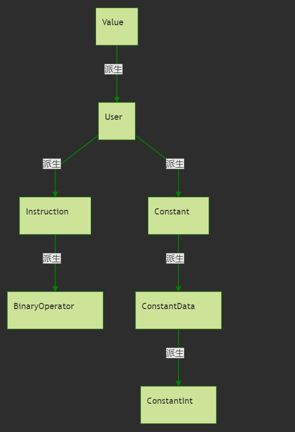
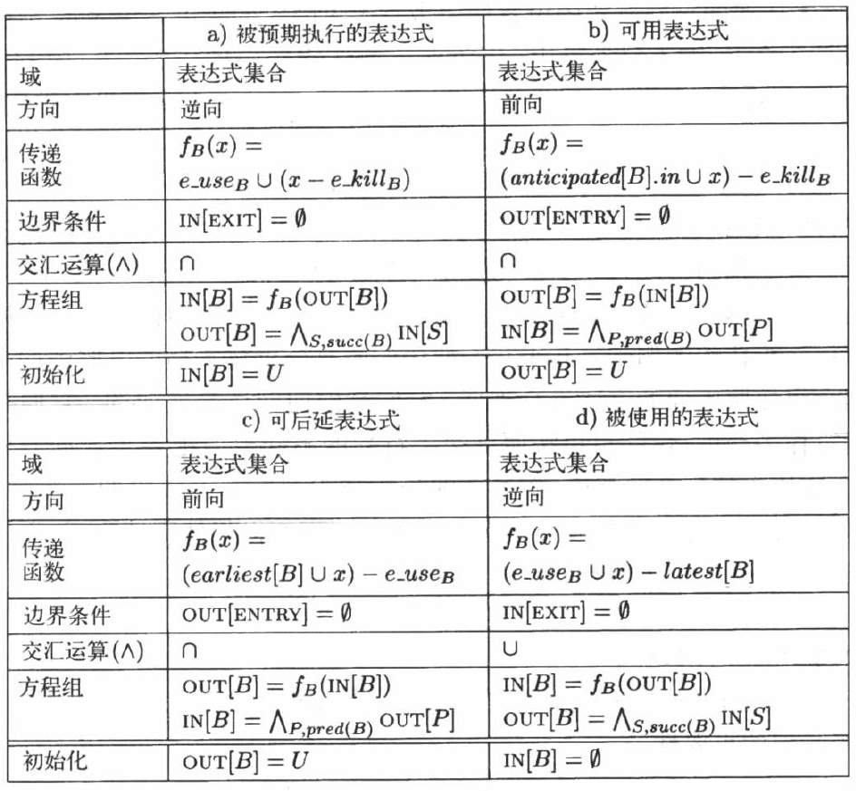

# 代码优化与LLVM IR pass

## 简介

- LLVM IR(Intermediate Representation) 是LLVM的一种中间表示，也可以将它视为中间代码。
  > __中间代码__ 的生成是为了便于更好的 __代码优化__。
- LLVM Pass 是LLVM代码优化（optimization）中的一个重要组成部分。为便于理解，我们可以将Pass看作一个又一个的模块，各个Pass可以通过IR获取信息为下一个Pass做好准备，又或者直接对中间代码进行优化。
  > 代码优化的实质：分析(Analysis)+转换(Transformation)
- [CSCD70](http://www.cs.toronto.edu/~pekhimenko/courses/cscd70-w20/)是多伦多大学涉及代码优化的一门课程，配套 [github](https://github.com/ArmageddonKnight/CSCD70)上的课件与作业

> 注：本文所设计到的代码优化类型并不全面，仅记录下笔者所学的类型。
<!--more-->

## 1. 基础知识

- 基本块（BasicBlock）
  > 基本块是满足下列条件的 __最大__ 的 __连续__ 中间表示指令序列
  - 控制流只能从基本块的 __第一个指令__ 进入该块。
    > 也就是说，没有跳转到基本块中间的或末尾指令的转移指令
  - 除了基本块的最后一个指令，控制流在离开基本块之前不会跳转或停机

- 流图（FlowGraghs）
  - 流图的结点是一些 __基本块__
  - 从基本块B到基本块C的之前有一条边，__当且仅当__ 基本块C的第一个指令 __可能__ 紧跟在B的最后一条指令之后执行。
    > 此时称，B是C的 __前驱__ (predecessor)，C是B的 __后继__ (successor)
    - 确认该边的方式
      - 有一个 __从B的结尾跳转到C的开头__ 的条件或无条件跳转语句
      - 按照原来的中间代码序列的顺序，C紧跟在之B后，且B的结尾不存在无条件跳转语句

- 常用的代码优化方法
  - __删除公共子表达式__
    > 如果表达式`x op y`先前已被计算过，并且从先前的计算到现在，`x op y`中的变量值没有改变，则`x op y`的这次出现就称为公共子表达式（common subexpression）
  - __删除无用代码__
    > 无用代码(Dead-code)：其计算结果永远不会被使用的语句
  - __常量合并__
    > 如果在编译时刻推导出一个表达式的值是常量，就可以使用该常量来替代这个表达式。该技术被称为 __常量合并__
  - __代码移动__
    > 这个转换的结果是那些 __不管循环多少次都得到相同结果的表达式__（即循环不变计算，loop-invariant computation），在进入循环之前就对它们进行求值。
  - __强度削弱__
    > 用较快的操作代替较慢的操作，如用 __加__ 代替 __乘__ 。（例：2*x ⇒ x+x）
  - __删除归纳变量__
    > 对于一个变量x ，如果存在一个正的或负的常数c使得每次x被赋值时它的值总增加c ，那么x就称为归纳变量(Induction Variable)。在沿着循环运行时，如果有一组归纳变量的值的变化保持步调一致，常常可以将这组变量删除为只剩一个

## 2. IR语法初探

测试代码如下：

```cpp
int g;

int test(int x)
{
    if(x < 0)
        x = 2;

    int val1 = x + 0;
    int kkk = val1 + 3;
    int val2 = 2 * x;

    int val3_1 = x + 1;
    int val3_2 = val3_1 - 1;
    return val1 + val2 + val3_1 + val3_2;
}
```

将上文中的C++代码用`clang`编译后生成的IR如下
> 注意： 用clang编译时，需要设置`-O0 -disable-O0-optnone`这两项flag，以取消`clang`自身的代码优化

{% codeblock lang: asm)
; 一个文件一个模块（Module）

; ModuleID = './tests/algebra.bc'
source_filename = "./tests/algebra.c"
target datalayout = "e-m:e-i64:64-f80:128-n8:16:32:64-S128"
target triple = "x86_64-pc-linux-gnu"

; 带有'@'的即为全局符号
@g = common dso_local global i32 0, align 4

; Function Attrs: noinline nounwind uwtable
define dso_local i32 @test(i32) #0 {
  ; 所需的栈空间。align用于对齐内存
  %2 = alloca i32, align 4
  %3 = alloca i32, align 4
  %4 = alloca i32, align 4
  %5 = alloca i32, align 4
  %6 = alloca i32, align 4
  %7 = alloca i32, align 4
  ; %0 即函数的第一个参数
  store i32 %0, i32* %2, align 4
  %8 = load i32, i32* %2, align 4
  %9 = icmp slt i32 %8, 0
  br i1 %9, label %10, label %11     ; 分支跳转

10:                                               ; preds = %1
  store i32 2, i32* %2, align 4
  br label %11

11:                                               ; preds = %10, %1
  %12 = load i32, i32* %2, align 4
  %13 = add nsw i32 %12, 0
  store i32 %13, i32* %3, align 4
  %14 = load i32, i32* %3, align 4
  %15 = add nsw i32 %14, 3
  store i32 %15, i32* %4, align 4
  %16 = load i32, i32* %2, align 4
  %17 = mul nsw i32 2, %16
  store i32 %17, i32* %5, align 4
  %18 = load i32, i32* %2, align 4
  %19 = add nsw i32 %18, 1
  store i32 %19, i32* %6, align 4
  %20 = load i32, i32* %6, align 4
  %21 = sub nsw i32 %20, 1
  store i32 %21, i32* %7, align 4
  %22 = load i32, i32* %3, align 4
  %23 = load i32, i32* %5, align 4
  %24 = add nsw i32 %22, %23
  %25 = load i32, i32* %6, align 4
  %26 = add nsw i32 %24, %25
  %27 = load i32, i32* %7, align 4
  %28 = add nsw i32 %26, %27
  ret i32 %28
}

attributes #0 = { noinline nounwind uwtable "correctly-rounded-divide-sqrt-fp-math"="false" "disable-tail-calls"="false" "less-precise-fpmad"="false" "min-legal-vector-width"="0" "no-frame-pointer-elim"="true" "no-frame-pointer-elim-non-leaf" "no-infs-fp-math"="false" "no-jump-tables"="false" "no-nans-fp-math"="false" "no-signed-zeros-fp-math"="false" "no-trapping-math"="false" "stack-protector-buffer-size"="8" "target-cpu"="x86-64" "target-features"="+fxsr,+mmx,+sse,+sse2,+x87" "unsafe-fp-math"="false" "use-soft-float"="false" }

!llvm.module.flags = !{!0}
!llvm.ident = !{!1}

!0 = !{i32 1, !"wchar_size", i32 4}
!1 = !{!"clang version 8.0.1-7 (tags/RELEASE_801/final)"}
{% endcodeblock)

## 3. Pass初探

- LLVM 的pass框架是LLVM系统的一个很重要的部分。LLVM的优化和转换工作就是由多个pass来一起完成的。类似流水线操作一样，每个pass完成特定的优化工作。 要想真正发挥LLVM的威力，掌握pass是不可或缺的一环。
- LLVM中pass架构的可重用性和可控制性都非常好，这允许用户自己开发pass或者关闭一些默认提供的pass。
- 总的来说，所有的pass大致可以分为两类：
  - 分析(`analysis`)和转换分析类的pass以提供信息为主
  - 转换类(`transform`)的pass优化中间代码
- 下文是一个简单的pass（CSCD70课程-Assignment1-FunctionInfo）

  ```cpp
  #include "llvm-9/llvm/Pass.h"
  #include "llvm-9/llvm/IR/Module.h"
  #include "llvm-9/llvm/Support/raw_ostream.h"
  using namespace llvm;
  namespace {

  // 继承自ModulePass
  class FunctionInfo final : public ModulePass
  {
  public:
    static char ID;

    FunctionInfo() : ModulePass(ID) {}
    virtual ~FunctionInfo() override {}

    // We don't modify the program, so we preserve all analysis.
    virtual void getAnalysisUsage(AnalysisUsage & AU) const override
    {
      AU.setPreservesAll();
    }

    virtual bool runOnModule(Module & M) override
    {
      outs() << "CSCD70 Functions Information Pass" << "\n";
      bool transformed = false;
      // 遍历内含的所有函数
      for (auto iter = M.begin(); iter != M.end(); ++iter)
      {
        Function &func = *iter;
        outs() << "Name:" << func.getName() << "\n";
        outs() << "Number of Arguments: " << func.arg_size() << "\n";
        outs() << "Number of Direct Call Sites in the same LLVM module: "
          << func.getNumUses() << "\n";
        outs() << "Number of Basic Blocks: " << func.size() << "\n";
        outs() << "Number of Instructions: " << func.getInstructionCount() << "\n";
        transformed = true;
      }
      return transformed;
    }
  };

  char FunctionInfo::ID = 0;
  // 注册自定义pass
  RegisterPass < FunctionInfo > X (
    "function-info",
    "CSCD70: Functions Information");
  }  // namespace anonymous
  ```

- 基础pass有很多类，一些常用的pass类分别是
  - ModulePass
  - FunctionPass
  - BasicBlockPass
  - 等等

- 一个`Module`类实例对应一个源码文件。在`Module`类中含有以下列表，其中以`FunctionList`为首。

  ```cpp
  GlobalListType GlobalList;      ///< The Global Variables in the module
  FunctionListType FunctionList;  ///< The Functions in the module
  AliasListType AliasList;        ///< The Aliases in the module
  IFuncListType IFuncList;        ///< The IFuncs in the module
  NamedMDListType NamedMDList;    ///< The named metadata in the module
  ```

  在`Function`类中，又有基础块列表（`BasicBlocks`）

  ```cpp
  BasicBlockListType BasicBlocks;  
  ```

  `BasicBlock`类中，内含指令列表（`InstList`）

  ```cpp
  InstListType InstList; 
  ```

  一个`Instruction`类实例对应一条IR代码  
  上述几个类内有联系，层次分明。其关系如下  
  

- 以下是几个较常用类的结构图  
  
  

- 在编写pass对IR进行优化时，
  - `Value ⇒ ConstantInt`类型转换

    ```cpp
    //如果转换失败，即Type不是ConstantInt类继承链上的，则返回NULL
    // 通常来讲，Value类转ConstantInt类比较常见
    Type _t;
    /* ...... */
    ConstantInt* val = dyn_cast<ConstantInt>(_t);
    ```

  - 获取`ConstantInt`类的值

    ```cpp
    ConstantInt* const_int;
    /* ...... */
    uint64_t val = const_int->getZExtValue();
    ```
  
  - 替换某个指令
    - 用法

      ```cpp
      Instruction inst;
      /* ...... */
      // 替换该指令所有出现的位置为val。注意，只是替换了该指令结果的引用，该指令并没有被删除
      inst.replaceAllUsesWith(val);

      // 删除指令请使用以下代码。
      // 注意：必须在遍历所有Instruction之后再删除，避免Instruction迭代器出现错误
      if(inst->isSafeToRemove())
          // 注意，用erase而不是remove，以至于unlink & delete。
          inst->eraseFromParent();
      ```

    - IR代码示例
        {% codeblock lang: asm)
        ; 执行Pass前
        %12 = load i32, i32* %2, align 4
        %13 = add nsw i32 %12, 0
        store i32 %13, i32* %3, align 4
        ; *********************************************
        ; Pass中只替换指令引用。执行Pass后
        %12 = load i32, i32* %2, align 4
        %13 = add nsw i32 %12, 0          ; 没有任何指令引用这条指令的结果，但这条指令仍然存在
        store i32 %12, i32* %3, align 4   ; 结果的引用发生改动，%13 ⇒ %12
        ; *********************************************
        ; Pass中既替换指令引用，又删除原先指令
        %12 = load i32, i32* %2, align 4
        store i32 %12, i32* %3, align 4
        ; *********************************************
        ; Pass中替换指令引用，但删除指令所执行的是inst->removeFromParent()， 报错！
        Instruction referencing instruction not embedded in a basic block!
          %12 = load i32, i32* %2, align 4
          <badref> = add nsw i32 %12, 0
        {% endcodeblock)

  - 建立新指令

    ```cpp
    // 取出当前指令的第一个操作数
    Value* val = inst.getOperand(0);
    // 新建IRBuilder，其中传入Instruction*以确定新指令的插入位置等等
    IRBuilder<> builder(&inst);
    // 建立新指令 "val << 1"
    Value* newInst = builder.CreateShl(val, 1);
    // 替换原先指令
    inst.replaceAllUsesWith(newInst);
    ```

> LLVM示例代码 - [github](https://github.com/Kiprey/Skr_Learning/tree/master/week7-8/Assignment1-Introduction_to_LLVM)

## 4. 基本块的优化

- 很多重要的 __局部优化技术__ 首先把一个基本块转换成为一个 __无环有向图(directed acyclic graph，DAG)__

### a. 基本块的DAG表示

- 基本块中每个 __语句__ s都对应一个 __内部节点__ N
- 结点N的 __标号__ 是s中的 __运算符__ ；同时还有一个 __定值变量表__ 被关联到N ，表示s是在此基本块内最晚对表中变量进行定值的语句
- N的 __子结点__ 是基本块中在s之前、最后一个对s所使用的 __运算分量__ 进行定值的 __语句对应的结点__。如果s的某个运算分量在基本块内没有在s之前被定值，则这个运算分量对应的子结点就是代表该运算分量初始值的 __叶结点__(为区别起见，叶节点的定值变量表中的变量加上下标0)
- 在为语句x=y+z构造结点N的时候，如果x已经在某结点M的定值变量表中，则从M的定值变量表中删除变量x
- 例子
  > 左侧是三地址代码，右侧是基本块的DAG表示
  

### b. 基于DAG删除无关代码

- 从一个DAG上删除所有 __没有附加活跃变量__ 的 __根节点__。重复此操作即可删除所有对应于无用代码的节点。
- 例子
  

### c. 可获取的信息

- 确定 __DAG中创建了叶节点的那些变量__ 在该基本块中赋值前被 __引用__
- 确定 __DAG中为语句s创建的节点N__，可以在基本块外被应用。
  > 在DAG构造结束时x仍然是N的定值变量

## 5. 数据流分析

### *. 基础知识

- 数据流分析是一组用来获取程序执行路径上的数据流信息的技术。
- 数据流分析技术的应用
  - 到达-定值分析（Reaching-Definition Analysis)
  - 活跃变量分析（Live-Variable Analysis)
  - 可用表达式分析（Available-Exprssion Analysis）
  > 在每一种数据流分析应用中，都会把每个 __程序点__ 和一个 __数据流值__ 关联起来。
- 语句的数据流模式
  - `IN[s]` : 语句s之前的数据流值  
    `OUT[s]` : 语句s之后的数据流值
  - $f_s$: 语句s的 __传递函数__（transfer function）
    > 一个赋值语句s之前和之后的数据流值的关系
    传递函数有两种风格：
    - 信息沿执行路径前向传播（前向数据流问题） ：$OUT[s] = f_s(IN[s])$
    - 信息沿执行路径逆向传播（逆向数据流问题） ：$IN[s] = f_s(OUT[s])$
  - 基本块中相邻两个语句之间的数据流值的关系:
    - 设基本块B由语句s1, s2, … , sn 顺序组成，则
      $$IN[s_{i+1}]= OUT[s_i]\qquad(i=1,2,...,n-1)$$
- 基本块的数据流模式
  - `IN[B]` : 紧靠基本块B __之前__ 的数据流值
    `OUT[B]` : 紧靠基本块B __之后__ 的数据流值
  - 设基本块B由语句$s_1,s_2,…,s_n$ 顺序组成，则
    - $IN[B]=IN[s_1]$
    - $OUT[B]=OUT[s_n]$
  - $f_B$:基本块B的传递函数
    - 前向数据流问题：$OUT[B] = f_B(IN[B])$  
      $f_B = f_{s_n}·…·f_{s_2} ·f_{s_1}$
    - 后向数据流问题：$IN[B] = f_B(OUT[B])$  
      $f_B = f_{s_1}· f_{s_2} · …·f_{s_n}$

### a. 活跃变量分析

- 对于变量x和程序点p，如果在流图中沿着从p开始的某条路径会引用变量x在p点的值，则称变量x在点p是 __活跃__(live)的，否则称变量x在点p __不活跃__(dead)
  
- 活跃变量信息的主要用途
  - 删除无用赋值
  - 为基本块分配寄存器
- 活跃变量的传递函数
  > 逆向数据流问题
  - $IN[B]=f_B(OUT[B])$
  - $f_B(x)=use_B\bigcup(x-def_B)$
    > $def_B$：在基本块B中 __定值__，但是定值前在B中没有被 __引用__ 的变量的集合。
    > $use_B$：在基本块B中 __引用__，但是引用前在B中没有被 __定值__ 的变量集合。
    例：各基本块B的$use_B$和$def_B$
    
- 活跃变量的数据流方程
  - $IN[B]$：在基本块B的入口处的活跃变量集合  
    $OUT[B]$：在基本块B的出口处的活跃变量集合
  - 方程
    - $IN[EXIT]=\Phi$
    - $IN[B]=f_B(OUT[B])\qquad(B\neq EXIT)$
    - $OUT[B]=\bigcup_{S是B的一个后继}IN[S]\qquad(B\neq EXIT)$
- 计算活跃变量的迭代算法
  - 输入：流图G，其中每个基本块B的$use_B$和$def_B$都已计算出来
  - 输出：$IN[B]$和$OUT[B]$
  - 伪代码：  
    
  - 例子
    

> LLVM示例代码 - [github](https://github.com/Kiprey/Skr_Learning/blob/master/week7-8/Assignment2-Dataflow_Analysis/src/liveness.cpp)

### b. 可用表达式

- 可用表达式（available expressions）
  - 如果从流图的 __首节点__ 到达程序点p的 __每条__ 路径都对表达式`x op y`进行计算，并且从最后一个这样的计算到点p之间 __没有再次对x或y定值__，那么表达式`x op y`点p是 __可用__ 的(available)
  - 直观意义：在点p上，`x op y`已经在之前被计算过，不需要重新计算
- 用途：
  - 消除全局公共子表达式
    
  - 进行复制传播
    
- 传递函数（Transform Function）
  - 对于可用表达式数据流模式而言，如果基本块B对x或者y __可能__ 进行了定值，且以后没有重新计算x op y，则称B __杀死（kill）__ 表达式x op y。如果基本块B对x op y进行计算，并且 __之后没有重新定值__ x或y，则称B __生成（generate）__ 表达式x op y
    > 杀死：指的是在后续中如果需要计算`x op y`，则原先的计算结果不可使用，原因是x或y __可能__ 在这两个过程中间进行了定值操作  
    > 生成：指的是在后续中如果需要计算`x op y`，则原先的计算结果可以之间使用。

    一个简单的例子：

    ```cpp
    a = b + c // 生成表达式 b + c
    d = e + f
    g = b + c // 代码优化时，由于 b+c没有被杀死，所以这一步可以优化为 g = a
    b = d     // 注意：b被重新定值，与之相关的表达式 b + c被杀死
    f = b + c // 由于b+c被杀死，所以代码优化时就  不能！ 优化为f = a
    ```

  - $f_B(x)=e$_ $gen_B\bigcup(x-e$_ $kill_B)$
    - $e$_ $gen_B$: 基本块B所生成的可用表达式的集合
    - $e$_ $kill_B$: 基本块B所杀死的U中的可用表达式的集合
    - U ：所有出现在程序中一个或多个语句的右部的表达式的全集

- $e\underline{ }gen_B$的计算
  - 初始化：$e\underline{ }gen_B=\Phi$
  - 顺序扫描基本块的每个语句: $z=x\ op\ y$
    - 把$x\ op\ y$加入$e\underline{ }gen_B$
    - 从$e\underline{ }gen_B$中删除和z有关的表达式（kill）
- $e\underline{ }kill_B$的计算
  - 初始化：$e\underline{ }kill_B=\Phi$
  - 顺序扫描基本块的每个语句: $z=x\ op\ y$
    - 从$e\underline{ }kill_B$中删除表达式$x\ op\ y$
    - 把所有和z相关的表达式加入到$e\underline{ }kill_B$
- 可用表达式的数据流方程
  - $IN[B]$：在B的入口处可用的U中的表达式集合  
    $OUT[B]$：在B的出口处可用的U中的表达式集合
  - 方程
    - $OUT[ENTRY]=\Phi$
    - $OUT[B]=f_B(IN[B])\qquad(B\neq ENTRY)$
      - $f_B(x)=e\underline{ }gen_B\bigcup(x-e\underline{ }kill_B)$
    - $IN[B]=\bigcap_{P是B的一个前驱}OUT[P]\qquad(B\neq ENTRY)$
    > 注：$e\underline{ }gen_B$和$e\underline{ }kill_B$可以直接从流图中计算出，因此是 __已知量__

- 计算可用表达式的迭代算法
  - 输入：流图G，其中每个基本块B的$e\underline{ }gen_B$和$e\underline{ }kill_B$都已计算出来
  - 输出：$IN[B]$和$OUT[B]$
  - 算法：
      
    示例代码：

      ```cpp
      virtual bool runOnFunction(Function & F) override final
      {
          for (const auto & inst : instructions(F))
          {
              InitializeDomainFromInstruction(inst);
          }
          for (const auto & inst : instructions(F))
          {
              _inst_bv_map.emplace(&inst, IC()); // IC 初始条件
          }
          // keep traversing until changes have been made to the
          // instruction-bv mapping

          while (traverseCFG(F)) {}

          printInstBVMap(F);

          return false;
      }
      bool traverseCFG(const Function & func)
      {
          bool transform = false;

          for(const BasicBlock& basicBlock : BBTraversalOrder(func))
          {
              // OUT[B]和IN[B]的节点集合
              BitVector ibv;
              BitVector obv;
              // 确定IN集合
              // 注：basicBlock不存在operator==函数，故只能比较其地址是否相同
              if(&basicBlock == &(*BBTraversalOrder(func).begin()))
                  // 设置OUT[ENTRY]为空集，就是设置EntryBlock的IN集为空集
                  // 注意基础块ENTRY和此处函数开头的基础块不是同一个
                  // ENTRY -> funcEntryBlock -> ... -> funcExitBlock -> EXIT
                  ibv = BC();  // BC 边界条件
              else
                  ibv = MeetOp(basicBlock);
              // 利用fB=fsn⋅…⋅fs2⋅fs1公式，遍历Instruction，计算出当前基础块的OUT集合
              for(const Instruction& inst : InstTraversalOrder(basicBlock))
              {
                  // 对_inst_bv_map的修改在TransferFunc内
                  // 传入旧的obv，判断是否修改out集。
                  obv = _inst_bv_map[&inst];
                  // TransferFunc的第三个参数感觉有点多余
                  transform |= TransferFunc(inst, ibv, obv);
                  // 计算出的inst_out集合，是下一次transfer的in集合，所以需要赋值
                  ibv = obv;
              }
          }
          return transform;
      }
      ```

> LLVM示例代码 - [github](https://github.com/Kiprey/Skr_Learning/blob/master/week7-8/Assignment2-Dataflow_Analysis/src/avail_expr.cpp)

### c. 静态单一赋值

#### 1). 简介

- 静态单一赋值（static single assignment，SSA），可以归纳成如下语句：
  > SSA是一种，每个变量在程序文本中最多分配一个值，的IR

  也就是说，非SSA形式的IR里一个变量可以赋值多次。
  SSA 简化了程序中变量的特性。
  为了得到SSA形式的 IR，初始 IR 中的变量会被分割成不同的版本（version），其中每个定义（definition）对应着一个版本。通常会在旧的变量名后加上下标构成新的变量名，这也就是各个版本的名字。  
  显然，在 SSA 形式中，UD 链（Use-Define Chain）是十分明确的。也就是说，变量的每一个使用（use）点只有唯一一个定义可以到达。

- SSA的优点：
  - 因为SSA使得每个变量都有唯一的定义，因此数据流分析和优化算法可以更加简单
  - 使用-定义关系链所消耗空间从指数增长降低为线性增长。若一个变量有N个使用和M个定义，若不采用SSA，则存在M×N个使用-定义关系。
  - SSA中因为使用和定义的关系更加的精确，能简化构建干扰图的算法
  - 源程序中对同一个变量的不相关的若干次使用，在SSA形式中会转变成对不同变量的使用，因此能消除很多不必要的依赖关系。
  - 因为SSA使得依赖分析更加简单、精确，而且PHI节点中的变量不可能同时活跃。因此在SSA形式能协助完成寄存器分配。

#### 2). Phi

- __Φ(Phi)__ 根据程序的执行流来确定赋的值是什么。请看如下IR代码
  > LLVM IR 指令 `phi` 用于实现SSA中的PHI节点。在运行时，phi 指令根据“在当前 block 之前执行的是哪一个 predecessor(前驱节点) block”来得到相应的值。  
  > 语法：`<result>` = phi [fast-math-flags] `<ty>` [ `<val0>`, `<label0>`], ...
  > 在一个基本块中，`Phi`指令前不允许出现非`Phi`指令。

  {% codeblock lang: asm)
    %2 = icmp slt i32 %0, 0
    br i1 %2, label %3, label %4

  3:                                                ; preds = %1
    br label %5

  4:                                                ; preds = %1
    br label %5

  5:                                                ; preds = %4, %3
    ; 如果执行流通过%3分支，则x = 2; 否则如果;执行流通过%4分支，则x = 0
    %.0 = phi i32 [ 2, %3 ], [ 0, %4 ]
  {% endcodeblock)

  > 注：此函数并不是一条实际的指令，需要编译器后端对其做相应的处理，从而得到正确的汇编代码。此过程名为`resolution`。

- 若需要启用`SSA`，则必须在`opt`命令中添加参数`-mem2reg`。 
  - `mem2reg Pass`中的算法会使 alloca 这个仅仅作为 load 和 stores 的用途的指令使用迭代 dominator 边界转换成 PHI 节点，然后通过使用深度优先函数排序重写 loads 和 stores。
  - 这种算法叫做 `iterated dominance frontier`算法，具体实现方法可以参看 PromoteMemToReg 函数的实现。

#### 3). 如何生成SSA

- 以下述代码为例，程序在函数体结尾会将x的值赋给y。

  ```cpp
  if(x < 0)
      x = 2;
  else
      x = 0;
  int y = x;
  ```

  那么在代码优化时，我们并不知道赋值于y的值是多少。所以引进了 __Φ(Phi)__ 函数，并重命名了变量

  ```cpp
  // 注：其中的x1，x2的数字都是下标。其本质上还是x
  if(x < 0)
      x1 = 2;
  else
      x2 = 0;
  int y = Φ(x1, x2);
  ```

- 总结：三步走战略
  - 找出各个内含变量定值的基础块，以及这些基础块所对应的 __支配边界__
    > 什么是支配边界？请阅读本文中 __6. 流图中的循环 —— a. 支配结点与回边__ 的相关内容。
  - 插入PHI节点： PHI节点要插在控制流图的汇聚点处（joint point), 只要在汇聚点之前的分支中有针对某个变量的修改， 就需要在该汇聚点插入针对该变量的PHI节点。 PHI节点的操作数是分支路径中重新定义的变量。
  - 变量重命名： 在插入PHI节点后，SSA中所有针对变量的定义就具备了，接下来就依次在定义处重命名变量，并替换对应的变量使用处。

- 我们需要将 __Φ__ 函数正确插入至代码块中。所以最关键的问题是 —— __插入至何处？__  
  > 插入至 __各个变量定值所在的基础块集合__ 的 __所有支配边界__ 。详见下面的算法。

#### 4). Φ(Phi)插入点算法

伪代码如下

```js
// @input   defsite内含某个变量赋值的所有基础块、DominanceFrontier某基础块的所有支配边界
// @output  Phi_list 插入点位置
// @brief   将Phi节点插入在各个变量定值基础块的所有支配边界上
list getPhiList(defsite_list defsite, DominanceFrontier_List dominanceFrontier, var_list vars)
{
  // 初始状态下，Phi_list为空
  Phi_list.empty();
  // 遍历所有变量
  for(var v in vars)
  {
    Worklist work_list;
    // 用内含该变量定值的基础块，对work_list初始化
    work_list.initial(defsite[v]);
    // 如果work_list不是空的，那就继续循环
    while(work_list.no_empty())
    {
      Work w = work_list.pop();
      // 遍历内含该变量赋值的基础块，其所有支配边界
      for(DominanceFrontier df in dominanceFrontier[w])
      {
        // 如果该支配边界并没有被phi插入
        if(df not in Phi_list)
        {
          // 插入phi
          Phi_list.push(df);
          // 如果插入失败（即，当前插入点既不在phi_list，也不在defsite中）
          if(df not in union_of_sets(defsite[v], Phi_list))
            // 将该支配边界添加回work_list
            work_list.push(df);
        }
      }
    }
  }
  return Phi_list;
}

```

#### 5) 参考

- [编译器后端寄存器分配算法SSA](https://blog.csdn.net/billleelh/article/details/9276031?utm_source=blogxgwz2)
- [LLVM SSA介绍](https://blog.csdn.net/qq_29674357/article/details/78731713)
- [LLVM ‘phi’ Instruction](http://llvm.org/docs/LangRef.html#phi-instruction)
- [构造Dominator Tree以及Dominator Frontier](https://blog.csdn.net/dashuniuniu/article/details/52224882)

## 6. 流图中的循环

### a. 支配结点与回边

- __支配__（Dominance）：如果每一条从流图的入口结点到结点 B 的路径都经过结点 A, 我们就说 A __支配（dominate）__ B，记为 A dom B。  
  其中，A和B都为 __支配节点__(Dominator)
  > 换言之， 如果A __支配__ B，那么不可能不经过A就可以从入口处到达B。
  > 一个基础块永远 __支配自己__（ __严格支配__ 排除支配自己这种情况）
- __直接支配节点__(Immediate Dominator)： 从入口处节点到达节点n的所有路径上，结点n的 __最后一个支配节点__ 称为 __直接支配节点__。

- __支配边界__（Dominance Frontier）：如果A支配了B的 __任何__ 一个前驱基础块，但A并不 __严格支配__ B，那么B就是A的支配边界
  > 支配边界确定了 Φ-function 的插入位置。由于每个definition支配对应的uses，所以如果达到了definition所在block的支配边界，就必须考虑其他路径是否有其他相同variable的定义，由于在编译期间无法确定会采用哪一条分支，所以需要放置 Φ-function
- 下面的图给出了一个示例，给出了图中的支配结点以及支配边界关系。
  
- 一旦有了支配边界，我们便可以计算出 __Φ__ 函数正确的插入位置。
- LLVM获取支配边界的示例代码

    ```cpp
    virtual void getAnalysisUsage(AnalysisUsage & AU) const
    {
      // Require that `DominanceFrontier` pass to run first before the
      // current pass (-> Tutorial 2 Example 2 Pass Manager).
      AU.addRequired < DominanceFrontierWrapperPass > ();
      AU.setPreservesAll();
    }

    virtual bool runOnModule(Module& M)
    {
      /* ....... */
      BasicBlock B = .....;
      Function F = ......;
      /* ...... */
      DominanceFrontier & dom_frontier =
          getAnalysis <DominanceFrontierWrapperPass> (F).getDominanceFrontier();

      // DominanceFrontier::iterator指向了数据结构map
      /*
        using DomSetMapType = std::map<BlockT *, DomSetType>; // Dom set map
        DomSetMapType Frontiers;
      */
      DominanceFrontier::iterator dom_frontier_iter = dom_frontier.find(&B);
      for (auto df_set_iter  = dom_frontier_iter->second.begin();
                df_set_iter != dom_frontier_iter->second.end();
              ++df_set_iter)
      {
        (*df_set_iter)->printAsOperand(outs(), false); outs() << ", ";
      }
      /* ....... */
    }
    ```

- 回边(back edges)：假定流图中存在两个结点d和n满足d dom n。如果存在从结点n到d的有向边n -> d，那么这条边称为回边。  
  例子：
  

## 7. 消除冗余

### a. 基本知识

- 冗余：如果在通向位置p的每条代码路径上，表达式e都已经进行过求值，那么表达式e在位置p处是冗余的。  
  部分冗余：如果表达式e在到达位置p的部分（而非全部）代码路径上是冗余的，则表达式eee在位置p处是部分冗余的。
  

- 为了在很多执行路径中减少表达式被求值的次数，并保证不增加任何路径中的求值次数。我们可以通过移动各个对`x op y`求值的位置，并在必要时把求值结果保存在临时变量中，来完成这个目的。
  > 在流图中`x op y`被求值的 __位置__ 可能增多,但只要对表达式求值的 __次数__ 减少即可。

- 我们期望所使用的部分冗余消除算法进行优化而得到的程序具有如下性质
  - 消除所有不复制代码就可消除的表达式冗余。
  - 不应该执行任何在未优化时不执行的指令。
    > 否则可能造成 __非预期错误__
  - __表达式的计算时刻尽量靠后__
    > 尽量靠后表达式的计算时刻可以降低该值的生命周期，降低使用寄存器的时间。

### b. 懒惰代码移动

#### 1). 介绍

- 以尽可能延迟计算为目标的部分冗余消除优化称为 __懒惰代码运动__（Lazy Code Motion）
- 流图的 __关键边__（Critical Edge）: 所有从一个具有多个后继节点到达另一个具有多个前驱节点的边。
  > 通过在关键边上引入新的基本块，我们总是可以找到一个基本块作为放置表达式的适当位置来健减少冗余。  
  > 仅靠增加基本块可能不足以消除所有的冗余计算，必要时需要复制代码，以便于将具有冗余特性的路径隔开。

#### 2). 相关概念

- __预期执行表达式__：（Anticipated expression）如果从程序点p出发的所有路径最终都会计算表达式b+c的值，并且b和c在那时的值就是它们在点p上的值，则一个表达式b+c在程序点p上被 __预期执行__。
  > 一个表达式的各个拷贝所放置的程序点必须 *预期执行* 此表达式
- **可用表达式**（Will-be-Available Expressions）：一个表达式的多个拷贝会被分别放置到该表达式首次被预期执行的程序点上。如果原来的程序中所有到达程序点p的路径都预期执行这个表达式，则现在这个表达式在点p上*可用*。
  > 这个分析的实质是活跃性分析（对表达式）。
- __可后延表达式__（Postponable Expression）：在所有从程序入口结点到达p的路径中都会碰到一个位置较前的x+y，并且在最后一个这样的位置到p直接没有对x+y的使用，那么表达式x+y就可后延到程序点p上。
- __被使用表达式__(used expression) : 如果在基本块B的出口点被使用的表达式不在B的最后放置（latest）集合中，那么它也是一个在B入口点处被使用的表达式。
- 部分冗余消除中的四个数据流分析过程
  

#### 3). 算法

1. 前提条件：已经计算出*e_gen*和*e_kill*集合
2. 程序块的信息收集
   > 注：下文中的英文名全部指代某个特定集合。

   1. 使用*e_gen*、*e_kill*集合，计算预期执行表达式集合*anticipated*  
      > 预期执行表达式分析（逆向数据流分析）确定一个表达式是否在某个程序点*之后*的所有路径中被使用。
   2. 使用*anticipated*、*e_kill*集合，计算可用表达式集合*available*  
      > 可用表达式分析（前向数据流分析）计算了一个表达式是否在*所有*路径中都在该点之前被*预期执行*。
   3. 并通过*anticipated*、*available*表达式集合来计算出基本块B的所有最早放置位置集合*earliest*。
      > 一个表达式的最前放置位置就是该表达式在其上被 __预期执行__ 但 __不可用__ 的程序点。
   4. 使用*earliest*、*e_use*集合，计算可后延表达式集合*Postponable*
      > 可后延表达式是通过前向数据流分析技术找出。  
   5. 根据*earliest*、*Postponable*、*e_use*集合计算出基本块B的所有最后放置位置集合*latest*
      > 一个表达式的最后放置位置就是该表达式在其上 __不可再后延__ 的程序点。
   6. 根据*latest*、*e_use*集合，计算出被使用表达式集合*used*
      > 除非一个临时赋值语句被*其后*的某条路径使用，否则该赋值语句可以被消除。被使用表达式是通过逆向数据流分析技术找出。
3. 利用从数据流计算推导出的知识重写代码

> 详细算法较为复杂，若有兴趣请移步《编译原理》

#### 4). 参考

- [编译器优化–6--代码移动](https://blog.csdn.net/weixin_46222091/article/details/104743294)
- 《编译原理》

### c. 循环不变量代码移动

- **循环不变量代码移动**指的是把循环中的所有重复执行替换为循环外的单次计算,从而优化程序。  
  具体操作就是将那些，所有操作数不在循环中改变的表达式，从循环内部移动到循环的*前置首结点*，避免重复计算。
  > **前置首结点**(preheader): 循环不变计算将被移至首结点之前，会创建一个称为*前置首结点*的新块。前置首结点的*唯一后继*是首结点，并且原来从循环L外到达L首结点的边都改成进入*前置首结点*。从循环L里面到达首结点的边不变
  
- 循环不变量的判定条件： 某个变量如果其表达式的所有操作数都是常量，或者是循环外部的变量，或者是循环内部已经被标定为*循环不变量*的变量，那么这条表达式被称为*循环不变量*。
- 循环不变语句`s: x = y + z`移动的条件
  1. s所在的基本块是循环**所有出口结点**(有后继结点在循环外的结点)的**支配结点**
     > 意味着控制流无论流向何处，都一定会执行语句s
    
  2. 循环中**没有其它语句对x赋值**
    
  3. 循环中对x的引用**仅由s到达**
    

- 如何处理嵌套循环
  - 先处理内部循环。之后再处理外部循环，但此时只处理*属于外部但不属于内部循环*的表达式
  - 在处理外部循环时，此时就可以进一部处理内部循环所外提的表达式了。

- 计算循环不变计算的LLVM检测算法

  ```cpp
  // 检查当前指令是否是循环不变量
  bool isInvariant(Instruction * I, Loop* loop)
  {
      bool is_invariant = true;
      // 遍历操作数
      for(auto iter = I->op_begin(); is_invariant && iter != I->op_end(); ++iter)
      {
          Value* val = dyn_cast<Value>(*iter);
          assert(val != NULL);
          // 如果当前操作数不是一个常量，那可能是被标定为循环不变量或者其他
          // 如果是函数参数则可以视为循环体之外的不变量
          // 注意：这里的函数参数，指的是当前循环所在函数的函数参数，不是循环内部调用函数传入的参数
          if(!isa<Constant> (val) && !isa<Argument>(val))
          {
              if(Instruction* inst = dyn_cast<Instruction>(val))
              {
                  // 如果既不是循环不变量指令，也不是循环外的指令
                  if(FOUND(markedAsInvariant, inst)
                      && loop->contains(inst->getParent()))
                      // 那么该操作数就不是循环不变量
                      is_invariant = false;
              }
              else
              {
                  // 不是所有遍历到的操作数都是指令、常量和函数参数，可能也有基本块的Label等等
                  // 其他情况下设置成false肯定没错
                  is_invariant = false;
              }
          }
      }
      return isSafeToSpeculativelyExecute(I)  // 检查未定义错误，例如除以0。
                                              // 这一条指令可以帮助过滤PHI和跳转指令
      && !I->mayReadFromMemory()              // 修改读取内存的指令，可能会导致结果值的改变，所以不予处理
      && !isa < LandingPadInst > (I)          // 异常处理相关的指令，必须在循环内部
      && is_invariant;
  }
  ```

- 对于循环不变量提取的代码优化，循环结构`do-while`可以非常完美的工作，不需要修改CFG
  > 原因是在消除冗余操作中，**不应该执行任何在未优化时不执行的指令**。  
  > 而`do-while`语句保证了其循环体至少执行一次。这样优化代码时就可以不受此条件的限制。
  
  至于那些LICM无法直接处理的循环结构，为了保证循环结构中的循环不变表达式可以被优化，编译器通常将循环结构转化为`do-while`结构。例如：`while` ⇒ `if & do-while`

> LLVM示例代码 - [github](https://github.com/Kiprey/Skr_Learning/blob/master/week7-8/Assignment3-Loop_Invariant_Code_Motion/LICM/loop_invariant_code_motion.cpp)