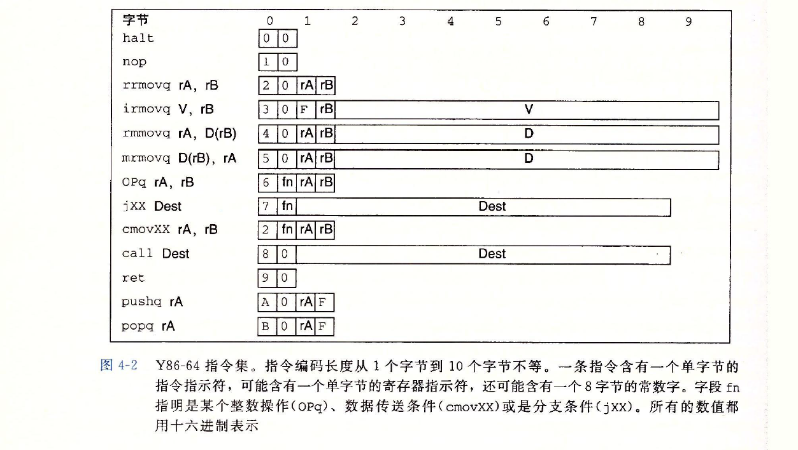
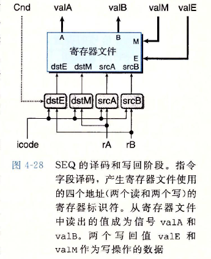
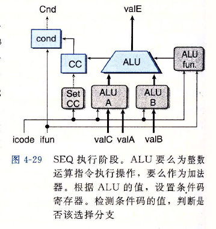
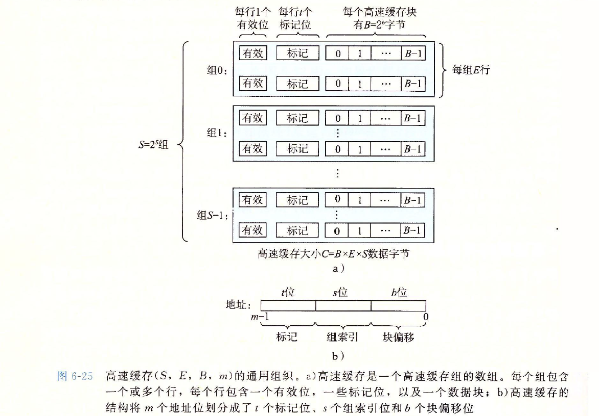
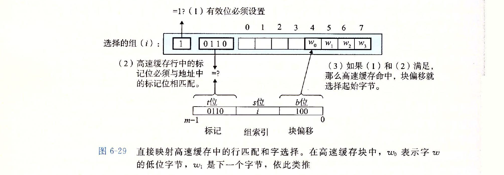
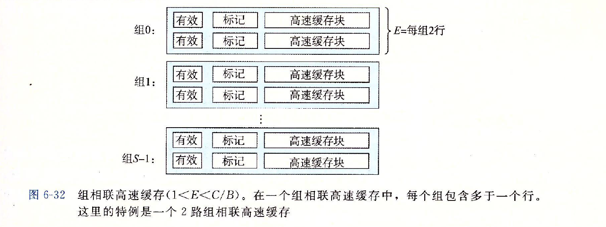
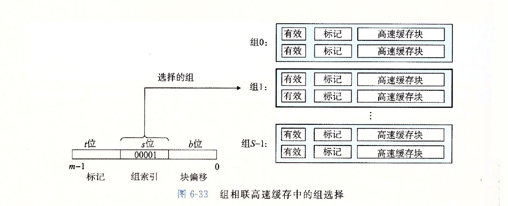
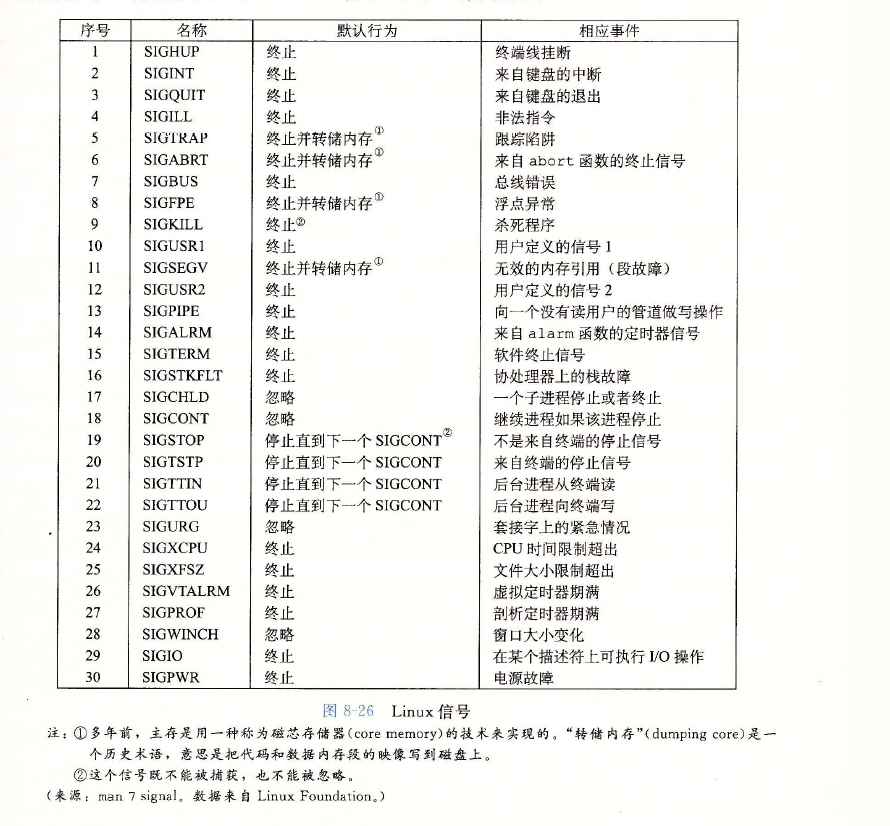
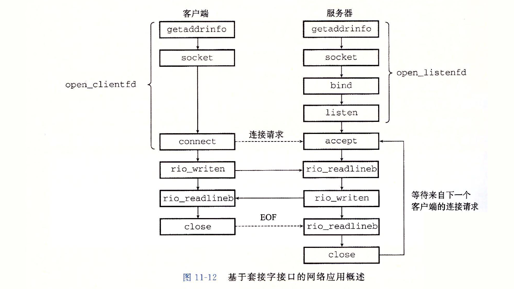

# CSAPP 笔记
<!-- TOC -->

- [CSAPP 笔记](#csapp-笔记)
  - [简介](#简介)
  - [一、 计算机系统漫游](#一-计算机系统漫游)
  - [二、 信息的表示和处理](#二-信息的表示和处理)
    - [1) 字节顺序](#1-字节顺序)
    - [2) 补码(two's complement)](#2-补码twos-complement)
    - [3) 有符号整数和无符号整数](#3-有符号整数和无符号整数)
    - [4) IEEE浮点表示](#4-ieee浮点表示)
  - [三、 程序的机器级表示](#三-程序的机器级表示)
    - [1) 用条件传送来实现条件分支](#1-用条件传送来实现条件分支)
    - [2) 浮点代码](#2-浮点代码)
  - [四、 处理器体系结构](#四-处理器体系结构)
    - [1) 程序员可见状态](#1-程序员可见状态)
    - [2) 指令编码](#2-指令编码)
    - [3) 异常](#3-异常)
    - [4) SEQ阶段](#4-seq阶段)
    - [5) 流水线](#5-流水线)
      - [a. 流水线冒险](#a-流水线冒险)
  - [五、 优化程序性能](#五-优化程序性能)
    - [1) 代码移动](#1-代码移动)
    - [2) 消除不必要的内存引用](#2-消除不必要的内存引用)
    - [3) 理解现代处理器](#3-理解现代处理器)
    - [4) 循环展开](#4-循环展开)
    - [5) 多个累计变量](#5-多个累计变量)
  - [六、 存储器层次结构](#六-存储器层次结构)
    - [1) 局部性](#1-局部性)
    - [2) 高速缓存存储器](#2-高速缓存存储器)
      - [a. 直接映射高速缓存](#a-直接映射高速缓存)
      - [b. 全相联高速缓存](#b-全相联高速缓存)
      - [c. 组相联高速缓存](#c-组相联高速缓存)
      - [d. 写策略](#d-写策略)
    - [3) 编写高速缓存友好的代码](#3-编写高速缓存友好的代码)
  - [七、 链接](#七-链接)
  - [八、异常控制流](#八异常控制流)
    - [1) 异常](#1-异常)
    - [2) 进程](#2-进程)
    - [3) 进程控制](#3-进程控制)
    - [4) 信号](#4-信号)
    - [5) 非本地跳转](#5-非本地跳转)
  - [九. 虚拟内存](#九-虚拟内存)
  - [十. 系统级I/O](#十-系统级io)
  - [十一. 网络编程](#十一-网络编程)
    - [1) 网络](#1-网络)
    - [2) 全球IP因特网](#2-全球ip因特网)
      - [1. IP地址](#1-ip地址)
      - [2. 因特网域名](#2-因特网域名)
      - [3. 因特网连接](#3-因特网连接)
    - [3) 套接字接口](#3-套接字接口)
  - [十二. 并发编程](#十二-并发编程)

<!-- /TOC -->
## 简介

- 这里存放着一点笔者阅读CSAPP所记录的笔记
- 由于CSAPP内容众多，这里只记录了一些笔者学习的主要点
- 根据笔者的进度，持续更新。单次更新随缘记录。
- CSAPP Lab的WriteUp在[这里](csapp-lab-writeup.md)
- github上的笔记可能较为滞后，建议进入[Kiprey's blog](https://kiprey.github.io/2020/07/csapp/)

<!--more-->

## 一、 计算机系统漫游

- 在计算机世界中，**信息** 就是位(bit) + 上下文。在不同的上下文中，其数据也会表示出不同的意思。  
  例如：
  - 在一串数字中，0x90表示154
  - 在一串机器码中，0x90表示nop指令
  - 在 一串字符串中，0x90表示一个特殊的字符
- 代码语言可以被其他程序翻译为不同的格式。以C语言为例，其中可以分为如下几个阶段
  - **预处理阶段**。 预处理器(cpp)根据`#`开头的预处理命令，插入或隐藏部分代码。修改后的源代码以`.i`为后缀
  - **编译阶段**。编译器(ccl)将`.i`文件编译为汇编代码`.s`文件
  - **汇编阶段**。汇编器(as)读取`.s`文件并将其转换为机器语言指令，打包生成一种*可重定位目标指令*的格式，并将其保存在`.o`文件中。
  - **链接阶段**。有些`.o`文件调用了某个库函数，但这个库函数的实现在另一个`.o`文件中。因此链接器(ld)需要将各种`.o`文件链接，最终生成可执行文件。
- 系统的硬件由以下几个部件组成
  - 总线
  - I/O设备
  - 主存
  - 处理器(CPU)
    - 处理器执行的操作会围绕寄存器文件(register file)和算术/逻辑单元(ALU)进行。
    - 处理器在指令的要求下可能会执行*加载、存储、操作、跳转*等操作
- 处理器的运行速度很快，但数据从主存运送到CPU里却相当的慢。这其中速度可能相差百倍以上，大大拖累了CPU的速度。  
  针对这种处理器与主存之间的差异，系统设计者引入了更小更快的存储设备——*高速缓存存储器*(cache)，这其中利用了高速缓存的*局部性原理*。
- 操作系统管理硬件
  - 我们可以将做操系统看成是应用程序和硬件之间插入的一层软件，所有应用程序对硬件的操作尝试都必须通过操作系统。
  - 操作系统的基本功能
    - 防止硬件被失控的应用程序滥用。
    - 向应用程序提供简单一致的机制来控制复杂而又通常大不相同的低级硬件设备。
  - 文件是对I/O设备的抽象表示，虚拟内存是对主存和磁盘I/O设备的抽象表示。进程则是对处理器、主存和I/O设备的抽象表示。
  - **进程**
    - 进程是操作系统对一个正在运行的程序的一种抽象。而*并发运行*，则是一个进程的指令和另一个进程的指令交错进行。
    - 操作系统实现这种进程交错指令的机制称为*上下文切换*。*上下文*是操作系统保持跟踪进程运行所需的所有状态信息。
  - **线程**
    - 一个进程实际上可以由多个称为*线程*的执行单位组成
    - 每个线程都运行在进程的上下文中，并共享同样代码和全局数据。
    - 多线程之间比多进程之间更容易共享数据。线程一般来说也比进程更高效。
  - **虚拟内存**
    - 虚拟内存为每个进程提供了一个假象——即每个继承都在独占地使用主存。每个进程看到的内存都是一致的，称为*虚拟地址空间*。
    - 虚拟内存的布局从低地址到高地址，分别为
      - 程序代码和数据。其中的数据包括全局变量与只读变量（例如字符串）
      - 堆内存。当调用内存分配或释放函数时。对可以在运行时动态地扩展和收缩。
      - 共享库。地址中间部分是一块用来存放像C标准库和数学库这样地共享库代码和数据的区域。
      - 栈内存。位于用户虚拟地址空间顶部的是用户栈，编译器用它来实现函数调用。
      - 内核虚拟内存。地址空间最顶部的区域是为内核保留的。不允许应用程序读/写/执行这个区域的内容。应用程序只能调用内核来执行这些操作。
      

## 二、 信息的表示和处理

### 1) 字节顺序

- 字节顺序分为*大端序*(big-endian)和*小端序*(liggle-endian)。大多数机器使用的都是小端序。
  

### 2) 补码(two's complement)

- 为了在正数的基础上实现负数的表达，将数据的最高位设置为符号位。当符号位为0时，当前数据表示为正数；当符号位为1时，当前数据表示为负数。
- 故以32位int类型为例，其正数范围为`0x00000001 ~ 0x7fffffff`；负数范围为`0x80000000~0xffffffff`.取值范围为`-2147483648~2147483647`.
- 取值范围不是对称的，负数的范围比正数的范围大一。故在int类型中，不是所有的负数都存在其相反数。例如以下例子

  ```cpp
  if(-INT_MIN == INT_MIN)
    printf("This meassages will always be printed.");
  ```

- `INT_MIN == -2147483648`，故`-INT_MIN == 2147483648 == INT_MAX + 1`，`-INT_MIN`范围超过int最大值，造成上溢，故最后的值还是`INT_MIN`，即`-INT_MIN == INT_MIN`。

### 3) 有符号整数和无符号整数
  
- 通过强制类型转换来转换无符号/有符号类型，其数据的**位值不变**，但改变了**解释这些位的方式**。
- 需要注意的是，尽量避免无符号/有符号类型的混用，因为这样可能会进行隐式类型转换，造成非预期的错误。例如以下漏洞代码

    ```cpp
    #define KSIZE 1024
    char kbuf[KSIZE];

    void *memcpy(void *dest, void*src, size_t n);
    int copy_from_kernel(void* user_dest, int maxlen)
    {
      int len = KSIZE < maxlen ? KSIZE : maxlen;
      memcpy(user_dest, kbuf, len);
      return len;
    }
    ```

  当程度调用`copy_from_kernel`函数所传入的`maxlen`参数为负数时，由于隐式类型转换，最终`memcpy`里的参数`n`会是一个非常大的无符号整数，这将使程序读取到它没有被被授权的内核内存区域。

### 4) IEEE浮点表示

- 二进制小数表示的例子: $0.0011_2 = 0.1875_{10}$
  - $0.0011_2 = 0\times0.1_2 + 0\times0.01_2 + 1\times0.001_2 + 1\times0.0001_2$
  - $0.1875_{10} = 0\times0.5_{10} + 0\times0.25_{10} + 1\times0.125_{10} + 1\times0.0625_{10}$
  - 二进制与十进制之间的关系是一一对应的
- IEEE浮点标准用$V=(-1)^s\times M\times2^E$的形式来表示一个浮点数：
  - 符号(sign)，$s$决定这数是正数还是负数。
  - 尾数(significand)，M是一个二进制小数。
  - 阶码(exponent)， $E$的左右就是为浮点数加权，这个权重是$2^E$（阶码可为负）
- 浮点数的位级表示方式

  ```cpp
  float:
  位序号：   31 | 30           23 | 22                           0 |
          +-------------------------------------------------------+
  位表示： |  s |     exp         |       frac                     |
          +-------------------------------------------------------+

  double:
  位序号：   63 | 62    52 | 51                                  0 |
          +-------------------------------------------------------+
  位表示： |  s |     exp  |                frac                   |
          +-------------------------------------------------------+
  ```

- 浮点数中的阶码并非真正的$2^{exp}$，而是需要减去一个偏移。该偏移为$offset = 2^{n-1} - 1$，其中n为阶码位数。

    ```cpp
    // float类型
    int offset = pow(2, 7) - 1;
    int trueExp = exp - offset;
    ```

  真正的阶码为$2^{exp-offset}$

- 浮点数编码的值有4钟不同的情况
  - **规格化** 的。exp != 0 && exp != 255
  - **非规格化** 的。exp == 0
  - 特殊情况
    1. **无穷大** 。exp == 255 && frac == 0
    2. **NaN** 。exp == 255 && frac != 0
  
- 尽管浮点数可表达的范围较大，但当浮点数越来越大时，其精度会越来越小；当浮点数越来越小时，其精度也会越来越大。不管精度如何变化，这其中始终存在一个范围。
  > 浮点数无法精确表示所有的小数。大多数小数都只能近似表示，例如0.1表示为0.100000001。  
  > 浮点数也无法精确表示超大整数。超大整数的表示可能会丢失一些精度，例如表示的整数与预期值相差1等等。
    
- float类型最好不要与double类型的数据进行比较，否则会产生一些奇怪的错误，例如以下代码

    ```cpp
    float a = 0.1;
    double b = 0.1;
    if (a == b)
      cout << "1";
    if (a == (float)b)
      cout << "2";
    if ((double)a == b)
      cout << "3";

    // 只输出 2
    ```

  当两个浮点数进行比较时，程序会自动将某个浮点数的类型转换成与另一个浮点数相同的类型，并比较其位级表示。 这段代码已经可以验证浮点数的不精确性。  

## 三、 程序的机器级表示

> 常用的汇编指令暂且不表，这里只记录一些特殊的指令

### 1) 用条件传送来实现条件分支
  
- 实现条件操作的传统方法是通过使用*控制*的条件转移，例如各类跳转指令。这种机制十分简单而通用。但在现代处理器上，它可能会非常低效。
  > 原因是现代处理器使用流水线方式来执行指令。  
  > 遇到条件跳转指令时，CPU会预判一条执行路径并将该路径上的指令装载进CPU里。  
  > 倘如预判失败，则必须清空流水线上的错误指令，而该操作会消耗大量时间，代价十分高昂。
- 一种替代策略是使用数据的条件转移。这种方法计算一个条件操作的两种结果，然后根据条件是否满足从中选取一个。如果这种策略在某些情况下可行，则只需用一条简单的条件传送指令来实现。例如以下代码：

  ```cpp
  // 原始C代码
  if(a > b)
    a = b;
  
  // 条件转移实现条件分支
  // %rdi: a, %rsi: b
    test %rdi, %rsi
    jle nextInst
    mov %rdi, %rsi
  nextInst:
    ...

  // 条件传送实现条件分支
  // %rdi: a, %rsi: b
    test %rdi, %rsi
    // 当 %rdi > %rsi时，将%rsi中的数据拷贝至%rdi中
    cmovg %rdi, %rsi
    ...
  ```

### 2) 浮点代码
  
- 浮点数所使用的寄存器与整型所使用的`%rdi,%rsi...`不同，它们分别是`%ymm0~ymm15`，每个`%ymmX`寄存器可以保存32字节。其中`%xmmX`寄存器是`%ymmX`寄存器的低16**字节**。

> 由于浮点数指令使用频率较低，暂且不表

## 四、 处理器体系结构

> 该章节中，作者定义了一个简单的`Y86`指令集用于学习，以下笔记均以`Y86`指令集为基础进行记录。
> 需要注意的是，尽管书上使用`Y86`指令集进行讲解，我们仍可通过该指令集来探究现代指令集。

- 一个处理器支持的指令和指令的字节级编码，称为*指令集体系结构*(Instruction-Set Architecture, ISA)。

### 1) 程序员可见状态

- 程序中的每条指令都会读取或修改处理器状态的某些部分，这成为*程序员可见状态*
  > 这里的*程序员*，既可以是用汇编代码写程序的人，也可以是产生机器级代码的编译器。
- *可见状态*包括：
  - RF: 程序寄存器
  - CC: 条件码
  - Stat: 程序状态。状态码指明程序是否运行正常或发生某个特殊事件。
  - DMEM: 内存
  - PC: 程序计数器

### 2) 指令编码

- 每条指令需要1~10个字节不等。其中
- 每条指令的第一个字节表明指示的类型。其中高4位是*代码*(code)部分，低4位是*功能*(function)部分。
  > 功能值只有在一组相关指令共用一个代码时才有用。

  以下是部分指令的具体字节编码

  ```text
  注：方括号中的数据，是指令第一个字节的十六进制表示

  整数操作指令    分支指令                    传送指令
  addq [60]     jmp [70]  jne [74]    rrmovq [20] cmovne [24]
  subq [61]     jle [71]  jge [75]    cmovle [21] cmovge [25]
  andq [62]     jl  [72]  jg  [76]    cmovl  [22] cmovg  [26]
  xorq [63]     je  [73]              cmove  [23]
  ```

  以上面的例子为例，`rrmovq`指令与条件传送有同样的指令代码，可以把它看作是一个“无条件传送”。

- 指令的长度与指令功能相关，有些需要操作数的指令编码就更长一点。
  - 可能有附加的*寄存器指示符字节*(register specifier byte)，用于指定1~2个寄存器。
  - 有些指令需要一个附加的*常数 字*(constant word)。这个立即数成为指令的某个操作数.  
    > 例如`irmovq $1, %rax`。
  

### 3) 异常

- 在现代处理器中，当某些代码发生了某种类型的**异常**(exception)，此时处理器会执行异常处理程序。如果程序员没有手动设置异常处理程序，则CPU会执行默认的处理程序。
  > 大多数情况下默认的处理程序只会简单的关闭程序。

### 4) SEQ阶段


> 详细细节请翻阅CSAPP第三版第277页，这里只是简单概述

- 取指阶段
  - 以PC作为第一个字节的地址，指令内存硬件单元会一次从内存中读出10个字节。并将第一个字节分割成两个4位的数，用于计算指令和功能码。
  - PC增加硬件单元会根据当前PC以及CPU内的信号来生成下一条指令的PC。  
    $new PC = old PC + 1 + r + 8i$（$r$为当前指令是否需要寄存器指示字节，$i$为需要的常数字节数）
    > 注意，此时只是计算，还没有设置下一条的PC
  
- 译码和写回阶段
  - 寄存器文件有两个读端口A和B，从这两个端口同时读取寄存器值valA和valB
  
- 执行阶段
  - 执行阶段包括ALU，该单元更具`alufun`信号的设置，对输入的`aluA`、`aluB`执行特定操作。
  - 指令阶段还包括条件码寄存器。每次运行时，ALU都会产生三个与条件码相关的信号——零、符号、溢出。
  - 标号为`cond`的硬件单元会根据条件码和功能码来确定是否进行条件分支或条件数据传送。
  
- 访存阶段
  - 该阶段的任务为读写程序数据。读写的对象除了主存以外，还包括寄存器文件
  
- 更新PC阶段
  - 根据指令的类型以及是否选择分支来设置新的PC。如果没有跳转，则使用取指阶段计算出的新PC值。
  

### 5) 流水线

#### a. 流水线冒险

- 将流水线技术引入一个待反馈的系统，当相邻指令间存在相关时会导致问题。  
  > 这里的*相关*有两种形式：  
  > 1.数据相关。下一条指令会用到当前指令计算出的结果。  
  > 2.控制相关。一条指令要确定下一条指令的位置。

  这些相关可能会导致流水线产生计算错误，称为冒险(hazard)。其中也分为*数据冒险*和*控制冒险*。
- 避免冒险的方式
  - 暂停(stalling)。暂停技术阻塞一组指令在它们所处的阶段，而允许其他指令继续通过流水线，直到冒险条件不再满足。其处理方法为：每次要阻塞一条指令在译码阶段，就在指令阶段插入一个气泡（bubble）。气泡类似nop指令，不会更改寄存器、内存、条件码与程序状态。
    
  - 转发(formarding)。将结果值直接从一个流水线阶段传到较早阶段的技术称为数据转发，也称旁路(bypassing)。
    
- 为了提高CPU的运行速度，应尽量避免流水线冒险

## 五、 优化程序性能

### 1) 代码移动

将循环不变量从循环中提出。例如以下操作

  ```cpp
  // 优化前
  for(size_t i = 0; i < strlen(str); i++)
    Statements;
  // 优化后
  size_t str_len = strlen(str);
  for(size_t i = 0; i < str_len; i++)
    Statements;
  ```

上面的例子中，未优化版本在某些情况下，其时间复杂度可达到$O(N^2)$级别！改进后的时间复杂度只有$O(N)$。

### 2) 消除不必要的内存引用

减少不必要的内存读/写以获得更高的执行速度。

### 3) 理解现代处理器

现代处理器使用流水线机制，同时搭配高速缓存内存以达到更高的速度。避免流水线暂停或cache中数据未命中，可以让CPU尽可能地发挥出全部性能。

### 4) 循环展开

- 循环展开是一种程序变换，通过增加每次迭代计算的元素数量，减少循环的迭代次数。
- 例子：

    ```cpp
    // 循环展开前
    for(int i = 0; i < lmits; i++)
      acc0 = acc0 OP data[i];

    // 循环展开后
    int limits = length - n;
    int i;
    for(i = 0; i < lmits; i += 2)
    {
      acc0 = acc0 OP data[i];
      acc0 = acc0 OP data[i+1];
    }
    for(; i < length; i ++)
      acc0 = acc0 OP data[i];
    ```

### 5) 多个累计变量

- 对于一个可结合或可交换的合并运算，我们可以通过将一组合并运算分割成两个或更多的部分，并在最后合并结果来提高性能。
- 例子
  > 该例子还运用了循环展开技术。

  ```cpp
  int limits = length - n;
  int i;
  for(i = 0; i < lmits; i += 2)
  {
    acc0 = acc0 OP data[i];
    acc1 = acc0 OP data[i+1];
  }
  for(; i < length; i ++)
    acc0 = acc0 OP data[i];
  int total = acc0 + acc1;
  ```

## 六、 存储器层次结构

### 1) 局部性

- 一个编写良好的计算机程序常常具有良好的*局部性*(locality)。
- 程序倾向于引用邻近于其他最近引用过的数据项的数据项，或者最近引用过的数据项本身。这种倾向性，被称为*局部性原理*(principle of locality)。
- 局部性通常由两种不同的形式，分别为*时间局部性*和*空间局部性*
  - 时间局部性：被引用过的一次的内存位置很可能在不远的将来被多次引用。
  - 空间局部性：如果一个内存位置被引用了一次，那么程序很可能在不远处的将来引用附近的一个内存位置。
- 有良好局部性的程序比局部性差的程序运行的更快。

### 2) 高速缓存存储器

- Cache是一种小容量高速缓冲存储器，它由SRAM组成，其直接制作在CPU芯片内，速度几乎与CPU一样快。
- 程序运行时，CPU使用的一部分数据/指令会预先成批拷贝在Cache中，当CPU需要从内存读/写数据或指令时，先检查Cache，若有，就直接从Cache中读取，而不用访问主存储器。
- 由于程序访问的局部性特征，大多数情况下CPU可以直接从这个高速缓存中取得指令和数据，不必再访问主存。这大大提高了访存速度。
- Cache的通用组织
  
- 有效位
  - 有效位为0时表示信息无效，为1表示信息有效
  - 开机或复位时，所有高速缓存行的有效位V = 0
  - 某行被替换后使其为1
  - 某行被装入新快后使其为1
  - 通过使V=0冲刷Cache（例如：进程切换）
    > “Cache冲刷”指令为操作系统所使用，对操作系统程序员不是透明的。

#### a. 直接映射高速缓存

- 每个组只有一行的高速缓存称为*直接映射*高速缓存(direct-mapped cache)
  
- 高速缓存请求数据的流程
  - 组选择：从主存地址中的特定偏移处抽取s个组索引，这些位被解释成一个对应的无符号整数高速缓存组号。
    
  - 行匹配：直接映射高速缓存中每组只有一个高速缓存行。如果当前行的有效位已经设置，并且标记(tag)匹配，则缓存命中。
  - 字选择：根据后b位的块内偏移来获取所需的字
    
  - 行替换：如果缓存不命中，则需要从下一级存储层次结构中取出请求的块，并驱逐并替换高速缓存行。  
- 优点：唯一映射；命中时间小
- 缺点：缺失率高；关联度低

#### b. 全相联高速缓存

- *全相联高速缓存*（fully associative cache）是由一个包含所有高速缓存行的组组成的。
- 全相联高速缓存的结构较为简单
  
- 全相联高速缓存中的行匹配和字选择与上述的类似，组只有一行所以默认只选择组0。
  
- 由于全相联高速缓存电路必须并行搜索许多相匹配的标记，构成一个又大又快的相联高速缓存十分困难，而且造价昂贵。因此全相联高速缓存只适合做小的高速缓存。
  > 例如虚拟内存系统中的翻译备用缓冲器，该部件用于缓存页表项。

#### c. 组相联高速缓存

- *组相联高速缓存*（set associative cache）是上述两种高速缓存的结合体。下图是它的结构
  
- 组相联高速缓存的组匹配
  
- 组相联高速缓存的行匹配与字选择
  
- 组相联高速缓存的不命中。
  - 当数据不命中时，需要替换该组中的某一行。其常用的替换算法有：
    - 随机替换算法（rand）
    - 先进先出算法（FIFO）
    - 最近最少用LRU（least-recently used）
    - 最不经常用LFU（least-frequently used）
  - 以LRU算法为例。LRU是一种栈算法，它的命中率随组的增大而提高。  
    LRU具体实现时，通过给每个cache行设定一个计数器，根据计数值来记录主存块的使用情况。  
    > 这个计数值称为**LRU位**
    当CPU访问了Cache时，每个Cache行的LRU位均递增。在下一次数据未命中时，操作系统通过比较特定组内的LRU位，选出最近最少用的Cache行，驱逐并重新加载数据。

#### d. 写策略

- 必须保持Cache中的数据和主存中数据一致，否则会出现Cache一致性问题。
  > 例如当多个设备都允许访问主存，或多个CPU都带有各自的Cache而共享主存时
- 写操作有两种情况
  - 写命中（Write Hit）：要写的单元已经在Cache中
    - 直写（Write Through）: 同时写Cache和主存单元。（速度十分缓慢）
    - 回写（Write Back）: 只写Cache不写主存，缺失时一次写回，每行有个修改位（dirty bit, 脏位），大大降低主存带宽要求，但控制可能很复杂。
  - 写不命中（Write Miss）: 要写的单元不在Cache中
    - 写分配（Write Allocate）
      - 将主存块装入Cache，然后更新相应单元。
      - 试图利用空间局部性，但每次都要从主存中读入一个块。
    - 写不分配（Not Write Allocate）
      - 直接写主存单元，不把主存装入到Cache。

### 3) 编写高速缓存友好的代码

- 确保代码高速缓存友好的基本方法
  - 让最常见的情况运行的快
  - 尽量减小每个循环内部的缓存不命中数量
- 编写高速缓存友好的代码的重要问题
  - 对局部变量的反复引用是好的，因为编译器能将它们缓存在寄存器中（时间局部性）
  - 步长为1的引用模式是好的，因为存储器层次结构中所有层次上的缓存都是将数据存储为连续的块（空间局部性）
- 示例代码
  
    ```cpp
    #include <iostream>
    #include <ctime>
    using namespace std;

    int main()
    {
      const int m = 10000;
      const int n = 1000;
      const int testNum = 1000;
      int total = 0;
      int** nums = new int* [m];
      for (int i = 0; i < m; i++)
      {
        nums[i] = new int[n];
        for(int j = 0; j < n; j++)
          nums[i][j] = (i%10) * (j%10);
      }
      clock_t t1 = clock();
      // 高速缓存友好的代码
      total = 0;
      for (int a = 0; a < testNum; a++)
        // 索引顺序为 i,j
        for (int i = 0; i < m; i++)
          for (int j = 0; j < n; j++)
            total += nums[i][j];

      clock_t t2 = clock();
      // 高速缓存不友好的代码
      total = 0;
      for (int a = 0; a < testNum; a++)
        // 索引顺序为 j, i
        for (int j = 0; j < n; j++)
          for (int i = 0; i < m; i++)
            total += nums[i][j];

      clock_t t3 = clock();
      cout << "t1: " << t1 << " t2: " << t2 << " t3: " << t3 << endl;
      cout << "高速缓存  友好代码所需时间: " << t2 - t1 << endl;
      cout << "高速缓存不友好代码所需时间: " << t3 - t2 << endl;

      return 0;
    }
    ```

  程序输出  
    
  其速度差距在这段代码的输出上表现的淋漓尽致，差距十分明显。

## 七、 链接

> 暂略

## 八、异常控制流

### 1) 异常

- 现代系统通过使控制流发生突变来对各种系统状态的变化做出反应，这种突变称为**异常控制流**(Exceptional Control Flow, ECF)。异常控制流发生在计算机系统的各个阶段，例如上下文切换、发送与接受信号，以及应用程序通过使用*陷阱*(trap)或*系统调用*(system call)的ECF形式，向操作系统请求服务。
- 在任何情况下，当CPU检测到*事件*发生时，它会通过一张叫做*异常表*(exception-table)的跳转表，跳转至处理特定异常的*异常处理程序*(exception handler)进行处理。
- 异常处理完成后，会发生以下三种情况中的一种
  - 控制流返回当前指令(即引起异常的指令，例如缺页异常)
  - 控制流返回下一条指令
  - 终止当前被中断的程序
- 异常的类别

  | 类别 | 原因 | 异步/同步 | 返回行为 |
  | :-  | :-- | :------: | :------ |
  | 中断(interrupt) | 来自I/O设备的信号|异步|总是返回到下一条指令|
  | 陷阱(trap) |有意的异常|同步|总是返回到下一条指令|
  | 故障(fault) |潜在可恢复的错误|同步|可能返回到当前指令|
  | 终止(abort) |不可恢复的错误|同步|不会返回|
  
  - 中断
    - 一些I/O设备或芯片通过向CPU上的某个引脚发送信号，并将异常号放至系统总线上来触发中断。
    - 在当前指令执行完成后，CPU注意该引脚上的电压变为高电平，则获取异常号并调用中断处理程序，最后将控制流返回到下一条指令。
  - 陷阱
    - 陷阱是一种*有意*的异常，其最重要的用途是在用户程序与内核间提供一个*系统调用*接口。利用该接口可进行读/写文件，加载程序等等。
    - 执行syscall指令会导致一个异常处理程序的陷阱，该程序会解析参数并调用适当的内核程序。
  - 故障
    - 故障由错误情况引起，它可能被故障处理程序所修正。
    - 其中一个经典的故障示例是**缺页异常**。
  - 终止
    - 终止是不可恢复的致命错误造成的后果，通常是一些硬件错误。

### 2) 进程

- **进程**(process)是*一个执行中程序的实例*。系统中的每个程序都运行在某个进程的**上下文**(context)
- 进程上下文由程序运行所需的状态组成，包括内存中的代码与数据、栈、寄存器内容、环境变量、文件描述符集合等等。
- 进程这个抽象类型提供了一种假象：程序独占CPU与内存。其中程序占用CPU的控制流称为逻辑流，注意与CPU的物理流不一样。
- 一个逻辑流的执行时间在时间上与另一个流重叠，称为*并发流*(concurrent flow)。  
  多个流并发执行的一般现象称为*并发*(concurrency)。  
  一个进程和其他进程轮流运行的概念称为*多任务*(multitasking)。  
  一个进程执行它的控制流的一部分的每一时间段叫做*时间片*(time slice).  
  如果两个流并发的运行在不同的处理器或计算机上，则这些流称为*并行流*(parallel flow)。它们**并行运行，并发执行。**
- **内核模式**
  - 一个运行在内核模式的进程可以执行指令集中的任何指令，并且可以访问系统中的任何内存位置。
  - 与之相反的是，用户模式中的进程不允许执行*特权指令*(privileged instruction)，例如停止处理器，改变模式位，或清空cache等操作。同时也不允许直接访问内核区中的数据与代码，只能通过异常处理程序进入内核模式。

### 3) 进程控制

- 进程总是处于下面三种状态之一
  - **运行**。运行中的进程正在CPU上执行或等待被执行。
  - **停止**。进程的执行被挂起(suspended)，并且不会被调度。
    - `SIGSTOP, SIGTSTP, SIGTTIN, SIGTTOU`信号会使一个运行中的进程停止
    - `SIGCONT`信号会使一个暂停的程序再次开始执行。
  - **终止**。进程永远的停止了。进程终止的三个原因：
    - 收到某个信号，其中该信号的默认行为是终止当前进程。
    - 从主程序返回
    - 调用exit函数。
- 回收子进程
  - 当一个进程由于某种原因终止时，该进程会被内核保存在一种已终止的状态，直到它被父进程回收(reaped)。
  - 当回收完成后，内核将子进程退出状态传递给父进程并抛弃已终止的进程。
  - 其中，一个终止但尚未被回收的进程称为*僵尸进程*(zonbie)。
  - 若父进程已经终止了，则该子进程称为*孤儿进程*，内核会安排init进程成为该子进程的父进程，并回收该僵尸进程。
    > init进程的pid为1，它不会终止，是所有进程的祖先。
- sleep函数会使当前进程休眠。需要注意的是，休眠的进程可能因为一个信号中断而提前返回。

### 4) 信号

- Linux*信号*(signal)是一种更高层的软件形式的异常。它允许进程和内核中断其他进程。
- 信号提供了一种机制，通知用户进程发生了这些异常。
- 以下是linux系统上支持的信号列表
  
- 传递一个信号到目的进程的步骤
  - 发送信号
    - 内核通过 更新目的进程上下文的某个状态，发送一个信号给目标进程
  - 接收信号
    - 进程可以忽略信号，终止或者通过执行信号处理程序来捕获这个信号。
    - 每个信号类型都有一个预定义的默认行为。
      - 进程终止
      - 进程终止并转储内存
      - 进程停止(挂起)直到被SIGCONT信号重启
      - 进程忽略该信号
- 信号是不排队的。如果待接受信号里已经存在当前类型的信号，则当前信号会被丢弃。
- 使用信号时，需要考虑是否存在**条件竞争**

### 5) 非本地跳转

- C语言提供了一种用户级异常控制流形式，称为*非本地跳转*(nonlocal jump)。它将程序直接从一个函数转移到另一个当前正在执行的函数，而不需要经过正常的调用——返回序列。
- 非本地跳转通过`setjmp`和`longjmp`函数来提供实现的
  - `setjmp`/`sigsetjmp`
    - setjmp函数会在env缓冲区中保存当前的*调用环境*，以供longjmp使用，同时返回0。
    - 调用环境包括程序计数器，栈指针和通用目的寄存器等等
    - setjmp返回值无法赋值给变量
  - `longjmp`/`siglongjmp`
    - longjmp函数从env缓冲区中恢复调用环境，然后触发一个从最近一次初始化env的setjmp调用的返回。
    - 然后setjmp返回，并带有非零的返回值retval。
- 重要应用
  - 一个重要应用就是允许从一个深层嵌套的函数调用中立即返回，通常是由检测到某个错误情况引起的。
  - C++和Java提供的异常机制是较高层次的，是C语言的setjmp和longjmp函数的更加结构化的版本。  
    可以简单的将try语句中的catch子句看作类似于setjmp函数；throw语句类似于longjmp函数。

## 九. 虚拟内存

> 虚拟内存部分暂时跳过，待学习操作系统时再回顾
> 动态内存分配部分，由于笔者曾经学习了glibc的ptmalloc机制（这部分笔记也在blog中），故该部分也暂且跳过。

## 十. 系统级I/O

> 暂时跳过

## 十一. 网络编程

### 1) 网络

- 互联网络至关重要的特性：它能由采用完全不同和不兼容计数的各种局域网和广域网组成。
- 如何让某台源主机跨过所有不兼容网络发送数据位到另一台目的主机？解决方法是**一层运行在每台主机和路由器上的协议软件**，它消除了不同网络之间的差异。该协议必须提供两种基本能力：
  - **命名机制**。互联网络协议通过定义一种一致的主机地址格式消除命名差异。每台主机会被分配至少一个这种*互联网络地址*(internet address), 该地址唯一标识了这台主机。
  - **传送机制**。互联网协议通过定义一种把数据位捆扎成不连续的片（称为*包*）的统一方式，从而消除了传送差异。一个包是由*包头*和*有效载荷*组成的，其中包头包括包的大小以及源主机和目的主机的地址，有效载荷包括从源主机发出的数据位。
- 互联网络思维的精髓：**封装**

### 2) 全球IP因特网

#### 1. IP地址

- 一个IPv4地址是一个32位无符号整数。网络程序将IP地址存放在以下结构中

  ```cpp
  /* IP address structure */
  struct in_addr{
    uint32_t s_addr; /* Address in network byte order (Big-endian) */
  };
  ```

- 因为因特网主机中可以有不同的主机字节序列，TCP/IP为任意整数数据项定义了一个统一的*网络字节顺序*(network byte order) —— **大端字节顺序**。
- Unix提供以下函数在网络和主机字节顺序间实现转换。

  ```cpp
  #include <arpa/inet.h>
  // 返回按照网络字节顺序的值
  uint32_t htonl(uint32_t hostlong);
  uint16_t htons(uint16_t hostsort);
  // 返回按照主机字节顺序的值
  uint32_t ntohl(uint32_t netlong);
  uint16_t ntohs(uint16_t netshort);
  ```

- IP地址通常是以一种称为*点分十进制表示法*来表示的。
  > 例如`128.2.194.242`就是地址`0x8002c2f2`的点分十进制表示。
  应用程序使用以下函数实现IP地址和点分十进制串之间的转换。

  ```cpp
  #include <arpa/inet.h>
  // 返回： 若成功则1，若src为非法点分十进制地址则为0，若出错则为-1
  int inet_pton(AF_INET, const char* src, void* dst);
  // 返回： 若成功则指向点分十进制字符串的指针，若出错则为NULL
  const char* inet_ntop(AF_INET, const void* src, char*dst, socklen_t size);
  ```

#### 2. 因特网域名

- 因特网定义了一组*域名*(domain name)以及一种将域名映射到IP地址的机制，便于人们记忆。
- 域名集合形成了一个层次结构。
  
- 因特网定义了域名集合和IP地址集合之间的映射。在现代，映射通过DNS(Doman Name System，域名系统)维护。

#### 3. 因特网连接

- 因特网客户端和服务端通过在*连接*上发送和接收字节流来通信。连接是**点对点、全双工、可靠**的。
- 一个**套接字**是连接的一个端点。每个套接字都有相应的**套接字地址**，由一个因特网地址和一个16位的*整数端口*组成，用“地址:端口”表示。
- 当客户端发起连接请求时，客户端套接字地址中的端口是由内核自动分配的，称为**临时端口**(ephemeral port)。但服务器套接字地址中的端口通常是某个**知名端口**，与服务相对应。  
  > 例如Web服务的80端口，FTF服务的20端口。
- 一个连接是由两端的套接字地址唯一确定。这对套接字地址叫做**套接字对**(socket pair)，由下列元组表示：`(cliaddr:cliport, servaddr:servport)`

### 3) 套接字接口

- **套接字接口**(socket interface)是一组函数，它们和Unix I/O 函数结合，用以创建网络应用。
- 以下是一个典型的客户端-服务器事务的上下文中的套接字接口概述。  
  
- 套接字地址结构
  
  ```cpp
  /* IP socket address structure */
  struct sockaddr_in{
    uint16_t      sin_family;   /* Protocol family (always AF_INET) */
    uint16_t      sin_port;     /* Port number in network byte order */
    uint16_t      sin_addr;     /* IP address in network byte order */
    unsigned char sin_zero[8];  /* Pad to sizeof(struct sockaddr) */
  }
  /* Generic socket address structure (for connect, bind, and accept) */
  struct sockaddr{
    uint16_t  sa_family;    /* Protocol family */
    char      sa_data[14];  /* Address data */
  }
  ```

- 默认情况下，内核会认为`socket`函数创建的描述符对应于**主动套接字**(active socket)。  
  `listen`函数将sockfd从一个主动套接字转化为一个**监听套接字**(listening socket)，该套接字可以接收来自客户端的请求。  
  `accept`函数会返回一个**已连接描述符**(connected socket)。（套接字和描述符在这里都指代socket）
  > 注意区分开**监听描述符**和**已连接描述符**。  
  > 1.监听描述符作为客户端连接请求的一个端点，通常被创建一次，并存在于服务器的整个生命周期。  
  > 2.已连接描述符是客户端和服务器之间已经建立起的连接的一个端点。服务器每次接收连接请求时都会创建一次，它只存在于服务器为一个客户端服务的过程。  
  
  > **监听描述符**和**已连接描述符**概念的区分可以方便并发服务器的建立。
- 程序可以使用`socket`、`connect`、`bind`、`listen`、`accept`函数等等来建立连接。

## 十二. 并发编程

- 在访问一块共享变量时，并发程序需要对该变量进行上锁，以免产生不必要的条件竞争。
- 并发编程一定要避免死锁
  

> 其余暂略，待学习操作系统时再学并发
