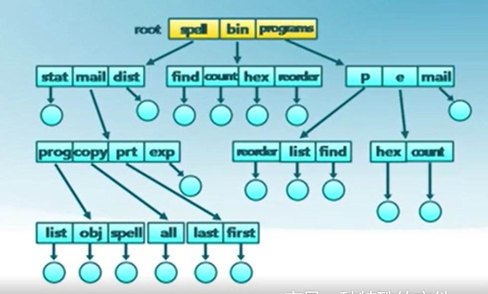
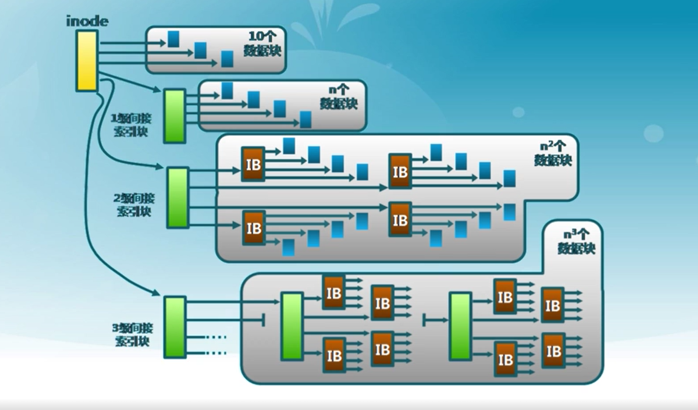
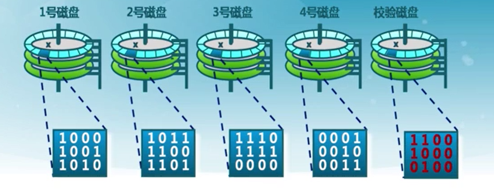
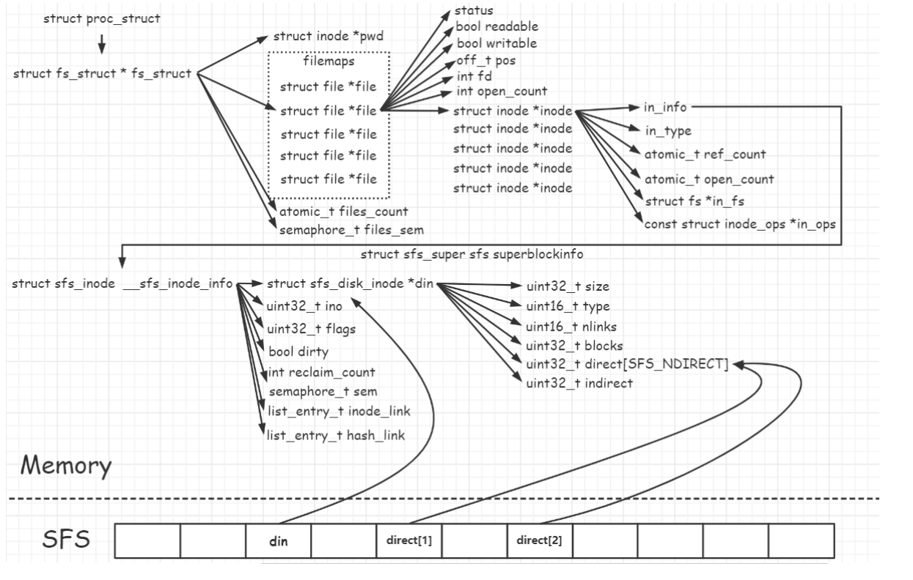
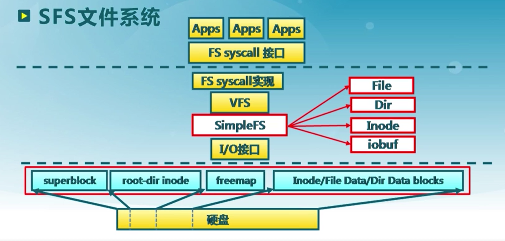

# uCore实验 - Lab8
<!-- TOC -->

- [uCore实验 - Lab8](#ucore实验---lab8)
  - [简介](#简介)
  - [知识点](#知识点)
    - [1. 文件系统和文件](#1-文件系统和文件)
    - [2. 文件描述符](#2-文件描述符)
    - [3. 目录、文件别名和文件系统种类](#3-目录文件别名和文件系统种类)
    - [4. 虚拟文件系统](#4-虚拟文件系统)
    - [5. 文件缓存和打开文件](#5-文件缓存和打开文件)
    - [6. 文件分配](#6-文件分配)
      - [a. 连续分配](#a-连续分配)
      - [b. 链式分配](#b-链式分配)
      - [c. 索引分配](#c-索引分配)
        - [大文件的索引分配](#大文件的索引分配)
      - [d. UFS多级索引分配](#d-ufs多级索引分配)
    - [7. 空闲空间管理](#7-空闲空间管理)
    - [8. 冗余磁盘矩阵RAID](#8-冗余磁盘矩阵raid)
      - [a. 基本概念](#a-基本概念)
      - [b. RAID-0：磁盘条带化](#b-raid-0磁盘条带化)
      - [c. RAID-1：磁盘镜像](#c-raid-1磁盘镜像)
      - [d. RAID-4：带校验的磁盘条带化](#d-raid-4带校验的磁盘条带化)
      - [e. RAID-5：带分布式校验的磁盘条带化](#e-raid-5带分布式校验的磁盘条带化)
      - [f. 可纠正多个磁盘错误的冗余磁盘阵列](#f-可纠正多个磁盘错误的冗余磁盘阵列)
      - [g. RAID嵌套](#g-raid嵌套)
    - [9. uCore文件系统实现](#9-ucore文件系统实现)
      - [a. uCore文件系统概述](#a-ucore文件系统概述)
      - [b. 文件系统结构](#b-文件系统结构)
        - [1) 通用文件系统访问接口层](#1-通用文件系统访问接口层)
        - [2) 文件系统抽象层(VFS)](#2-文件系统抽象层vfs)
          - [VFS接口与数据结构](#vfs接口与数据结构)
          - [inode接口](#inode接口)
        - [3) Simple FS 文件系统层(SFS)](#3-simple-fs-文件系统层sfs)
          - [概述](#概述)
          - [函数接口与数据结构](#函数接口与数据结构)
          - [文件系统布局](#文件系统布局)
          - [索引结点](#索引结点)
        - [4) 外设接口层(I/O设备)](#4-外设接口层io设备)
      - [c. 文件系统挂载流程](#c-文件系统挂载流程)
      - [d. 文件打开流程](#d-文件打开流程)
      - [e. 文件读取流程](#e-文件读取流程)
      - [f. 文件写入流程](#f-文件写入流程)
      - [g. 文件关闭流程](#g-文件关闭流程)
  - [练习解答](#练习解答)
    - [0) 练习0](#0-练习0)
    - [1) 练习1](#1-练习1)
    - [2) 练习2](#2-练习2)

<!-- /TOC -->
## 简介

- 这里是笔者在完成`uCore` Lab 8时写下的一些笔记
- 内容涉及文件系统与I/O子系统的一些相关实现。
- 内容巨多，建议使用导航栏

<!--more-->

## 知识点

### 1. 文件系统和文件

- **文件系统是操作系统中管理持久性数据的子系统，提供数据存储和访问功能**

  - 组织、检索、读写访问数据
  - 大多数计算机系统都有文件系统
  - Google也是一个文件系统

- **文件是具有符号名，由字节序列构成的数据项集合**

  - 文件系统的基本数据单位
  - 文件名是文件的标识符号

- 文件系统的功能

  - **分配文件磁盘空间**
    - 管理文件块（位置和顺序）
    - 管理空闲空间（位置）
    - 分配算法（策略）
  - **管理文件集合**
    - 定位：文件及其内容
    - 命名：通过名字找到文件
    - 文件系统结构：文件组织方式
  - **数据可靠和安全**
    - 安全：多层次保护数据
    - 可靠
      - 持久保存文件
      - 避免系统崩溃、媒体错误、攻击等

- 文件属性

  - 名称、类型、大小、位置、保护、创建者、创建时间、最近修改时间

  - 文件头：文件系统元数据中的文件信息
    - 文件属性
    - 文件存储位置和顺序

### 2. 文件描述符

- 打开文件和文件描述符

  - **文件访问模式**：进程访问文件数据前必须先“打开”文件

  - **内核跟踪**进程打开的所有文件
    - 操作系统为每个进程维护一个打开文件表
    - 文件描述符是打开文件的标识

- 操作系统在打开文件表中维护的打开文件状态和信息

  - **文件指针**
    - 记录最近一次读写位置
    - 每个进程分别维护自己已打开的文件指针
  - **文件打开次数**
    - 当前打开文件的次数
    - 最后一个进程关闭文件时，将其从打开文件表中移除
  - **文件的磁盘信息**：缓存数据访问信息
  - **访问权限**：每个进程的文件访问模式信息

- 文件的**用户视图**和**系统视图**

  - 文件的**用户视图**：持久的**数据结构**

  - 系统访问接口

    - 字节序列的集合（Unix)
    - 系统不关心存储在磁盘上的数据结构

  - 操作系统的**文件视图**

    - 数据块的集合
    - 数据块是逻辑运算单位，而扇区是物理存储单位
    - 块大小通常来说**不等于**扇区大小

  - 用户视图到系统视图的转换

    - 进程读文件：获取字节所在的数据块，返回数据块对应部分
    - 进程写文件：获取数据块，修改数据块中对应部分，写回数据块

    > **文件系统中的基本操作单位是数据块**。

- **访问模式**

  - 操作系统需要了解进程如何访问文件
  - **顺序**访问：按字节依次读取。大多数的文件访问都是顺序读取。
  - **随机**访问：从中间读写。不常用但仍然重要，例如虚拟内存中把内存页存储在文件上
  - **索引**访问：依据数据库特征索引。
    - 通常操作系统不完整提供索引访问
    - 数据库是建立在索引内容的磁盘访问上

- **文件内部结构**

  - 无结构：单词、字节序列
  - 简单记录结构：分列、固定长度、可变长度
  - 复杂结构：格式化的文档、可执行文件、......

- **文件共享和访问控制**

  - **多用户**系统中的文件共享相当重要
  - 访问控制
    - 每个用户能够获得哪些文件的哪些访问权限
    - 访问模式：读、写、执行、删除、列表等
  - 文件访问控制列表（ACL）： <文件实体，权限>
  - Unix模式
    - <用户|组|所有人，读|写|可执行>
    - 用户标识ID：识别用户，表明每个用户所允许的权限及保护模式
    - 组标识ID：允许用户组成组，并指定组访问权限

- **语义一致性**

  - **规定多进程如何同时访问共享文件**
    - 与同步算法类似
    - 因磁盘I/O和网络延迟而设计简单
  - Unix文件系统（UFS）语义
    - 对所打开文件的写入内容立即对其他打开同一文件的其他用户可见
    - 共享文件指针允许多用户同时读取和写入文件
  - 会话语义：写入内容只有当文件关闭时可见
  - 读写锁：一些操作系统和文件系统提供该功能

### 3. 目录、文件别名和文件系统种类

- **分层文件系统**

  - 文件以目录的方式组织起来

  - **目录是一类特殊的文件**：目录的内容是文件索引表 **<文件|指向文件的指针>**

  - 目录和文件的**树形结构**（早期的文件系统是扁平的）

    

- **目录操作**

  - 典型目录操作
    - 搜索、创建、删除文件
    - 列目录、重命名、遍历路径
  - 操作系统应该只允许内核修改目录
    - 确保映射的完整性
    - 应用程序通过系统调用访问目录

- **目录实现**

  - 文件名的线性列表，包含了指向数据块的指针。
    - 编程简单
    - 执行耗时。
  - 哈希表——哈希数据结构的线性表
    - 减少目录搜索时间
    - 碰撞——两个文件名的哈希值相同
    - 固定大小

- **文件别名**

  > 两个或多个文件名关联同一个文件

  - 硬链接：多个文件项指向一个文件

  - 软链接：以“快捷方式”指向其他文件

    > 通过存储其真实文件的逻辑名称来实现。

  

- **文件目录中的循环**

  - 如何保证没有循环
    - 只允许到文件的链接，不允许在子目录的链接
    - 增加链接时，用循环检测算法确定是否合理
  - 更多实践：**限制路径可遍历文件目录的数量**

  

- **名字解析（路径遍历）**
  - 名字解析：把逻辑名字转换成物理资源（如文件）
    - 依据路径名，在文件系统中找到实际文件位置
    - 遍历文件目录直到找到目标文件
  - 举例：解析`/bin/sh`
    - 读取根目录的文件头（在磁盘固定位置）
    - 读取根目录的数据快，搜索`bin`项
    - 读取`bin`的文件头
    - 读取`bin`的数据块，搜索`ls`项
    - 读取`ls`的文件头
  - 当前工作目录（PWD）
    - 每个进程都会指向一个文件目录用于解析文件名
    - 允许用户指定相对路径来代替绝对路径
- 文件系统挂载
  - 文件系统需要先挂载才能被访问
  - 未挂载的文件系统被挂载在挂载点上
- **文件系统种类**
  - 磁盘文件系统：文件存储在数据存储设备上，如磁盘。例如：FAT, NTFS， ext2/3, ISO9660等等
  - 数据库文件系统：文件特征是可被寻址的，例如WinFS
  - 日志文件系统：记录文件系统的修改事件
  - 特殊/虚拟文件系统
  - 网络/分布式文件系统
    - 文件可以通过网络被共享
      - 文件位于远程服务器
      - 客户端远程挂载服务器文件系统
      - 标准系统文件访问被转换为成远程访问
      - 标准文件共享协议：NFS for Unix, CIFS for Windows。
    - 分布式文件系统的挑战
      - 客户端和客户端上的用户辨别起来很复杂
      - **一致性**问题
      - **错误处理模式**

### 4. 虚拟文件系统

- 文件系统的实现：**分层结构**
  - 虚拟（逻辑）文件系统（VFS， Virtual File System）
  - 特定文件系统模块
- **虚拟文件系统（VFS）**
  - 目的：对所有不同文件系统的抽象
  - 功能：
    - 提供相同的文件和文件系统**接口**
    - 管理所有文件和文件系统关联的**数据结构**
    - 高效查询**例程**，遍历文件系统
    - 与特定文件系统模块的**交互**

- **文件系统基本数据结构**
  - 文件卷控制块（Unix： `superblock`)
    - 每个文件系统一个
    - 文件系统详细信息
    - 块、块大小、空余块、计数/指针等
  - 文件控制块（Unix: `vnode` or `inode`)
    - 每个文件一个
    - 文件详细信息
    - 访问权限、拥有者、大小、数据块位置等
  - 目录项（Linux: `dentry`）
    - 每个目录项一个（目录和文件）
    - 将目录项数据结构及树型布局编码成树型数据结构
    - 指向文件控制块、父目录、子目录等
- **文件系统的存储结构**
  - 文件系统数据结构：**卷控制块、文件控制块、目录节点**
  - 持久存储在外存中：存储设备的数据块中
  - 当需要时加载进内存
    - 卷控制模块：当文件系统挂载时进入内存
    - 文件控制块：当文件被访问时进入内存
    - 目录节点：在遍历一个文件路径时进入内存

### 5. 文件缓存和打开文件

- 数据块缓存
  - 数据块按需读入内存
    - 提供read()操作
    - 预读：预先读取后面的数据块
  - 数据块使用后被缓存
    - 假设数据将会再次用到
    - 写操作可能被缓存和延迟写入
  - 两种数据块缓存方式
    - 数据块缓存
    - 页缓存：统一缓存数据块和内存页
- 页缓存
  - **虚拟页式存储**：在虚拟地址空间中虚拟页面可映射到本地外存文件中
  - **文件数据块的页缓存**
    - 在虚拟内存中文件数据块被映射成页
    - 文件的读写操作被转换成对内存的访问
    - 可能导致缺页或设置为脏页
    - **存在的问题：页置换算法需要协调虚拟存储和页缓存间的页面数**
- 文件系统中打开文件的数据结构
  - 文件描述符
    - 每个被打开的文件都有一个文件描述符
    - 文件状态信息：目录项、当前文件指针、文件操作设置等
  - 打开文件表
    - 每个进程都有一个**进程打开文件表**
    - 一个系统级的打开文件表
    - 有文件被打开时，文件卷就不能被卸载

- 打开文件锁

  > 一些文件系统提供文件锁，用于协调多进程的文件访问

  - **强制**——根据锁保持情况和访问需求确定是否拒绝访问
  - **劝告**——进程可以查找锁的状态来决定怎么处理

### 6. 文件分配

- 文件大小
  - 大多数文件都很小
    - 需要对小文件提供很好的支持
    - 块空间不能太大
  - 一些文件非常大
    - 必须支持大文件（64位文件偏移）
    - 大文件访问需要高效
- 文件分配
  - 如何表示分配给一个文件数据块的位置和顺序
  - 分配方式：连续分配、链式分配、索引分配
  - 指标：存储效率（外部碎片等）、读写性能（访问速度等）

#### a. 连续分配

- 文件头指定起始块和长度
- 分配策略：**最先匹配、最佳匹配**
- 优点：文件读取表现好；**高效的顺序和随机访问**
- 缺点：
  - **碎片严重！**
  - **文件大小如何增长？** 预分配 ？ / 按需分配？

#### b. 链式分配

- 文件以数据块链表方式存储
- 文件头包含了到第一块和最后一块的指针
- 优点
  - 创建、增大、缩小很容易
  - 没有碎片
- 缺点
  - 无法实现真正的随机访问
  - 可靠性差：破坏一个链，后面的数据块全部丢失

#### c. 索引分配

- 为每个文件创建一个**索引数据块**，该索引数据块是指向文件数据块的指针列表
- 文件头包含了索引数据块指针列表
- 优点
  - 创建、增大、缩小很容易
  - 没有碎片
  - 支持直接访问
- 缺点
  - 当文件很小时，存储索引的开销大
  - 不便于处理大文件

##### 大文件的索引分配

- 使用链式索引块：将多个索引块以链表的方式串联起来
- 多级索引块：一个一级索引块指向多个二级索引块等等

#### d. UFS多级索引分配



- 文件头包含13个指针
  - 前10个指针指向数据块
  - 第11个指针指向索引块
  - 第12个指针指向二级索引块
  - 第13个指针指向三级索引块
- 效果
  - 提高了文件大小限制阈值
  - 动态分配数据块，文件扩展很容易
  - 小文件开销小
  - 只为大文件分配间接数据块，大文件在访问数据块时需要大量查询

### 7. 空闲空间管理

跟踪记录文件卷中未分配的数据块

> 采用什么数据结构表示空闲空间列表？

- 位图
  - 用位图代表空闲数据块列表
    - `11111110011001001010010101`
    - $D_i = 0$表示数据块$i$是空闲，否则表示已分配
  - 使用简单但可能会是一个大的向量表
    - 160GB磁盘 -> 40MB数据块 -> 5MB位图
    - 假定空闲空间在磁盘中均匀分布，则找到`0`前需要扫描**磁盘数据块总数/空闲块数目**
- 链表
- 链式索引

### 8. 冗余磁盘矩阵RAID

#### a. 基本概念

- 磁盘分区

  > 通常磁盘通过分区来最大限度减小寻道时间

  - 分区是一组柱面的集合
  - 每个分区都可视为逻辑上独立的磁盘

  

- 一个典型的磁盘文件系统组织

  - 文件卷：一个拥有完整文件系统实例的外存空间，通常常驻在磁盘的单个分区上

  - 

- 多磁盘管理

  - 使用多磁盘可改善
    - 吞吐量（通过并行）
    - 可靠性和可用性（通过冗余）
  - 冗余磁盘阵列（RAID，Redundant Array of Inexpensive disks）
    - 多种磁盘管理技术
    - RAID分类：RAID-0、RAID-1、RAID-5
  - 冗余磁盘阵列的实现
    - 软件：操作系统内核的文件卷管理
    - 硬件：RAID硬件控制器（I/O）

#### b. RAID-0：磁盘条带化

> 基于数据块的条带化

把数据块分成多个子块，存储在独立的磁盘中

> 通过独立磁盘上并行数据块访问提供更大的磁盘带宽


#### c. RAID-1：磁盘镜像

向两个磁盘写入，从任何一个读取

- 可靠性成倍增加
- 读取性能线性增加


#### d. RAID-4：带校验的磁盘条带化

> 基于数据块的条带化

数据块级的磁盘条带化加专用奇偶校验磁盘

> 允许从任意一个故障磁盘中恢复



#### e. RAID-5：带分布式校验的磁盘条带化

> 基于数据块的条带化


#### f. 可纠正多个磁盘错误的冗余磁盘阵列

- RAID-5：每组条带块有一个奇偶校验块，允许一个磁盘错误
- RAID-6：每组条带块有两个冗余块，允许两个磁盘错误

#### g. RAID嵌套

- RAID 0+1

  

- RAID 1+0

  

### 9. uCore文件系统实现

#### a. uCore文件系统概述

操作系统中负责管理和存储可长期保存数据的软件功能模块称为文件系统。在本次试验中，主要侧重文件系统的设计实现和对文件系统执行流程的分析与理解。

ucore的文件系统模型源于Havard的OS161的文件系统和Linux文件系统。但其实这二者都是源于传统的UNIX文件系统设计。UNIX提出了四个文件系统抽象概念：文件(file)、目录项(dentry)、索引节点(inode)和安装点(mount point)。

- **文件**：UNIX文件中的内容可理解为是一有序字节buffer，文件都有一个方便应用程序识别的文件名称（也称文件路径名）。典型的文件操作有读、写、创建和删除等。
- **目录项**：目录项不是目录（又称文件路径），而是目录的组成部分。在UNIX中目录被看作一种特定的文件，而目录项是文件路径中的一部分。如一个文件路径名是“/test/testfile”，则包含的目录项为：根目录“/”，目录“test”和文件“testfile”，这三个都是目录项。一般而言，目录项包含目录项的名字（文件名或目录名）和目录项的索引节点（见下面的描述）位置。
- **索引节点**：UNIX将文件的相关元数据信息（如访问控制权限、大小、拥有者、创建时间、数据内容等等信息）存储在一个单独的数据结构中，该结构被称为索引节点。
- **安装点**：在UNIX中，文件系统被安装在一个特定的文件路径位置，这个位置就是安装点。所有的已安装文件系统都作为根文件系统树中的叶子出现在系统中。

上述抽象概念形成了UNIX文件系统的逻辑数据结构，并需要通过一个具体文件系统的架构设计与实现把上述信息映射并储存到磁盘介质上，从而在具体文件系统的磁盘布局（即数据在磁盘上的物理组织）上具体体现出上述抽象概念。

> 比如文件元数据信息存储在磁盘块中的索引节点上。当文件被载入内存时，内核需要使用磁盘块中的索引点来构造内存中的索引节点。

ucore模仿了UNIX的文件系统设计，ucore的文件系统架构主要由四部分组成：

- **通用文件系统访问接口层**：该层提供了一个从用户空间到文件系统的标准访问接口。这一层访问接口让应用程序能够通过一个简单的接口获得ucore内核的文件系统服务。
- **文件系统抽象层**：向上提供一个一致的接口给内核其他部分（文件系统相关的系统调用实现模块和其他内核功能模块）访问。向下提供一个同样的抽象函数指针列表和数据结构屏蔽不同文件系统的实现细节。
- **Simple FS文件系统层**：一个基于索引方式的简单文件系统实例。向上通过各种具体函数实现以对应文件系统抽象层提出的抽象函数。向下访问外设接口
- **外设接口层**：向上提供device访问接口屏蔽不同硬件细节。向下实现访问各种具体设备驱动的接口，比如disk设备接口/串口设备接口/键盘设备接口等。

对照上面的层次我们再大致介绍一下文件系统的访问处理过程，加深对文件系统的总体理解。假如应用程序操作文件（打开/创建/删除/读写），首先需要通过文件系统的通用文件系统访问接口层给用户空间提供的访问接口进入文件系统内部，接着由文件系统抽象层把访问请求转发给某一具体文件系统（比如SFS文件系统），具体文件系统（Simple FS文件系统层）把应用程序的访问请求转化为对磁盘上的block的处理请求，并通过外设接口层交给磁盘驱动例程来完成具体的磁盘操作。结合用户态写文件函数write的整个执行过程，我们可以比较清楚地看出ucore文件系统架构的层次和依赖关系。


**ucore文件系统总体结构**

从ucore操作系统不同的角度来看，ucore中的文件系统架构包含四类主要的数据结构, 它们分别是：

- **超级块（SuperBlock）**，它主要从文件系统的全局角度描述特定文件系统的全局信息。它的作用范围是整个OS空间。
- **索引节点（inode）**：它主要从文件系统的单个文件的角度它描述了文件的各种属性和数据所在位置。它的作用范围是整个OS空间。
- **目录项（dentry）**：它主要从文件系统的文件路径的角度描述了文件路径中的一个特定的目录项（注：一系列目录项形成目录/文件路径）。它的作用范围是整个OS空间。对于SFS而言，inode(具体为struct sfs_disk_inode)对应于物理磁盘上的具体对象，dentry（具体为struct sfs_disk_entry）是一个内存实体，其中的ino成员指向对应的inode number，另外一个成员是file name(文件名).
- **文件（file）**，它主要从进程的角度描述了一个进程在访问文件时需要了解的文件标识，文件读写的位置，文件引用情况等信息。它的作用范围是某一具体进程。

如果一个用户进程打开了一个文件，那么在ucore中涉及的相关数据结构（其中相关数据结构将在下面各个小节中展开叙述）和关系如下图所示：


先上一张相关数据结构的关联图

> 自己画的太丑了T_T，该图来源[resery](http://www.resery.top/)



文件系统整体结构



我们先从上到下分析一下结构

#### b. 文件系统结构

##### 1) 通用文件系统访问接口层

在内核中，通用的文件相关的函数分别是以下这些函数，同时也是我们在uCore中最常使用的函数。

```cpp
int sysfile_open(const char *path, uint32_t open_flags);        // Open or create a file. FLAGS/MODE per the syscall.
int sysfile_close(int fd);                                      // Close a vnode opened  
int sysfile_read(int fd, void *base, size_t len);               // Read file
int sysfile_write(int fd, void *base, size_t len);              // Write file
int sysfile_seek(int fd, off_t pos, int whence);                // Seek file  
int sysfile_fstat(int fd, struct stat *stat);                   // Stat file
int sysfile_fsync(int fd);                                      // Sync file
int sysfile_chdir(const char *path);                            // change DIR  
int sysfile_mkdir(const char *path);                            // create DIR
int sysfile_link(const char *path1, const char *path2);         // set a path1's link as path2
int sysfile_rename(const char *path1, const char *path2);       // rename file
int sysfile_unlink(const char *path);                           // unlink a path
int sysfile_getcwd(char *buf, size_t len);                      // get current working directory
int sysfile_getdirentry(int fd, struct dirent *direntp);        // get the file entry in DIR
int sysfile_dup(int fd1, int fd2);                              // duplicate file
int sysfile_pipe(int *fd_store);                                // build PIPE
int sysfile_mkfifo(const char *name, uint32_t open_flags);      // build named PIPE
```

在这些`sysfile_xx`函数中，调用的下一层函数分别是封装好的各个`file_xx`函数

```cpp
int file_open(char *path, uint32_t open_flags);
int file_close(int fd);
int file_read(int fd, void *base, size_t len, size_t *copied_store);
int file_write(int fd, void *base, size_t len, size_t *copied_store);
int file_seek(int fd, off_t pos, int whence);
int file_fstat(int fd, struct stat *stat);
int file_fsync(int fd);
int file_getdirentry(int fd, struct dirent *dirent);
int file_dup(int fd1, int fd2);
int file_pipe(int fd[]);
int file_mkfifo(const char *name, uint32_t open_flags);
```

通常来讲，这些函数都会操作当前进程访问文件的数据接口，即`current->filesp`。该`struct files_struct`结构如下所示

```cpp
/*
 * process's file related informaction
 */
struct files_struct {
    struct inode *pwd;      // inode of present working directory
    struct file *fd_array;  // opened files array
    int files_count;        // the number of opened files
    semaphore_t files_sem;  // lock protect sem
};
```

该结构中包含了当前进程的工作路径、所打开的文件数组集合以及信号量等。

在`fd_array`数组中，每个进程打开的文件所对应的索引，就是该文件在该进程所对应的文件描述符。

> 即不同进程打开文件时，返回的文件描述符可能时是不一样的。

##### 2) 文件系统抽象层(VFS)

###### VFS接口与数据结构

> 文件系统抽象层是把不同文件系统的对外共性接口提取出来，形成一个函数指针数组，这样，通用文件系统访问接口层只需访问文件系统抽象层，而不需关心具体文件系统的实现细节和接口。

系统接口再下一层就到了`VFS`虚拟文件系统。VFS函数涉及到了文件结构`struct file`。该结构体指定了文件的相关类型，包括读写权限，文件描述符`fd`，当前读取到的位置`pos`，文件系统中与硬盘特定区域所对应的结点`node`，以及打开的引用次数`open_count`

```cpp
struct file {
    enum {
        FD_NONE, FD_INIT, FD_OPENED, FD_CLOSED,
    } status;
    bool readable;
    bool writable;
    int fd;
    off_t pos; // 下一次写入的起始位置
    struct inode *node;
    int open_count;
};
```

虚拟文件系统中，所使用的相关函数接口分别是

```cpp
/*
 * Virtual File System layer functions.
 *
 * The VFS layer translates operations on abstract on-disk files or
 * pathnames to operations on specific files on specific filesystems.
 */
void vfs_init(void);
void vfs_cleanup(void);
void vfs_devlist_init(void);

/*
 * VFS layer low-level operations.
 * See inode.h for direct operations on inodes.
 * See fs.h for direct operations on filesystems/devices.
 *
 *    vfs_set_curdir   - change current directory of current thread by inode
 *    vfs_get_curdir   - retrieve inode of current directory of current thread
 *    vfs_get_root     - get root inode for the filesystem named DEVNAME
 *    vfs_get_devname  - get mounted device name for the filesystem passed in
 */
int vfs_set_curdir(struct inode *dir);
int vfs_get_curdir(struct inode **dir_store);
int vfs_get_root(const char *devname, struct inode **root_store);
const char *vfs_get_devname(struct fs *fs);

/*
 * VFS layer high-level operations on pathnames
 * Because namei may destroy pathnames, these all may too.
 *
 *    vfs_open         - Open or create a file. FLAGS/MODE per the syscall.
 *    vfs_close  - Close a inode opened with vfs_open. Does not fail.
 *                 (See vfspath.c for a discussion of why.)
 *    vfs_link         - Create a hard link to a file.
 *    vfs_symlink      - Create a symlink PATH containing contents CONTENTS.
 *    vfs_readlink     - Read contents of a symlink into a uio.
 *    vfs_mkdir        - Create a directory. MODE per the syscall.
 *    vfs_unlink       - Delete a file/directory.
 *    vfs_rename       - rename a file.
 *    vfs_chdir  - Change current directory of current thread by name.
 *    vfs_getcwd - Retrieve name of current directory of current thread.
 *
 */
int vfs_open(char *path, uint32_t open_flags, struct inode **inode_store);
int vfs_close(struct inode *node);
int vfs_link(char *old_path, char *new_path);
int vfs_symlink(char *old_path, char *new_path);
int vfs_readlink(char *path, struct iobuf *iob);
int vfs_mkdir(char *path);
int vfs_unlink(char *path);
int vfs_rename(char *old_path, char *new_path);
int vfs_chdir(char *path);
int vfs_getcwd(struct iobuf *iob);

/*
 * VFS layer mid-level operations.
 *
 *    vfs_lookup     - Like VOP_LOOKUP, but takes a full device:path name,
 *                     or a name relative to the current directory, and
 *                     goes to the correct filesystem.
 *    vfs_lookparent - Likewise, for VOP_LOOKPARENT.
 *
 * Both of these may destroy the path passed in.
 */
int vfs_lookup(char *path, struct inode **node_store);
int vfs_lookup_parent(char *path, struct inode **node_store, char **endp);

/*
 * Misc
 *
 *    vfs_set_bootfs - Set the filesystem that paths beginning with a
 *                    slash are sent to. If not set, these paths fail
 *                    with ENOENT. The argument should be the device
 *                    name or volume name for the filesystem (such as
 *                    "lhd0:") but need not have the trailing colon.
 *
 *    vfs_get_bootfs - return the inode of the bootfs filesystem.
 *
 *    vfs_add_fs     - Add a hardwired filesystem to the VFS named device
 *                    list. It will be accessible as "devname:". This is
 *                    intended for filesystem-devices like emufs, and
 *                    gizmos like Linux procfs or BSD kernfs, not for
 *                    mounting filesystems on disk devices.
 *
 *    vfs_add_dev    - Add a device to the VFS named device list. If
 *                    MOUNTABLE is zero, the device will be accessible
 *                    as "DEVNAME:". If the mountable flag is set, the
 *                    device will be accessible as "DEVNAMEraw:" and
 *                    mountable under the name "DEVNAME". Thus, the
 *                    console, added with MOUNTABLE not set, would be
 *                    accessed by pathname as "con:", and lhd0, added
 *                    with mountable set, would be accessed by
 *                    pathname as "lhd0raw:" and mounted by passing
 *                    "lhd0" to vfs_mount.
 *
 *    vfs_mount      - Attempt to mount a filesystem on a device. The
 *                    device named by DEVNAME will be looked up and
 *                    passed, along with DATA, to the supplied function
 *                    MOUNTFUNC, which should create a struct fs and
 *                    return it in RESULT.
 *
 *    vfs_unmount    - Unmount the filesystem presently mounted on the
 *                    specified device.
 *
 *    vfs_unmountall - Unmount all mounted filesystems.
 */
int vfs_set_bootfs(char *fsname);
int vfs_get_bootfs(struct inode **node_store);

int vfs_add_fs(const char *devname, struct fs *fs);
int vfs_add_dev(const char *devname, struct inode *devnode, bool mountable);

int vfs_mount(const char *devname, int (*mountfunc)(struct device *dev, struct fs **fs_store));
int vfs_unmount(const char *devname);
int vfs_unmount_all(void);

// vfs中更为底层的函数
struct inode_ops {
    unsigned long vop_magic;
    int (*vop_open)(struct inode *node, uint32_t open_flags);
    int (*vop_close)(struct inode *node);
    int (*vop_read)(struct inode *node, struct iobuf *iob);
    int (*vop_write)(struct inode *node, struct iobuf *iob);
    int (*vop_fstat)(struct inode *node, struct stat *stat);
    int (*vop_fsync)(struct inode *node);
    int (*vop_namefile)(struct inode *node, struct iobuf *iob);
    int (*vop_getdirentry)(struct inode *node, struct iobuf *iob);
    int (*vop_reclaim)(struct inode *node);
    int (*vop_gettype)(struct inode *node, uint32_t *type_store);
    int (*vop_tryseek)(struct inode *node, off_t pos);
    int (*vop_truncate)(struct inode *node, off_t len);
    int (*vop_create)(struct inode *node, const char *name, bool excl, struct inode **node_store);
    int (*vop_lookup)(struct inode *node, char *path, struct inode **node_store);
    int (*vop_ioctl)(struct inode *node, int op, void *data);
};
```

###### inode接口

`vfs`会涉及到`inode`结构的操作，该结构是位于内存的索引节点，它是VFS结构中的重要数据结构，因为它实际负责把不同文件系统的特定索引节点信息（甚至不能算是一个索引节点）统一封装起来，避免了进程直接访问具体文件系统。其定义如下：

```cpp
/*
 * A struct inode is an abstract representation of a file.
 *
 * It is an interface that allows the kernel's filesystem-independent
 * code to interact usefully with multiple sets of filesystem code.
 */

/*
 * Abstract low-level file.
 *
 * Note: in_info is Filesystem-specific data, in_type is the inode type
 *
 * open_count is managed using VOP_INCOPEN and VOP_DECOPEN by
 * vfs_open() and vfs_close(). Code above the VFS layer should not
 * need to worry about it.
 */
struct inode {
    union {
        // 设备结点
        struct device __device_info;
        // 对应文件系统中，文件/目录的实际节点
        struct sfs_inode __sfs_inode_info;
    } in_info;
    enum {
        inode_type_device_info = 0x1234,
        inode_type_sfs_inode_info,
    } in_type;
    int ref_count;
    int open_count;
    struct fs *in_fs;
    const struct inode_ops *in_ops;
};
```

`struct inode`中存放了`info`、类型`type`、引用次数`ref_count`、打开次数`open_count`、相关联的文件系统`in_fs`以及当前结构所对应的操作集合`in_ops`。该结构与硬盘上对应区域相关联，从而便于对硬盘进行操作。

`inode_ops`成员是对常规文件、目录、设备文件所有操作的一个抽象函数表示。对于某一具体的文件系统中的文件或目录，只需实现相关的函数，就可以被用户进程访问具体的文件了，且用户进程无需了解具体文件系统的实现细节。可选实现如下：

```cpp
/*
 * Function table for device inodes.
 */
// The sfs specific DIR operations correspond to the abstract operations on a inode.
static const struct inode_ops sfs_node_dirops = {
    .vop_magic                      = VOP_MAGIC,
    .vop_open                       = sfs_opendir,
    .vop_close                      = sfs_close,
    .vop_fstat                      = sfs_fstat,
    .vop_fsync                      = sfs_fsync,
    .vop_namefile                   = sfs_namefile,
    .vop_getdirentry                = sfs_getdirentry,
    .vop_reclaim                    = sfs_reclaim,
    .vop_gettype                    = sfs_gettype,
    .vop_lookup                     = sfs_lookup,
};
/// The sfs specific FILE operations correspond to the abstract operations on a inode.
static const struct inode_ops sfs_node_fileops = {
    .vop_magic                      = VOP_MAGIC,
    .vop_open                       = sfs_openfile,
    .vop_close                      = sfs_close,
    .vop_read                       = sfs_read,
    .vop_write                      = sfs_write,
    .vop_fstat                      = sfs_fstat,
    .vop_fsync                      = sfs_fsync,
    .vop_reclaim                    = sfs_reclaim,
    .vop_gettype                    = sfs_gettype,
    .vop_tryseek                    = sfs_tryseek,
    .vop_truncate                   = sfs_truncfile,
};
static const struct inode_ops dev_node_ops = {
    .vop_magic                      = VOP_MAGIC,
    .vop_open                       = dev_open,
    .vop_close                      = dev_close,
    .vop_read                       = dev_read,
    .vop_write                      = dev_write,
    .vop_fstat                      = dev_fstat,
    .vop_ioctl                      = dev_ioctl,
    .vop_gettype                    = dev_gettype,
    .vop_tryseek                    = dev_tryseek,
    .vop_lookup                     = dev_lookup,
};
```

`inode`结构是与文件系统相关的，不同文件系统所实现的`inode`结构是不同的，它的存在可以让VFS忽略更下一级的文件系统差异，使之注重于提供一个统一的文件系统接口。`inode`根据其`in_info`的不同而实现其不同的功能。

> 文件系统抽象层VFS提供了file接口、dir接口、inode接口、fs接口以及外设接口。而这些接口在`sfs`中被具体实现。

##### 3) Simple FS 文件系统层(SFS)

###### 概述

从`VFS`向下一层，就是`SFS`。

ucore内核把所有文件都看作是字节流，任何内部逻辑结构都是专用的，由应用程序负责解释。但是ucore区分文件的物理结构。ucore目前支持如下几种类型的文件：

- 常规文件：文件中包括的内容信息是由应用程序输入。SFS文件系统在普通文件上不强加任何内部结构，把其文件内容信息看作为字节。
- 目录：包含一系列的entry，每个entry包含文件名和指向与之相关联的索引节点（index node）的指针。目录是按层次结构组织的。
- 链接文件：实际上一个链接文件是一个已经存在的文件的另一个可选择的文件名。
- 设备文件：不包含数据，但是提供了一个映射物理设备（如串口、键盘等）到一个文件名的机制。可通过设备文件访问外围设备。
- 管道：管道是进程间通讯的一个基础设施。管道缓存了其输入端所接受的数据，以便在管道输出端读的进程能一个先进先出的方式来接受数据。

SFS文件系统中目录和常规文件具有共同的属性，而这些属性保存在索引节点中。SFS通过索引节点来管理目录和常规文件，索引节点包含操作系统所需要的关于某个文件的关键信息，比如文件的属性、访问许可权以及其它控制信息都保存在索引节点中。可以有多个文件名可指向一个索引节点。

###### 函数接口与数据结构

```cpp
void sfs_init(void);
int sfs_mount(const char *devname);

void lock_sfs_fs(struct sfs_fs *sfs);
void lock_sfs_io(struct sfs_fs *sfs);
void unlock_sfs_fs(struct sfs_fs *sfs);
void unlock_sfs_io(struct sfs_fs *sfs);

int sfs_rblock(struct sfs_fs *sfs, void *buf, uint32_t blkno, uint32_t nblks);
int sfs_wblock(struct sfs_fs *sfs, void *buf, uint32_t blkno, uint32_t nblks);
int sfs_rbuf(struct sfs_fs *sfs, void *buf, size_t len, uint32_t blkno, off_t offset);
int sfs_wbuf(struct sfs_fs *sfs, void *buf, size_t len, uint32_t blkno, off_t offset);
int sfs_sync_super(struct sfs_fs *sfs);
int sfs_sync_freemap(struct sfs_fs *sfs);
int sfs_clear_block(struct sfs_fs *sfs, uint32_t blkno, uint32_t nblks);

int sfs_load_inode(struct sfs_fs *sfs, struct inode **node_store, uint32_t ino);

static int sfs_sync(struct fs *fs);
static struct inode* sfs_get_root(struct fs *fs) ;
static int sfs_unmount(struct fs *fs);
static void sfs_cleanup(struct fs *fs);
static int fs_init_read(struct device *dev, uint32_t blkno, void *blk_buffer);
static int fs_do_mount(struct device *dev, struct fs **fs_store);
// ......
```

在`SFS`中涉及到了两种文件系统结构，分别是`fs`和`sfs_fs`。`fs`结构是我们在上层函数调用中所直接操作的抽象文件系统，而`sfs_fs`则是在下层函数中所使用的。在原先`sfs_fs`上抽象出一层`fs`结构有助于忽略不同文件系统的差异。其实现如下所示

```cpp
/*
 * Abstract filesystem. (Or device accessible as a file.)
 *
 * Information:
 *      fs_info   : filesystem-specific data (sfs_fs)
 *      fs_type   : filesystem type
 * Operations:
 *
 *      fs_sync       - Flush all dirty buffers to disk.
 *      fs_get_root   - Return root inode of filesystem.
 *      fs_unmount    - Attempt unmount of filesystem.
 *      fs_cleanup    - Cleanup of filesystem.???
 *
 *
 * fs_get_root should increment the refcount of the inode returned.
 * It should not ever return NULL.
 *
 * If fs_unmount returns an error, the filesystem stays mounted, and
 * consequently the struct fs instance should remain valid. On success,
 * however, the filesystem object and all storage associated with the
 * filesystem should have been discarded/released.
 *
 */
struct fs {
    union {
        struct sfs_fs __sfs_info;
    } fs_info;                                     // filesystem-specific data
    enum {
        fs_type_sfs_info,
    } fs_type;                                     // filesystem type
    int (*fs_sync)(struct fs *fs);                 // Flush all dirty buffers to disk
    struct inode *(*fs_get_root)(struct fs *fs);   // Return root inode of filesystem.
    int (*fs_unmount)(struct fs *fs);              // Attempt unmount of filesystem.
    void (*fs_cleanup)(struct fs *fs);             // Cleanup of filesystem.???
};


/* filesystem for sfs */
struct sfs_fs {
    struct sfs_super super;                         /* on-disk superblock */
    struct device *dev;                             /* device mounted on */
    struct bitmap *freemap;                         /* blocks in use are mared 0 */
    bool super_dirty;                               /* true if super/freemap modified */
    void *sfs_buffer;                               /* buffer for non-block aligned io */
    semaphore_t fs_sem;                             /* semaphore for fs */
    semaphore_t io_sem;                             /* semaphore for io */
    semaphore_t mutex_sem;                          /* semaphore for link/unlink and rename */
    list_entry_t inode_list;                        /* inode linked-list */
    list_entry_t *hash_list;                        /* inode hash linked-list */
};
```

`sfs_fs`结构中包含了底层设备的超级块`superblock`、所挂载的设备`dev`、以及底层设备中用于表示空间分配情况的`freemap`等。

###### 文件系统布局

文件系统通常保存在磁盘上。在本实验中，第三个磁盘（即disk0，前两个磁盘分别是 ucore.img 和 swap.img）用于存放一个SFS文件系统（Simple Filesystem）。通常文件系统中，磁盘的使用是以扇区（Sector）为单位的，但是为了实现简便，SFS 中以 block （4K，与内存 page 大小相等）为基本单位。

SFS文件系统的布局如下

```cpp
+------------+----------+---------+-------------------------------------+
| superblock | root-dir | freemap | Inode / File Data / Dir Data blocks |
+------------+----------+---------+-------------------------------------+
```

- 第0个块（4K）是超级块（superblock），它包含了关于文件系统的所有关键参数，当计算机被启动或文件系统被首次接触时，超级块的内容就会被装入内存。其定义如下：

  ```cpp
  /*
   * On-disk superblock
   */
  struct sfs_super {
      // 超级块结构中包含成员变量魔数magic，内核通过它来检查磁盘镜像是否是合法的 SFS img
      uint32_t magic;                                 /* magic number, should be SFS_MAGIC */
      uint32_t blocks;                                /* # of blocks in fs */
      uint32_t unused_blocks;                         /* # of unused blocks in fs */
      char info[SFS_MAX_INFO_LEN + 1];                /* infomation for sfs  */
  };
  ```

- 第1个块放了一个root-dir的inode，用来记录根目录的相关信息。root-dir是SFS文件系统的根结点，通过这个root-dir的inode信息就可以定位并查找到根目录下的所有文件信息。

- 从第2个块开始，根据SFS中所有块的数量，用1个bit来表示一个块的占用和未被占用的情况。这个区域称为SFS的freemap区域，这将占用若干个块空间。为了更好地记录和管理freemap区域

- 最后在剩余的磁盘空间中，存放了所有其他目录和文件的inode信息和内容数据信息。需要注意的是虽然inode的大小小于一个块的大小（4096B），但为了实现简单，每个 inode 都占用一个完整的 block。

###### 索引结点

- 在`sfs`层面上，`inode`结构既可表示文件`file`、目录`dir`，也可表示设备`device`。而区分`inode`结构的操作有两种，一种是其`in_info`成员变量，另一种是该结构的成员指针`in_ops`。以下是函数`sfs_get_ops`的源码，该函数返回某个属性（文件/目录）所对应的`inode`操作：

  > 注意，设置inode_ops的操作不止一处，以下代码只作为示例。

  ```cpp
  /*
   * sfs_get_ops - return function addr of fs_node_dirops/sfs_node_fileops
   */
  static const struct inode_ops *
  sfs_get_ops(uint16_t type) {
      switch (type) {
      case SFS_TYPE_DIR:
          return &sfs_node_dirops;
      case SFS_TYPE_FILE:
          return &sfs_node_fileops;
      }
      panic("invalid file type %d.\n", type);
  }
  ```

  当uCore创建一个**用于存储文件/目录**的`inode`结构（即该`inode`结构的`in_info`成员变量为`sfs_inode`类型）时，程序会执行函数`sfs_create_inode`。该函数会将`inode`结构中的`sfs_inode`成员与磁盘对应结点`sfs_disk_inode`相关联，从而使得只凭`inode`即可操作该结点。

  > 用于描述设备`device`的`inode`会在其他函数中被初始化，不会执行函数`sfs_create_inode`

  ```cpp
  /*
   * sfs_create_inode - alloc a inode in memroy, and init din/ino/dirty/reclian_count/sem fields in sfs_inode in inode
   */
  static int
  sfs_create_inode(struct sfs_fs *sfs, struct sfs_disk_inode *din, uint32_t ino, struct inode **node_store) {
      struct inode *node;
      if ((node = alloc_inode(sfs_inode)) != NULL) {
          vop_init(node, sfs_get_ops(din->type), info2fs(sfs, sfs));
          struct sfs_inode *sin = vop_info(node, sfs_inode);
          sin->din = din, sin->ino = ino, sin->dirty = 0, sin->reclaim_count = 1;
          sem_init(&(sin->sem), 1);
          *node_store = node;
          return 0;
      }
      return -E_NO_MEM;
  }
  ```

- **磁盘索引结点**——保存在硬盘中的索引结点

  `sfs_disk_inode`结构记录了文件或目录的内容存储的索引信息，该数据结构在硬盘里储存，需要时读入内存。`type`成员表明该结构是目录类型还是文件类型，又或者是链接`link`类型。如果`inode`表示的是文件，则成员变量`direct[]`直接指向了保存文件内容数据的数据块索引值。`indirect`指向的是间接数据块，此数据块实际存放的全部是数据块索引，这些数据块索引指向的数据块才被用来存放文件内容数据。
  
  ```cpp
  /* file types */
  #define SFS_TYPE_INVAL                              0       /* Should not appear on disk */
  #define SFS_TYPE_FILE                               1
  #define SFS_TYPE_DIR                                2
  #define SFS_TYPE_LINK                               3
  /* inode (on disk) */
  struct sfs_disk_inode {
      uint32_t size;                                  /* size of the file (in bytes) */
      uint16_t type;                                  /* one of SYS_TYPE_* above */
      uint16_t nlinks;                                /* # of hard links to this file */
      uint32_t blocks;                                /* # of blocks */
      uint32_t direct[SFS_NDIRECT];                   /* direct blocks */
      uint32_t indirect;                              /* indirect blocks */
  };
  ```

  对于普通文件，索引值指向的 block 中保存的是文件中的数据。而对于目录，索引值指向的数据保存的是目录下所有的文件名以及对应的索引节点所在的索引块（磁盘块）所形成的数组。数据结构如下：
  
  ```cpp
  /* file entry (on disk) */
  struct sfs_disk_entry {
      uint32_t ino;                                   /* inode number */
      char name[SFS_MAX_FNAME_LEN + 1];               /* file name */
  };
  ```

- **内存索引结点**——保存在内存中的索引结点

  ```cpp
  /* inode for sfs */
  struct sfs_inode {
      struct sfs_disk_inode *din;                     /* on-disk inode */
      uint32_t ino;                                   /* inode number */
      bool dirty;                                     /* true if inode modified */
      int reclaim_count;                              /* kill inode if it hits zero */
      semaphore_t sem;                                /* semaphore for din */
      list_entry_t inode_link;                        /* entry for linked-list in sfs_fs */
      list_entry_t hash_link;                         /* entry for hash linked-list in sfs_fs */
  };
  ```

  SFS中的内存`sfs_inode`除了包含SFS的硬盘`sfs_disk_inode`信息，而且还增加了其他一些信息。这些信息用于判断相关硬盘位置是否改写、互斥操作、回收和快速地定位等作用。

  > 需要注意的是，一个内存`sfs_inode`是在打开一个文件后才创建的，如果关机则相关信息都会消失。而硬盘`sfs_disk_inode`的内容是保存在硬盘中的，只是在进程需要时才被读入到内存中，用于访问文件或目录的具体内容数据

- **文件结点**——用于**指向磁盘索引结点**的结点，其结构如下

  ```cpp
  /* file entry (on disk) */
  struct sfs_disk_entry {
      uint32_t ino;                                   /* inode number */
      char name[SFS_MAX_FNAME_LEN + 1];               /* file name */
  };
  ```

  文件结点中的`name`表示当前文件的文件名，而其`ino`成员则指向了`sfs_disk_inode`磁盘索引结点。上一层的目录索引结点则会指向各个下层的文件结点。

  > 将文件结点和磁盘索引结点分开，有助于**硬链接**的实现。

- 同时，为了方便实现上面提到的多级数据的访问以及目录中 entry 的操作，对于`inode`，SFS实现了一些辅助的函数，它们分别是
  
  > 备注：这些函数的功能最好在阅读源码时详细了解。

  - `sfs_bmap_load_nolock`

    > 将对应`sfs_inode`的第 `index` 个索引指向的 block 的索引值取出，并存到相应的指针指向的单元（`ino_store`）。
  >
    > 如果`index == din->blocks`, 则将会为`inode`增长一个 block。并标记 `inode` 为 dirty

  - `sfs_bmap_truncate_nolock`

    > 将多级数据索引表的最后一个 entry 释放掉。该函数可以认为是`sfs_bmap_load_nolock`中，`index == inode->blocks`的逆操作。

  - `sfs_dirent_read_nolock`

    > 将目录的第 slot 个 entry 读取到指定的内存空间。
  
  - `sfs_dirent_search_nolock`
  
    > 该函数是常用的查找函数，函数会在目录下查找 name，并且返回相应的搜索结果（文件或文件夹）的 inode 的编号（也是磁盘编号），和相应的 entry 在该目录的 index 编号以及目录下的数据页是否有空闲的 entry。
  
  > 需要注意的是，这些后缀为`nolock`的函数，只能在已经获得相应`inode`的`semaphore`才能调用。

##### 4) 外设接口层(I/O设备)

- 在底层一点就是I/O设备的相关实现，例如结构体`device`

  ```cpp
  #define dop_open(dev, open_flags)           ((dev)->d_open(dev, open_flags))
  #define dop_close(dev)                      ((dev)->d_close(dev))
  #define dop_io(dev, iob, write)             ((dev)->d_io(dev, iob, write))
  #define dop_ioctl(dev, op, data)            ((dev)->d_ioctl(dev, op, data))

  struct device {
      size_t d_blocks;
      size_t d_blocksize;
      int (*d_open)(struct device *dev, uint32_t open_flags);
      int (*d_close)(struct device *dev);
      int (*d_io)(struct device *dev, struct iobuf *iob, bool write);
      int (*d_ioctl)(struct device *dev, int op, void *data);
  };
  ```

  该结构体支持对块设备、字符设备的表示，完成对设备的基本操作。

  不同底层设备所调用的函数方法是不同的，例如以下两个函数就是对不同设备`device`结构体的初始化

  > 需要注意的是，常用的`stdin`和`stdout`在uCore中是作为输入输出设备，与`disk0`处于同一个层次。

  ```cpp
  static void
  stdin_device_init(struct device *dev) {
      dev->d_blocks = 0;
      dev->d_blocksize = 1;
      dev->d_open = stdin_open;
      dev->d_close = stdin_close;
      dev->d_io = stdin_io;
      dev->d_ioctl = stdin_ioctl;

      p_rpos = p_wpos = 0;
      wait_queue_init(wait_queue);
  }
  static void
  disk0_device_init(struct device *dev) {
      static_assert(DISK0_BLKSIZE % SECTSIZE == 0);
      if (!ide_device_valid(DISK0_DEV_NO)) {
          panic("disk0 device isn't available.\n");
      }
      dev->d_blocks = ide_device_size(DISK0_DEV_NO) / DISK0_BLK_NSECT;
      dev->d_blocksize = DISK0_BLKSIZE;
      dev->d_open = disk0_open;
      dev->d_close = disk0_close;
      dev->d_io = disk0_io;
      dev->d_ioctl = disk0_ioctl;
      sem_init(&(disk0_sem), 1);

      static_assert(DISK0_BUFSIZE % DISK0_BLKSIZE == 0);
      if ((disk0_buffer = kmalloc(DISK0_BUFSIZE)) == NULL) {
          panic("disk0 alloc buffer failed.\n");
      }
  }
  ```

- 结构体`device`只表示了一个设备所能使用的功能，我们需要一个数据结构用于将`device`和`fs`关联。同时，为了将连接的所有设备连接在一起，uCore定义了一个链表，通过该链表即可访问到所有设备。而这就是定义`vfs_dev_t`结构体的目的。

  ```cpp
  // device info entry in vdev_list
  typedef struct {
      const char *devname;
      struct inode *devnode;
      struct fs *fs;
      bool mountable;
      list_entry_t vdev_link;
  } vfs_dev_t;
  
  #define le2vdev(le, member)                         \
    to_struct((le), vfs_dev_t, member)
  
  static list_entry_t vdev_list;     // device info list in vfs layer
  static semaphore_t vdev_list_sem;
  ```

- `stdin`和`stdout`在uCore中被视为标准输入输出**设备**，与`disk0`一样，共同被VFS所管理。

  在内核中，uCore并不会主动让每个进程**打开**`stdin`和`stdout`，但用户程序仍然可以使用诸如`write(1, buf, size)`这样的语句。这是因为生成用户可执行文件时，`umain`函数将会被链接入用户的主程序，而该函数中就有针对`stdin`和`stdout`相关文件描述符的初始化。

  ```cpp
  void
  umain(int argc, char *argv[]) {
      int fd;
      if ((fd = initfd(0, "stdin:", O_RDONLY)) < 0) {
          warn("open <stdin> failed: %e.\n", fd);
      }
      if ((fd = initfd(1, "stdout:", O_WRONLY)) < 0) {
          warn("open <stdout> failed: %e.\n", fd);
      }
      int ret = main(argc, argv);
      exit(ret);
  }
  ```

- 再低一个层次就涉及到了硬盘驱动，驱动直接和硬盘I/O接口打交道。例如以下函数：

  ```cpp
  int
  ide_read_secs(unsigned short ideno, uint32_t secno, void *dst, size_t nsecs) {
      assert(nsecs <= MAX_NSECS && VALID_IDE(ideno));
      assert(secno < MAX_DISK_NSECS && secno + nsecs <= MAX_DISK_NSECS);
      unsigned short iobase = IO_BASE(ideno), ioctrl = IO_CTRL(ideno);

      ide_wait_ready(iobase, 0);

      // generate interrupt
      outb(ioctrl + ISA_CTRL, 0);
      outb(iobase + ISA_SECCNT, nsecs);
      outb(iobase + ISA_SECTOR, secno & 0xFF);
      outb(iobase + ISA_CYL_LO, (secno >> 8) & 0xFF);
      outb(iobase + ISA_CYL_HI, (secno >> 16) & 0xFF);
      outb(iobase + ISA_SDH, 0xE0 | ((ideno & 1) << 4) | ((secno >> 24) & 0xF));
      outb(iobase + ISA_COMMAND, IDE_CMD_READ);

      int ret = 0;
      for (; nsecs > 0; nsecs --, dst += SECTSIZE) {
          if ((ret = ide_wait_ready(iobase, 1)) != 0) {
              goto out;
          }
          insl(iobase, dst, SECTSIZE / sizeof(uint32_t));
      }
  out:
      return ret;
  }
  ```

#### c. 文件系统挂载流程

一个文件系统在使用前，需要将其挂载至内核中。在uCore里，硬盘`disk0`的挂载流程如下：

- 首先，在`fs_init`函数中执行`init_device(disk0)`，初始化对应`device`结构并将其连接至`vdev_list`链表中：

- 之后，在`fs_init`函数中执行`sfs_init() -> sfs_mount("disk0")`

  ```cpp
  int sfs_mount(const char *devname) {
      return vfs_mount(devname, sfs_do_mount);
  }
  ```

  紧接着，`sfs_mount`会调用`vfs_mount`，在`vfs`的挂载接口中调用`sfs`自己的`sfs_do_mount`挂载函数

  ```cpp
  /*
   * vfs_mount - Mount a filesystem. Once we've found the device, call MOUNTFUNC to
   *             set up the filesystem and hand back a struct fs.
   *
   * The DATA argument is passed through unchanged to MOUNTFUNC.
   */
  int
  vfs_mount(const char *devname, int (*mountfunc)(struct device *dev, struct fs **fs_store)) {
      int ret;
      lock_vdev_list();
      // 在设备链表中获取当前待挂载的设备
      vfs_dev_t *vdev;
      if ((ret = find_mount(devname, &vdev)) != 0) {
          goto out;
      }
      if (vdev->fs != NULL) {
          ret = -E_BUSY;
          goto out;
      }
      assert(vdev->devname != NULL && vdev->mountable);
     // 执行特定文件系统的挂载程序
      struct device *dev = vop_info(vdev->devnode, device);
      if ((ret = mountfunc(dev, &(vdev->fs))) == 0) {
          assert(vdev->fs != NULL);
          cprintf("vfs: mount %s.\n", vdev->devname);
      }
  
  out:
      unlock_vdev_list();
      return ret;
  }
  ```

- `sfs_do_mount`挂载函数会执行以下几个操作

  - 从待挂载设备中读取超级块，并验证超级块中，魔数与总块数是否存在错误
  - 初始化哈希链表
  - 从待挂载设备中读入`freemap`并测试其正确性
  - 设置`fs`结构的相关信息，并在函数最后将该信息设置为传入的`device`结构体中的`fs`成员变量

#### d. 文件打开流程

- 用户进程调用`open`函数时，通过系统中断调用内核中的`sysfile_open`函数，并进一步调用`file_open`函数。在`file_open`函数中，程序主要做了以下几个操作：

  - 在当前进程的文件管理结构`filesp`中，获取一个空闲的`file`对象。
  - 调用`vfs_open`函数，并存储该函数返回的`inode`结构
  - 根据上一步返回的`inode`，设置`file`对象的属性。如果打开方式是`append`，则还会设置`file`的`pos`成员为当前文件的大小。
  - 最后返回`file->fd`

  ```cpp
  // open file
  int
  file_open(char *path, uint32_t open_flags) {
      bool readable = 0, writable = 0;
      switch (open_flags & O_ACCMODE) {
      case O_RDONLY: readable = 1; break;
      case O_WRONLY: writable = 1; break;
      case O_RDWR:
          readable = writable = 1;
          break;
      default:
          return -E_INVAL;
      }
  
      int ret;
      struct file *file;
      if ((ret = fd_array_alloc(NO_FD, &file)) != 0) {
          return ret;
      }
  
      struct inode *node;
      if ((ret = vfs_open(path, open_flags, &node)) != 0) {
          fd_array_free(file);
          return ret;
      }
  
      file->pos = 0;
      if (open_flags & O_APPEND) {
          struct stat __stat, *stat = &__stat;
          if ((ret = vop_fstat(node, stat)) != 0) {
              vfs_close(node);
              fd_array_free(file);
              return ret;
          }
          file->pos = stat->st_size;
      }
  
      file->node = node;
      file->readable = readable;
      file->writable = writable;
      fd_array_open(file);
      return file->fd;
  }
  ```

- `vfs_open`函数主要完成以下操作：

  - 调用`vfs_lookup`搜索给出的路径，判断是否存在该文件。如果存在，则`vfs_lookup`函数返回该文件所对应的`inode`节点至当前函数`vfs_open`中的局部变量`node`。

  - 如果给出的路径不存在，即文件不存在，则根据传入的flag，选择调用`vop_create`创建新文件或直接返回错误信息。

    > `vop_creat`所对应的`SFS`创建文件函数似乎没实现？

  - 执行到此步时，当前函数中的局部变量`node`一定非空，此时进一步调用`vop_open`函数打开文件。

    > SFS中，`vop_open`所对应的`sfs_openfile`不执行任何操作，但该接口仍然需要保留。

  - 如果文件打开正常，则根据当前函数传入的`open_flags`参数来判断是否需要将当前文件截断（truncate）至0（即**清空**）。如果需要截断，则执行`vop_truncate`函数。最后函数返回。

  ```cpp
  // open file in vfs, get/create inode for file with filename path.
  int
  vfs_open(char *path, uint32_t open_flags, struct inode **node_store) {
      bool can_write = 0;
      switch (open_flags & O_ACCMODE) {
      case O_RDONLY:
          break;
      case O_WRONLY:
      case O_RDWR:
          can_write = 1;
          break;
      default:
          return -E_INVAL;
      }
  
      if (open_flags & O_TRUNC) {
          if (!can_write) {
              return -E_INVAL;
          }
      }
  
      int ret;
      struct inode *node;
      bool excl = (open_flags & O_EXCL) != 0;
      bool create = (open_flags & O_CREAT) != 0;
      ret = vfs_lookup(path, &node);
  
      if (ret != 0) {
          if (ret == -16 && (create)) {
              char *name;
              struct inode *dir;
              if ((ret = vfs_lookup_parent(path, &dir, &name)) != 0) {
                  return ret;
              }
              ret = vop_create(dir, name, excl, &node);
          } else return ret;
      } else if (excl && create) {
          return -E_EXISTS;
      }
      assert(node != NULL);

      if ((ret = vop_open(node, open_flags)) != 0) {
          vop_ref_dec(node);
          return ret;
      }
  
      vop_open_inc(node);
      if (open_flags & O_TRUNC || create) {
          if ((ret = vop_truncate(node, 0)) != 0) {
              vop_open_dec(node);
              vop_ref_dec(node);
              return ret;
          }
      }
      *node_store = node;
      return 0;
  }
  ```

- 文件打开操作到这里就差不多结束了，不过我们可以探讨一下文件是如何进行路径查找以及清空当前文件的。

  - `vfs_lookup`用于查找传入的路径，并返回其对应的`inode`结点。

    - 该函数首先调用`get_device`函数获取设备的`inode`结点。在`get_device`函数中，程序会分析传入的`path`结构并执行不同的函数。传入的`path`与对应的操作有以下三种，分别是

      - `directory/filename`： 相对路径。此时会进一步调用`vfs_get_curdir`，并最终获取到当前进程的工作路径并返回对应的`inode`。

      - `/directory/filename`或者`:directory/filename`：无设备指定的绝对路径。

        - 若路径为`/directory/filename`，此时返回`bootfs`根目录所对应的`inode`。

          > `bootfs`是内核启动盘所对应的文件系统。

        - 若路径为`:/directory/filename`，则获取当前进程工作目录所对应的文件系统根目录，并返回其`inode`数据。

      - `device:directory/filename`或者`device:/directory/filename`： 指定设备的绝对路径。返回所指定设备根目录的对应`inode`。

      > 总的来说，`get_device`返回的是一个目录`inode`结点。

      `get_device`函数代码如下：

      ```cpp
      /*
       * get_device- Common code to pull the device name, if any, off the front of a
       *             path and choose the inode to begin the name lookup relative to.
      */

      static int
      get_device(char *path, char **subpath, struct inode **node_store) {
          int i, slash = -1, colon = -1;
          for (i = 0; path[i] != '\0'; i ++) {
              if (path[i] == ':') { colon = i; break; }
              if (path[i] == '/') { slash = i; break; }
          }
          if (colon < 0 && slash != 0) {
              /* *
               * No colon before a slash, so no device name specified, and the slash isn't leading
               * or is also absent, so this is a relative path or just a bare filename. Start from
               * the current directory, and use the whole thing as the subpath.
               * */
              *subpath = path;
              return vfs_get_curdir(node_store);
          }
          if (colon > 0) {
              /* device:path - get root of device's filesystem */
              path[colon] = '\0';

              /* device:/path - skip slash, treat as device:path */
              while (path[++ colon] == '/');
                *subpath = path + colon;
              return vfs_get_root(path, node_store);
          }

          /* *
           * we have either /path or :path
           * /path is a path relative to the root of the "boot filesystem"
           * :path is a path relative to the root of the current filesystem
           * */
          int ret;
          if (*path == '/')
              if ((ret = vfs_get_bootfs(node_store)) != 0)
                  return ret;
          else {
              assert(*path == ':');
              struct inode *node;
              if ((ret = vfs_get_curdir(&node)) != 0)
                  return ret;
              /* The current directory may not be a device, so it must have a fs. */
              assert(node->in_fs != NULL);
              *node_store = fsop_get_root(node->in_fs);
              vop_ref_dec(node);
          }

          /* ///... or :/... */
          while (*(++ path) == '/');
          *subpath = path;
          return 0;
      }
      ```
  
    - 之后，该函数调用`vop_lookup`(实际是`sfs_lookup`)来获取目的结点。
  
  - `vop_truncate`函数（即`sfs_truncfile`函数）主要完成以下操作
  
    - 获取该文件原先占用磁盘的块数`nblks`，以及”截断“后占用的块数`tblks`。
  
      > 注意这个截断操作可以向后截断（即缩小文件大小），也可向前截断（即增大文件大小）。这里的”截断“实质上是调整文件尺寸的操作。
  
    - 如果原先占用的磁盘块数比目的块数大，则循环调用`sfs_bmap_load_nolock`函数，单次添加一个块
  
    - 如果原先占用的磁盘块数比目的块数小，则循环调用`sfs_bmap_truncate_nolock`函数，单次销毁一个块。
  
    > 以上两种操作都需要设置`dirtybit`

#### e. 文件读取流程

- 用户进程调用`read`函数时，通过系统中断最终调用`sysfile_read`。在该函数中，程序主要完成以下几个操作

  - 测试当前待读取的文件是否存在**读权限**
  - 在内核中创建一块缓冲区。
  - 循环执行`file_read`函数读取数据至缓冲区中，并将该缓冲区中的数据复制至用户内存（即传入`sysfile_read`的base指针所指向的内存）

- `file_read`函数是内核提供的一项文件读取函数。在这个函数中会涉及到IO缓冲区的数据结构`iobuf`，其结构如下所示

  ```cpp
  /*
   * iobuf is a buffer Rd/Wr status record
   */
  struct iobuf {
      void *io_base;     // IO缓冲区的内存地址
      off_t io_offset;   // 当前读取/写入的地址
      size_t io_len;     // 缓冲区的大小
      size_t io_resid;   // 剩余尚未读取/写入的内存空间.
  };
  ```

  在这个函数中，程序会先初始化一个IO缓冲区，并执行`vop_read`函数将数据读取至缓冲区中。而`vop_read`函数会进一步调用`sfs_io`。

  ```cpp
  // read file
  int file_read(int fd, void *base, size_t len, size_t *copied_store) {
      int ret;
      struct file *file;
      *copied_store = 0;
      if ((ret = fd2file(fd, &file)) != 0)
          return ret;
      if (!file->readable)
          return -E_INVAL;
      fd_array_acquire(file);
  
      struct iobuf __iob, *iob = iobuf_init(&__iob, base, len, file->pos);
      ret = vop_read(file->node, iob);
  
      size_t copied = iobuf_used(iob);
      if (file->status == FD_OPENED)
          file->pos += copied;
      *copied_store = copied;
      fd_array_release(file);
      return ret;
  }
  ```

- `sfs_io`函数是`sfs_io_nolock`函数的`wrapper`，该函数将进一步调用`sfs_io_nolock`。

  这里存在对缓冲区数据的一个跳过，如果当前缓冲区中存在一些数据尚未被读取或写入，则在下一次写入和读取时则会跳过该部分的内存。

  ```cpp
  /*
   * sfs_io - Rd/Wr file. the wrapper of sfs_io_nolock
              with lock protect
   */
  static inline int
  sfs_io(struct inode *node, struct iobuf *iob, bool write) {
      struct sfs_fs *sfs = fsop_info(vop_fs(node), sfs);
      struct sfs_inode *sin = vop_info(node, sfs_inode);
      int ret;
      lock_sin(sin);
      {
          size_t alen = iob->io_resid;
          ret = sfs_io_nolock(sfs, sin, iob->io_base, iob->io_offset, &alen, write);
          // 如果当前缓冲区中存在尚未读取/写入的数据
          // 则跳过该部分数据，写入/读取至该块数据的下一个地址处
          if (alen != 0) {
              iobuf_skip(iob, alen);
          }
      }
      unlock_sin(sin);
      return ret;
  }
  ```

  `sfs_io_nolock`函数将在练习1中详细讲解。

#### f. 文件写入流程

文件写入流程与文件读取几乎一模一样。文件写入的执行流程是

`sysfile_write -> file_write -> vop_write -> sfs_io -> ...`

故再此不再赘述

#### g. 文件关闭流程

- 首先`sysfile_close`函数直接调用`file_close`函数，并在内部调用`fd_array_close`函数，使得当前`file`在`files_struct`中被关闭。

  ```cpp
  // close file
  int file_close(int fd) {
      int ret;
      struct file *file;
      if ((ret = fd2file(fd, &file)) != 0) {
          return ret;
      }
      fd_array_close(file);
      return 0;
  }
  ```

- 在`fd_array_close`函数中，如果该文件的打开次数为0，则调用`fd_array_free`将该文件所占用的资源释放

  ```cpp
  // fd_array_close - file's open_count--; if file's open_count-- == 0 , then call fd_array_free to free this file item
  void
  fd_array_close(struct file *file) {
      assert(file->status == FD_OPENED);
      assert(fopen_count(file) > 0);
      file->status = FD_CLOSED;
      if (fopen_count_dec(file) == 0) {
          fd_array_free(file);
      }
  }
  ```

- 而`fd_array_free`函数会进一步调用`vfs_close`。并在内部调用`inode_ref_dec`和`inode_open_dec`以递减该文件的引用次数和打开次数。

  - 当**引用次数**递减为0时，`inode_ref_dec`内部会调用`vop_reclaim`（即`sfs_reclaim`）来释放对应`inode`结构所涉及的所有数据。
  - 当**打开次数**递减为0时，`inode_open_dec`内部会调用`vop_close`（即`sfs_close`）来将相关`inode`写入至磁盘中，并释放结构。

  > 这两个函数对inode的操作稍微有一点点差别，请结合源代码详细理解。

  > 不再详细向下写了，内容太多实在写不完了。。。。

## 练习解答

### 0) 练习0

> 填写已有实验

本次的练习0无需修改其他代码，只要把原先的地方填入lab8代码中即可。

### 1) 练习1

> **完成读文件操作的实现**
>
> 首先了解打开文件的处理流程，然后参考本实验后续的文件读写操作的过程分析，编写在sfs_inode.c中sfs_io_nolock读文件中数据的实现代码。

文件的处理流程请阅读上文[uCore文件系统实现](#9-uCore文件系统实现)

当进行文件读取/写入操作时，最终uCore都会执行到``sfs_io_nolock``函数。在该函数中，我们要完成对设备上基础块数据的读取与写入。

在进行读取/写入前，我们需要先将数据与基础块对齐，以便于使用`sfs_block_op`函数来操作基础块，提高读取/写入效率。

但一旦将数据对齐后会存在一个问题：

- 待操作数据的前一小部分有可能在最前的一个基础块的末尾位置

- 待操作数据的后一小部分有可能在最后的一个基础块的起始位置

我们需要分别对这**第一**和**最后**这两个位置的基础块进行读写/写入，因为**这两个位置的基础块所涉及到的数据都是部分的**。而中间的数据由于已经对齐好基础块了，所以可以直接调用`sfs_block_op`来读取/写入数据。以下是相关操作的实现：

```cpp
/*  
 * sfs_io_nolock - Rd/Wr a file contentfrom offset position to offset+ length  disk blocks<-->buffer (in memroy)
 * @sfs:      sfs file system
 * @sin:      sfs inode in memory
 * @buf:      the buffer Rd/Wr
 * @offset:   the offset of file
 * @alenp:    the length need to read (is a pointer). and will RETURN the really Rd/Wr lenght
 * @write:    BOOL, 0 read, 1 write
 */
static int
sfs_io_nolock(struct sfs_fs *sfs, struct sfs_inode *sin, void *buf, off_t offset, size_t *alenp, bool write) {
    struct sfs_disk_inode *din = sin->din;
    assert(din->type != SFS_TYPE_DIR);
  // calculate the Rd/Wr end position
    // 计算缓冲区读取/写入的终止位置
    off_t endpos = offset + *alenp, blkoff;
    *alenp = 0;
    if (offset < 0 || offset >= SFS_MAX_FILE_SIZE || offset > endpos)
        return -E_INVAL;
    // 如果偏移与终止位置相同，及欲读取/写入0字节的数据
    if (offset == endpos) {
        // 直接返回
        return 0;
    }
    if (endpos > SFS_MAX_FILE_SIZE)
        endpos = SFS_MAX_FILE_SIZE;
    if (!write) {
        // 如果是读取数据，并冲区中剩余的数据超出一个硬盘节点的数据大小
        if (offset >= din->size) {
            // 直接返回，读取失败
            return 0;
        }
        if (endpos > din->size)
            endpos = din->size;
    }
    // 根据不同的执行函数，设置对应的函数指针
    int (*sfs_buf_op)(struct sfs_fs *sfs, void *buf, size_t len, uint32_t blkno, off_t offset);
    int (*sfs_block_op)(struct sfs_fs *sfs, void *buf, uint32_t blkno, uint32_t nblks);
    if (write)
        sfs_buf_op = sfs_wbuf, sfs_block_op = sfs_wblock;
    else
        sfs_buf_op = sfs_rbuf, sfs_block_op = sfs_rblock;

    int ret = 0;
    size_t size, alen = 0;
    uint32_t ino;
    uint32_t blkno = offset / SFS_BLKSIZE;          // The NO. of Rd/Wr begin block
    uint32_t nblks = endpos / SFS_BLKSIZE - blkno;  // The size of Rd/Wr blocks

  //LAB8:EXERCISE1 YOUR CODE HINT: call sfs_bmap_load_nolock, sfs_rbuf, sfs_rblock,etc. read different kind of blocks in file
  /*
   * (1) If offset isn't aligned with the first block, Rd/Wr some content from offset to the end of the first block
   *       NOTICE: useful function: sfs_bmap_load_nolock, sfs_buf_op
   *               Rd/Wr size = (nblks != 0) ? (SFS_BLKSIZE - blkoff) : (endpos - offset)
   * (2) Rd/Wr aligned blocks
   *       NOTICE: useful function: sfs_bmap_load_nolock, sfs_block_op
     * (3) If end position isn't aligned with the last block, Rd/Wr some content from begin to the (endpos % SFS_BLKSIZE) of the last block
   *       NOTICE: useful function: sfs_bmap_load_nolock, sfs_buf_op
  */
    // 对齐偏移。如果偏移没有对齐第一个基础块，则多读取/写入第一个基础块的末尾数据
    if ((blkoff = offset % SFS_BLKSIZE) != 0) {
        size = (nblks != 0) ? (SFS_BLKSIZE - blkoff) : (endpos - offset);
        // 获取第一个基础块所对应的block的编号`ino`
        if ((ret = sfs_bmap_load_nolock(sfs, sin, blkno, &ino)) != 0)
            goto out;
        // 通过上一步取出的`ino`，读取/写入一部分第一个基础块的末尾数据
        if ((ret = sfs_buf_op(sfs, buf, size, ino, blkoff)) != 0)
            goto out;
        alen += size;
        if (nblks == 0)
            goto out;
        buf += size, blkno ++, nblks --;
    }
    // 循环读取/写入对齐好的数据
    size = SFS_BLKSIZE;
    while (nblks != 0) {
        // 获取inode对应的基础块编号
        if ((ret = sfs_bmap_load_nolock(sfs, sin, blkno, &ino)) != 0)
            goto out;
        // 单次读取/写入一基础块的数据
        if ((ret = sfs_block_op(sfs, buf, ino, 1)) != 0)
            goto out;
        alen += size, buf += size, blkno ++, nblks --;
    }
    // 如果末尾位置没有与最后一个基础块对齐，则多读取/写入一点末尾基础块的数据
    if ((size = endpos % SFS_BLKSIZE) != 0) {
        if ((ret = sfs_bmap_load_nolock(sfs, sin, blkno, &ino)) != 0)
            goto out;
        if ((ret = sfs_buf_op(sfs, buf, size, ino, 0)) != 0)
            goto out;
        alen += size;
    }
out:
    *alenp = alen;
    if (offset + alen > sin->din->size) {
        sin->din->size = offset + alen;
        sin->dirty = 1;
    }
    return ret;
}
```

> 给出设计实现”UNIX的PIPE机制“的概要设方案

- PIPE管道机制是进程间通信的较为重要的一种方式。在VFS中，最简单的做法就是在磁盘上建立一块pipe缓冲文件`pipe_tmp`。之后，当打开了`pipe_tmp`文件的某进程fork出子进程后，父子进程就可以通过读写同一文件来实现进程间通信。
- 但实际上，上述的进程间通信是十分低效的，因为需要调用多个函数来完成文件读写，同时硬盘的读写速率也远远小于内存。由于用户与实际的文件系统间由虚拟文件系统VFS调控，因此我们可以在内存中根据文件系统规范，建立虚拟pipe缓冲区域文件来代替磁盘上的缓冲文件，这样便可大大提高通信速率。

### 2) 练习2

> **完成基于文件系统的执行程序机制的实现**

基于文件系统的执行程序机制，有几部分地方需要添加代码，分别是`alloc_proc`、`do_fork`、`load_icode`三个函数。

- `alloc_proc`

  - 这个函数需要添加的内容最少，只需多补充一个`struct files_struct *filesp`的初始化即可

  - 修改后的源码如下

    ```cpp
    static struct proc_struct *
    alloc_proc(void) {
        struct proc_struct *proc = kmalloc(sizeof(struct proc_struct));
        if (proc != NULL) {
            // Lab7内容
            // ...

            //LAB8:EXERCISE2 YOUR CODE HINT:need add some code to init fs in proc_struct, ...
            // LAB8 添加一个filesp指针的初始化
            proc->filesp = NULL;
        }
        return proc;
    }
    ```

- `do_fork`

  - fork机制在原先lab7的基础上，多了`file_struct`结构的复制操作与执行失败时的重置操作。

    这两部操作分别需要调用`copy_files`和`put_files`函数

  - 修改后的源码如下

    ```cpp
    int
    do_fork(uint32_t clone_flags, uintptr_t stack, struct trapframe *tf) {
        int ret = -E_NO_FREE_PROC;
        struct proc_struct *proc;
        if (nr_process >= MAX_PROCESS) {
            goto fork_out;
        }
        ret = -E_NO_MEM;
        if ((proc = alloc_proc()) == NULL) {
            goto fork_out;
        }
        proc->parent = current;
        assert(current->wait_state == 0);

        if (setup_kstack(proc) != 0) {
            goto bad_fork_cleanup_proc;
        }
        //LAB8:EXERCISE2 YOUR CODE  HINT:how to copy the fs in parent's proc_struct?
        // LAB8 将当前进程的fs复制到fork出的进程中
        if (copy_files(clone_flags, proc) != 0) {
            goto bad_fork_cleanup_kstack;
        }
        if (copy_mm(clone_flags, proc) != 0) {
            goto bad_fork_cleanup_fs;
        }
        copy_thread(proc, stack, tf);

        bool intr_flag;
        local_intr_save(intr_flag);
        {
            proc->pid = get_pid();
            hash_proc(proc);
            set_links(proc);

        }
        local_intr_restore(intr_flag);

        wakeup_proc(proc);

        ret = proc->pid;
    fork_out:
        return ret;
      // LAB8 如果复制失败，则需要重置原先的操作
    bad_fork_cleanup_fs:  //for LAB8
        put_files(proc);
    bad_fork_cleanup_kstack:
        put_kstack(proc);
    bad_fork_cleanup_proc:
        kfree(proc);
        goto fork_out;
    }
    ```

- `load_icode`函数可以在lab7原先的基础上进行修改，不需要从0开发。

  - 原先lab7源码中，读取可执行文件是直接读取内存的，但在这里需要使用函数`load_icode_read`来从文件系统中读取`ELF header`以及各个段的数据。

  - 原先Lab7的`load_icode`函数中并没有对`execve`所执行的程序传入参数，而我们需要在lab8中补充这个实现。

  - 补充后的源码如下

    ```cpp
    // load_icode -  called by sys_exec-->do_execve

    static int
    load_icode(int fd, int argc, char **kargv) {
        /* LAB8:EXERCISE2 YOUR CODE  HINT:how to load the file with handler fd  in to process's memory? how to setup argc/argv?
         * MACROs or Functions:
         *  mm_create        - create a mm
         *  setup_pgdir      - setup pgdir in mm
         *  load_icode_read  - read raw data content of program file
         *  mm_map           - build new vma
         *  pgdir_alloc_page - allocate new memory for  TEXT/DATA/BSS/stack parts
         *  lcr3             - update Page Directory Addr Register -- CR3
         */
      /* (1) create a new mm for current process
         * (2) create a new PDT, and mm->pgdir= kernel virtual addr of PDT
         * (3) copy TEXT/DATA/BSS parts in binary to memory space of process
         *    (3.1) read raw data content in file and resolve elfhdr
         *    (3.2) read raw data content in file and resolve proghdr based on info in elfhdr
         *    (3.3) call mm_map to build vma related to TEXT/DATA
         *    (3.4) callpgdir_alloc_page to allocate page for TEXT/DATA, read contents in file
         *          and copy them into the new allocated pages
         *    (3.5) callpgdir_alloc_page to allocate pages for BSS, memset zero in these pages
         * (4) call mm_map to setup user stack, and put parameters into user stack
         * (5) setup current process's mm, cr3, reset pgidr (using lcr3 MARCO)
         * (6) setup uargc and uargv in user stacks
         * (7) setup trapframe for user environment
         * (8) if up steps failed, you should cleanup the env.
         */
        assert(argc >= 0 && argc <= EXEC_MAX_ARG_NUM);

        if (current->mm != NULL) {
            panic("load_icode: current->mm must be empty.\n");
        }

        int ret = -E_NO_MEM;
        // 创建proc的内存管理结构
        struct mm_struct *mm;
        if ((mm = mm_create()) == NULL) {
            goto bad_mm;
        }
        if (setup_pgdir(mm) != 0) {
            goto bad_pgdir_cleanup_mm;
        }

        struct Page *page;
        // LAB8 这里要从文件中读取ELF header，而不是Lab7中的内存了
        struct elfhdr __elf, *elf = &__elf;
        if ((ret = load_icode_read(fd, elf, sizeof(struct elfhdr), 0)) != 0) {
            goto bad_elf_cleanup_pgdir;
        }
        // 判断读取入的elf header是否正确
        if (elf->e_magic != ELF_MAGIC) {
            ret = -E_INVAL_ELF;
            goto bad_elf_cleanup_pgdir;
        }
        // 根据每一段的大小和基地址来分配不同的内存空间
        struct proghdr __ph, *ph = &__ph;
        uint32_t vm_flags, perm, phnum;
        for (phnum = 0; phnum < elf->e_phnum; phnum ++) {
            // LAB8 从文件特定偏移处读取每个段的详细信息（包括大小、基地址等等）
            off_t phoff = elf->e_phoff + sizeof(struct proghdr) * phnum;
            if ((ret = load_icode_read(fd, ph, sizeof(struct proghdr), phoff)) != 0) {
                goto bad_cleanup_mmap;
            }
            if (ph->p_type != ELF_PT_LOAD) {
                continue ;
            }
            if (ph->p_filesz > ph->p_memsz) {
                ret = -E_INVAL_ELF;
                goto bad_cleanup_mmap;
            }
            if (ph->p_filesz == 0) {
                continue ;
            }
            vm_flags = 0, perm = PTE_U;
            if (ph->p_flags & ELF_PF_X) vm_flags |= VM_EXEC;
            if (ph->p_flags & ELF_PF_W) vm_flags |= VM_WRITE;
            if (ph->p_flags & ELF_PF_R) vm_flags |= VM_READ;
            if (vm_flags & VM_WRITE) perm |= PTE_W;
            // 为当前段分配内存空间
            if ((ret = mm_map(mm, ph->p_va, ph->p_memsz, vm_flags, NULL)) != 0) {
                goto bad_cleanup_mmap;
            }
            off_t offset = ph->p_offset;
            size_t off, size;
            uintptr_t start = ph->p_va, end, la = ROUNDDOWN(start, PGSIZE);

            ret = -E_NO_MEM;

            end = ph->p_va + ph->p_filesz;
            while (start < end) {
                // 设置该内存所对应的页表项
                if ((page = pgdir_alloc_page(mm->pgdir, la, perm)) == NULL) {
                    ret = -E_NO_MEM;
                    goto bad_cleanup_mmap;
                }
                off = start - la, size = PGSIZE - off, la += PGSIZE;
                if (end < la) {
                    size -= la - end;
                }
                // LAB8 读取elf对应段内的数据并写入至该内存中
                if ((ret = load_icode_read(fd, page2kva(page) + off, size, offset)) != 0) {
                    goto bad_cleanup_mmap;
                }
                start += size, offset += size;
            }
            end = ph->p_va + ph->p_memsz;
            // 对于段中当前页中剩余的空间（复制elf数据后剩下的空间），将其置为0
            if (start < la) {
                /* ph->p_memsz == ph->p_filesz */
                if (start == end) {
                    continue ;
                }
                off = start + PGSIZE - la, size = PGSIZE - off;
                if (end < la) {
                    size -= la - end;
                }
                memset(page2kva(page) + off, 0, size);
                start += size;
                assert((end < la && start == end) || (end >= la && start == la));
            }
            // 对于段中剩余页中的空间（复制elf数据后的多余页面），将其置为0
            while (start < end) {
                if ((page = pgdir_alloc_page(mm->pgdir, la, perm)) == NULL) {
                    ret = -E_NO_MEM;
                    goto bad_cleanup_mmap;
                }
                off = start - la, size = PGSIZE - off, la += PGSIZE;
                if (end < la) {
                    size -= la - end;
                }
                memset(page2kva(page) + off, 0, size);
                start += size;
            }
        }
        // 关闭读取的ELF
        sysfile_close(fd);

        // 设置栈内存
        vm_flags = VM_READ | VM_WRITE | VM_STACK;
        if ((ret = mm_map(mm, USTACKTOP - USTACKSIZE, USTACKSIZE, vm_flags, NULL)) != 0) {
            goto bad_cleanup_mmap;
        }
        assert(pgdir_alloc_page(mm->pgdir, USTACKTOP-PGSIZE , PTE_USER) != NULL);
        assert(pgdir_alloc_page(mm->pgdir, USTACKTOP-2*PGSIZE , PTE_USER) != NULL);
        assert(pgdir_alloc_page(mm->pgdir, USTACKTOP-3*PGSIZE , PTE_USER) != NULL);
        assert(pgdir_alloc_page(mm->pgdir, USTACKTOP-4*PGSIZE , PTE_USER) != NULL);

        mm_count_inc(mm);
        // 设置CR3页表相关寄存器
        current->mm = mm;
        current->cr3 = PADDR(mm->pgdir);
        lcr3(PADDR(mm->pgdir));

        //setup argc, argv
        // LAB8 设置execve所启动的程序参数
        uint32_t argv_size=0, i;
        for (i = 0; i < argc; i ++) {
            argv_size += strnlen(kargv[i],EXEC_MAX_ARG_LEN + 1)+1;
        }

        uintptr_t stacktop = USTACKTOP - (argv_size/sizeof(long)+1)*sizeof(long);
        // 直接将传入的参数压入至新栈的底部
        char** uargv=(char **)(stacktop  - argc * sizeof(char *));

        argv_size = 0;
        for (i = 0; i < argc; i ++) {
            uargv[i] = strcpy((char *)(stacktop + argv_size ), kargv[i]);
            argv_size +=  strnlen(kargv[i],EXEC_MAX_ARG_LEN + 1)+1;
        }

        stacktop = (uintptr_t)uargv - sizeof(int);
        *(int *)stacktop = argc;

        struct trapframe *tf = current->tf;
        memset(tf, 0, sizeof(struct trapframe));
        tf->tf_cs = USER_CS;
        tf->tf_ds = tf->tf_es = tf->tf_ss = USER_DS;
        tf->tf_esp = stacktop;
        tf->tf_eip = elf->e_entry;
        tf->tf_eflags = FL_IF;
        ret = 0;
    out:
        return ret;
    bad_cleanup_mmap:
        exit_mmap(mm);
    bad_elf_cleanup_pgdir:
        put_pgdir(mm);
    bad_pgdir_cleanup_mm:
        mm_destroy(mm);
    bad_mm:
        goto out;
    }
    ```

> 给出设计实现基于”**UNIX的硬链接和软链接机制**“的概要设方案

- SFS中已经预留出硬链接/软链接的相关定义（没有实现）

  ```cpp
  /*
   * VFS layer high-level operations on pathnames
   *
   *    vfs_link         - Create a hard link to a file.
   *    vfs_symlink      - Create a symlink PATH containing contents CONTENTS.
   *    vfs_unlink       - Delete a file/directory.
   *
   */
  int vfs_link(char *old_path, char *new_path);
  int vfs_symlink(char *old_path, char *new_path);
  int vfs_unlink(char *path);
  ```

- 硬链接机制的实现

  - 创建硬链接时，仍然为`new_path`建立一个`sfs_disk_entry`结构，但该结构的内部`ino`成员指向`old_path`的磁盘索引结点，并使该磁盘索引节点的`nlinks`引用计数成员加一即可。
  - 删除硬链接时，令对应磁盘结点`sfs_disk_inode`中的`nlinks`减一，同时删除硬链接的`sfs_disk_entry`结构即可。
  
- 软链接的实现

  - 与创建硬链接不同，创建软链接时要多建立一个`sfs_disk_inode`结构（即建立一个全新的文件）。之后，将`old_path`写入该文件中，并标注`sfs_disk_inode`的`type`为`SFS_TYPE_LINK`即可。

  - 删除软链接与删除文件的操作没有区别，直接将对应的`sfs_disk_entry`和`sfs_disk_inode`结构删除即可。
